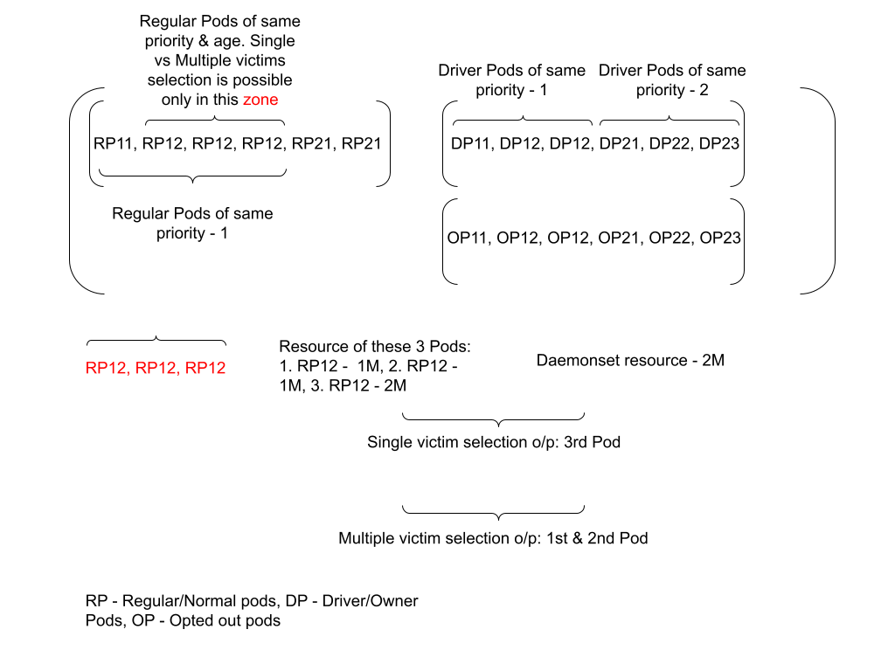

<!--
 * Licensed to the Apache Software Foundation (ASF) under one
 * or more contributor license agreements. See the NOTICE file
 * distributed with this work for additional information
 * regarding copyright ownership. The ASF licenses this file
 * to you under the Apache License, Version 2.0 (the
 * "License"); you may not use this file except in compliance
 * with the License. You may obtain a copy of the License at
 *
 * http://www.apache.org/licenses/LICENSE-2.0
 *
 * Unless required by applicable law or agreed to in writing, software
 * distributed under the License is distributed on an "AS IS" BASIS,
 * WITHOUT WARRANTIES OR CONDITIONS OF ANY KIND, either express or implied.
 * See the License for the specific language governing permissions and
 * limitations under the License.
 -->
# Design & Implementation of Preemption for DaemonSet Pods using Simple Preemptor

The simplistic approach to preempt or free up resources of running applications for DaemonSet pods. A good example of daemonset pod is fluentd logging pod which is very essential for any applicaton pod running in the node for logging.

## When to start preemption?
[YUNIKORN-1184](https://issues.apache.org/jira/browse/YUNIKORN-1184) ensures daemon set pods have been allocated properly if resources are available on the required node, otherwise, reserve the same required node so that it can be picked up to make reservation as reserved allocation (AllocatedReserved) in the next scheduling cycle. However, the whole process of modifying the reservation to reserved allocation depends on how much resources are freed up in the meantime. Duration for freeing up resources by natural course is non deterministic as it depends on the running pods execution on that particular node and it could take slightly longer time as well.

By any chance, before the next run of the regular scheduling cycle (context#schedule() ), resources become available and particularly on that specific required node, then nothing needs to be done. It just moves ahead with the next steps. In case of resource constraints, unlike the regular pod reservation, other nodes cannot be tried by calling application#tryNodesNoReserve() as this demonset pod needs to run only on the specific required node. Instead, we can fork a new go routine (trigger_preempt_workflow() ) to run the workflow steps described below.

## How to do preemption?
K8s does the preemption based on the pod priority. Pods with lower priority would be chosen first and so on. Proposal is not to depend on k8s for Preemption. Instead, Core should take the responsibility of finding out the list of pods that needs to be preempted, making communications to Shim and finally expecting the preempted resources to allocate to the corresponding daemonset automatically as part of the regular scheduling cycle.

### Steps in trigger_preempt_workflow() go routine:

##### Reservation age check (1)
We can introduce a new Reservation age “createtime” (can be added to the reservation object) to check against the configured value of preemption_start_delay, a property to define the minimal waiting time to start the preemption process. Once reservation age exceeds this waiting time, the next step would be carried out. Otherwise, the corresponding reservation has to wait and can be processed next time.

##### Get allocations from specific required Node (2)
Get all allocations from the required node of the daemonset pod and go through the below Pre-filter pods step to filter the pods not suited for a preemption.

##### Pre-filter pods to choose Victims/Candidates suited for Preemption (3)

Core should filter the pods based on the following criteria:

###### DaemonSet Pods

All Daemonset pods should be filtered out completely irrespective of priority settings. Depending on the “requiredNode” value of pod spec, these pods can be filtered out and cannot be taken forward for the remaining process.

##### Ordering Victim pods (4)

###### Pods classification

Once pods has been filtered out, need to classify the pods based on its types:

1. Regular/Normal Pods (RP)
2. Driver/Owner Pods (DP)
3. Preemption Opt out Pods (OP)

This classification ensures different treatment for each type of pod so that victims can be chosen among these pods in the same order. Please refer to the above diagram. It shows the 2-Dimensional array (NOTE: “Array” has been used only for documentation purposes, need to finalize the appropriate data structure) with each sub array holding pods of the same type. 1st sub array has RP’s, 2nd sub array has DP’s, 3rd sub array has OP’s and goes on.

Regular/Normal Pods (RP)

The regular/normal pods should be gathered and placed in the 1st sub array as these pods are given first preference for choosing the victims. In general, preempting these pods have very little impact when compared to other types/classes of pods. Hence, keeping these pods in the first subarray is the right choice

Application Owner (DP)

Pod acting as owner/master for other pods in the same application should be placed in the 2nd sub array because preempting those kinds of pods has a major impact when compared to Regular pods. We can select these pods by checking whether any owner reference exists between this pod and other pods. This will help prevent scenarios such as a driver pod being evicted at a very early stage when other alternatives are available for choosing the victim.

Preemption Opt out (OP)

Pods can be allowed to run with the Preempt opt out option. So, Pods marked with opt out should be placed in the 3rd sub array and can be used to choose victims as a last option. For now, we can use a label such as yunikorn.apache.org/allow-preemption: false for detecting those pods.

As and when we want to introduce a new class/type of Pods, a new sub array would be created for the same and would be placed in the main array based on its significance.

###### Sorting Pods

Each sub array should be sorted based on the multiple criteria:

1. Priority
2. Age
3. Resource

Each sub array would be sorted priority wise, age wise and finally resource wise. The 1st sub array carrying Regular Pods has 4 pods of priority 1 and 2 pods of Priority 2. Among the 4 pods of the same priority, 3 pods are of the same age as well. Hence, again sorting resource wise really adds value and sorts them in the above shown order. Please refer to “zone”.

#### Victim pods selection strategy (5)

Introduce a new configuration, preemption_victim_poselection_strategy with different options (single, multiple etc) but later options act as fallback to earlier one. Defining an order for these options should be possible and upto the Administrator to place the options in an order he/she desires. Depending on the values, the whole selection strategy mechanism can decide whether a “fallback” approach among these options should be followed or not. Depending on the value, the selection strategy process would continue with the next option only if no selection has been made with the earlier option or stop only with the first option even if no selection has been made.

##### 1. Single Victim Pod

Single Victim Pod, but resource deviation between victim pod and daemonset pod is not beyond configurable percentage. Configuring deviation with lower percentage (for example, 5% or 10%) helps prevent evicting victim pods already running with higher resource requirements. If there are many single victims found within the defined deviation %, then selection starts based on deviation % ascending order as intent is to choose the victim as close as possible to the daemonset pod resource requirements.

##### 2. Multiple Victim Pods

Multiple Victim Pods, but no. of victim pods not more than configured value. This selection strategy helps to choose more than one victim, starts with the victim (resource wise descending order) and goes upto to a stage where total resource of victims meets the daemonset resource requirements but ensuring total count of victim pods not exceeding configured value.

New config: preemption_victim_pods_selection_strategy
Possible values are single,multiple (default) or multiple,single or single or multiple

In case of more than one value (for ex. single,multiple), fallback would be followed as described above.

#### Communicate the Pod Preemption to Shim (6)

Once the list of pods has been finalized for preemption, Core can make a call to Shim for termination using notifyRMAllocationReleased (with type as TerminationType_PREEMPTED_BY_SCHEDULER). Shim can process the request as usual by making a call to K8s to delete the pod and subsequently call failTaskPodWithReasonAndMsg to notify the pod with reasons.

### What happens after Preemption?

Shim makes a call to K8s to delete the pod. Once k8s delete the pod, shim gets a notification from k8 and passes the information to core. This flow happens for any pod deletion and exists even today. So, even for preempted resources, we can leave it upto the regular scheduling cycle and Core-Shim communications to allocate these freed up preempted resources to the daemonset pod as node has been already reserved much earlier before the above described whole preemption workflow has begun.