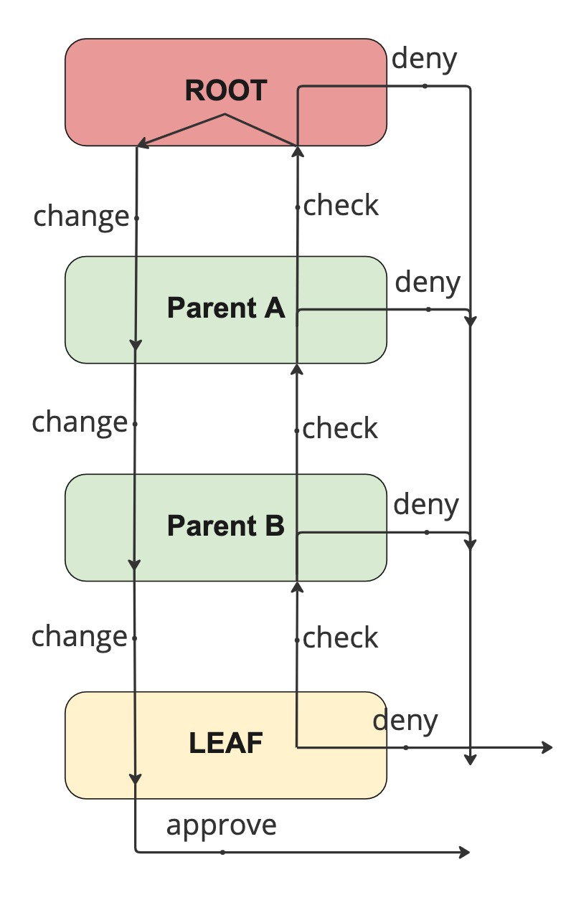

<!--
Licensed to the Apache Software Foundation (ASF) under one
or more contributor license agreements.  See the NOTICE file
distributed with this work for additional information
regarding copyright ownership.  The ASF licenses this file
to you under the Apache License, Version 2.0 (the
"License"); you may not use this file except in compliance
with the License.  You may obtain a copy of the License at

  http://www.apache.org/licenses/LICENSE-2.0

Unless required by applicable law or agreed to in writing,
software distributed under the License is distributed on an
"AS IS" BASIS, WITHOUT WARRANTIES OR CONDITIONS OF ANY
KIND, either express or implied.  See the License for the
specific language governing permissions and limitations
under the License.
-->

## Introduction

Enforcing resource allocation usage is currently limited to a queue.
As part of the allocation process for an application, which owns the allocation, triggers an update of the resource usage for users and groups.
The tracking for [user resource usage tracking in YuniKorn](user_based_resource_usage_tracking) is described and implemented independently of the enforcement.

This design builds on top of the tracking design as referenced above. Like a queue a user/group could have a limit set. 
A limit can specify a resource usage quota, and an application usage limit. 
Enforcing the limit which connects the usage to the limit settings is covered in this design.

## Goals

* Implementation of the enforcement for user and group limits:
  * Resource usage quota
  * Running applications
* Configuration processing
  * Process limit object values from the queue configuration
* Updates to the tracking interface to support enforcement as part of increases:
  * Increase a user/group running applications
  * Increase a user/group resource usage

## Non Goals

* User and group retrieval is part of the k8shim which is out of scope
* Exposing usage as a metric into prometheus
* Enforcement of queue quotas or running applications.
* Tracking of users and or groups, see [User and Group usage tracking design doc](user_based_resource_usage_tracking)

## Configuration processing

The queue configuration definition has a limit object defined as [per the documentation](../user_guide/queue_config#limits). 
User and group limits are based on those objects.
However the current configuration processing only performs a syntax check not a content check.

### Generic behaviour

Limits can be configured for queues at any level. Limits are applied recursively in the case of a queue limit. 
This means that a limit on the root queue is an overall limit in the cluster for the user or group.
A root queue limit is thus also equivalent with the partition limit.

A limit is per individual user or group. It is not a combined limit for all users or groups specified in the limit object.
See the below limit object as an example.
In this example both users sue and bob are allowed to run 2 applications and can each use 10 cpu and 250G of memory.
Users and or groups not defined are not affected by this limit object.

```yaml
- limit: "example entry"
  maxapplications: 2
  maxresources:
  cpu: 10
  memory: 250G
  users:
    - sue
    - bob
```

In the case that limits are configured at multiple levels in the hierarchy a fixed order of enforcement is used.
Like with queue quotas, checks start at the leaf queue and work their way up the hierarchy finishing at the root level.
For the limit configuration processing the same needs to be implemented and the config should be rejected if it does not comply.
Any limit set at any level below the root must always be smaller or equal to the root limit.

The checks for the limit configuration must be part of the generic configuration checks currently performed as part of the loading of the configuration.
We cannot allow the configuration to be accepted at the queue level and later be denied at the limit level checks. A change is all or nothing, we cannot apply partial changes. Configuration checks must be made without impacting the scheduling cycles. After the change has passed the configuration check the changed configuration must then be applied in a single action.

### Wildcard interpretation

Wildcard can only be used as the only entry in the limit object according to the documentation.
There can be multiple limit objects in the overall limits for a queue.
As part of this design the interpretation of the wildcard needs to be defined.
Wildcards interpretation is related to the ordering of the limit objects in the overall limits object.
The usage and interpretation will be different for users and groups.

In general terms: allowing a wildcard in the user or group list only as part of the last entry of the limits list.
After the wildcard has been added for either the user or group list we do not allow a user or group list with a non wildcard entry.
This is especially important for the group resolution. It does allow specifying a user and group wildcard with different limits set. 
In all cases, there will only be a match using the wildcard if none of the earlier limit entries match.

#### User

Users that are specified as part of a limit will be assigned that specific limit. 
If a limit with a wildcard is specified all users that are not already assigned a limit will be assigned the wildcard limit.
For the user entry the wildcard sets a default quota for every user on that queue. Overridden by the named user entries.

Specifying a single limit for users using the wildcard is allowed. There is no requirement to have a wildcard entry.

#### Group

For groups the interpretation is slightly more complex. 
As explained as part of the tracking documentation the group that the usage is tracked against must match the membership of the user. 
A wildcard group matches any group.

Specifying a wildcard for the group limit sets a cumulative limit for all users in that queue. 
If there is no specific group mentioned the wildcard group limit would thus be the same as the queue limit. 
For that reason we do not allow specifying only one group limit that is using the wildcard. 
There must be at least one limit with a group name defined.

The combination of one or more named group limits with a wildcard group limit is allowed. 
There is no requirement to have a wildcard entry.

The hierarchy is considered bottom up, starting from the leaf up to the root.
The first group that is specified in the queue hierarchy for limiting usage that matches a group in the _UserGroup_ object is selected for that application. 
That definition has an impact on the wildcard interpretation and the wildcard has an impact on the group selection. 
The wildcard will indirectly affect group quotas set for a specific group higher up in the hierarchy. 
This point needs clear documentation as part of the group selection algorithm and its side effects.

### Example configuration

An example of a set of limits. A mixture of a user and multiple groups each with a limit.
Followed by the catch-all for both users and groups with separate resource limits.

In the example below all users, except the user “sue” have the same limit set. Members of the group “development” and the group “test” both have the same limit set. All other users who are not a member of the group “development” or “test” are counted towards the cumulative group limit.
```yaml
limits:
- limit: "specific user"
  users:
  - "sue"
  maxresources: {memory: 25G, vcore: 5}
- limit: "specific groups"
  groups:
  - "development"
  - "test"
  maxresources: {memory: 100G, vcore: 10}
- limit: "user catch all"
  users:
  - "*"
  maxresources: {memory: 10G, vcore: 1}
- limit: "group catch all"
  groups:
  - "*"
  maxresources: {memory: 50G, vcore: 10}
```

### Syntax checking

As part of the already existing queue configuration processing the syntax for the configuration is checked. 
This check is triggered also for a reload of the file, via the config map, or the REST interface.
Rudimentary limit object checking is implemented as part of the config check.

The above described changes around the wildcards and what is allowed is not part of the configuration validation and must be added.

### Quota checks

No checks are performed for the limits against the queue quotas. 
This means that as part of the current checks a limit can be set that is higher than the queue would allow. 
There is also no hierarchical check in place. This means that a child could set higher limits than is possible based on the parent settings.

The configuration validation processing must be extended to the limit objects.
At each level in the configuration the resource quota assigned in a limit must be smaller than the maximum allowed at that level for the queue.
The queue quota processing already has this builtin and the limit should be checked against the quota.

The hierarchical check for limits contains a further complexity. 
A limit at one level might not apply to the same users or groups as the limit at the level below it. 
An implementation decision will need to be made on how far we want to go with the checks. 
Most, if not all, of the configurations that we do not want to allow do not break the system. 
We will not be able to check user and group interactions as we do not know the group memberships. 
The only thing we can check is the same user or group at different levels in the hierarchy.

## Configuration updates and storage

The configuration is read as part of the queue configuration. 
The queue configuration when processed creates, deletes or updates queues from the queue structure as appropriate.
For limits linked to users or groups we could pre-generate the named entries but we cannot do that for wildcards.
To support wildcards we need to at least store the configuration inside the user group manager code.

The definition of the configuration store and the methods that need to be defined will be left as an implementation detail.
It must be internal to the user group manager and will be based on the existing configuration objects.

The configuration for the limits should be maintained as a separate hierarchy from the scheduling queues and the tracked users and groups.
This is required to allow parallel processing of changes and scheduling.
This becomes more important with an increased number of users, groups and or queues.

Proposal is to pass the full configuration after it has been accepted by the system to an independent update routine for updating the affected objects in the user group manager.

### Processing changes existing objects

As configuration changes are based on queue changes a single queue change could trigger multiple tracker object changes.

Applying the change from the configuration to an existing object in the structure of the user group manager would be initiated from the queue configuration traversal.
All entries inside the limit are then processed. 
A comparison between the existing and new values is required to allow the correct removal of a limit via the updated configuration.

If the user object does not exist the update will be a NOP, otherwise the user object will be updated by calling the setter method with the corresponding values.

Wildcards will trigger an update of all objects of the specific type, user or group, for the queue they are linked to.
These kinds of updates could be expensive which also warrants the case for comparison of the existing values.

### Queue tracking

The queueTracker object is the location where the limits are actually stored. The user and group objects do not contain the settings.

The setter methods defined need to transparently handle the update.
There should be no difference in behaviour to an update of existing values or setting values that do not exist.
As an example: a leaf queue might have a value set for the maximum resources for the user.
The new configuration does not have a value set. The setter must clear the existing value.
Second example: a limit on a queue is not set for a group.
The new configuration does set a limit for the group. 
This should not result in the queue(s) in the hierarchy to be created. 
If the queue exists in the hierarchy it will be updated.

The following change is made to the queueTracker object.
New fields are added to store the limit for the applications and the resources.
New methods are added to allow updating these new values from a configuration change.

```
package user_group_manager

type queueTracker struct {
	queueName           string
	resourceUsage       *Resource
	runningApplications map[string]boolean
	maxResourceUsage    *Resource
	maxRunningApps      unit64

	childQueues   map[string]*queueTracker
}

(qt *queueTracker) setMaxApplications(count uint64, queuePath string)
(qt *queueTracker) setMaxResources(resource *Resource, queuePath string)
```

An empty queue path indicates that the change needs to be applied to the current queue object. The queuePath is a fully qualified queue path that starts with “root’.

### User tracking

The following change is made to the userTracker object. New methods to allow updating the new limit values stored in the queue objects.
```
package user_group_manager

(ut *userTracker) setMaxApplications(count uint64, queuePath string)
(ut *userTracker) setMaxResources(resource *Resource, queuePath string)
```

### Group tracking
The following change is made to the groupTracker object. New methods to allow updating the new limit values stored in the queue objects.

```
package user_group_manager

(ut *groupTracker) setMaxApplications(count uint64, queuePath string)
(ut *groupTracker) setMaxResources(resource *Resource, queuePath string)
```

## New queue to track

As part of the usage tracking new objects are created for the users and or groups that are tracked.
For users there is a change required to make sure the correct limits are set.
This happens at two points while processing users.
First is during the creation of a new user tracker object.
Second is while increasing the usage of a queue which does not exist yet in the hierarchy.

The logic to retrieve the configuration should be built into the creation of the queueTracker objects.
The objects are not pre-created. They are only created as part of the _increaseResource_ call.
The current call does not allow passing in the identity that the queue object is tracking for.
That detail is stored in the container object: the userTracker or groupTracker object.

To allow the automatic creation of the queueTracker objects the identity will need to be passed into the increaseResource call of the queueTracker object.
The identity and type are required to find the configuration setting and apply the proper limits during the creation of the queueTracker object.

```
package user_group_manager

type trackingType int

const (
    none trackingType = iota
    user
    group
)

(qt *queueTracker) increaseResource(queuePath, applicationID, identity string, type trackingType, usage *Resource)
```

The _trackingType_ specifies one of the two types we can track. An iota is preferred above the usage of a plain integer or boolean (user true or false) kind of setup.

## Enforcement changes

### Tracker interface update

The current tracker does not support denying a change. For enforcement of quotas on the usage there has to be a possibility to deny a change.
This denial can only occur on an increase of tracked resources. A decrease of the usage, i.e. a removal of an allocation because a pod has finished, can never be denied.

This limits the change to support quota enforcement to a single change in the Tracker interface.
The _IncreaseTrackedResource_ call returns the state of the increase requested. 
The return value can either be true or false. The call must only return true if the increase is allowed for both the user and the group tracked for the request.
If either of the userTracker or groupTracker quota would be exceeded no change is made to either object and false is returned.

The following change is made to the Tracker interface:

```
package user_group_manager

type Tracker interface {
    IncreaseTrackedResource(queuePath, applicationID string, usage *Resource, user *security.UserGroup) bool
    DecreaseTrackedResource(queuePath, applicationID string, usage *Resource, removeApp bool, user *security.UserGroup)
}
```

The change must be applied to both userTracker and groupTracker.
Until the change is applied to both the userTracker and groupTracker, no other updates are allowed of either object.
The increase and decrease processing must still follow the same order. Both must update the userTracker and related groupTracker objects in the same order.
This was a requirement described in the tracking design and that has not changed.

If the call to _IncreaseTrackedResource_ returns false the allocation that triggered the change needs to be abandoned.
Any change that was made to objects inside the scheduler, like an application, queue or node, must be reversed.
The scheduling cycle proceeds as if no allocation was made.

The error return value for both the _IncreaseTrackedResource_ and the _DecreaseTrackedResource_ have been removed.
The reason is that there is nothing that could be done by the caller to change the outcome or fail any changes if an error was returned.
Both functions should still log the error case as it could point to a bug in the code.
A caller should never have to pass in empty or nil parameters.

### User tracking

The following change is made to the userTracker method. There is no change to the structure itself for the enforcement checks:

```
package user_group_manager

(ut *userTracker) increaseResource(queuePath, applicationID string, alloc *Resource) bool
```
### Group tracking

The following change is made to the groupTracker method. There is no change to the structure itself for the enforcement checks:
```
package user_group_manager

(gt *groupTracker) increaseResource(queuePath, applicationID string, alloc *Resource) bool
```

### Queue tracking

The following change is made to the queueTracker method. There is no change to the structure itself for the enforcement checks:
```
package user_group_manager

(qt *queueTracker) increaseResource(queuePath, applicationID, identity string, type trackingType, usage *Resource) bool
```

Note that the above change includes the change described earlier which was made to support the automatic creation of the queue objects as part of the increaseResource call.
### Hierarchy traversal

The implementation of the hierarchical check should follow the same pattern as we currently do for the queues.
There is one major difference between the queue checks and the user and group checks.
For the queues we do not attempt to allocate unless there is unused quota available.
This starts at the top of the hierarchy and prevents recursing into the depth of the hierarchy towards the leaf queue.

For the users and groups we have already ended up as the leaf of the structure. 
Checks will thus start at the leaf and work their way up to the root of the structure.
A check will be performed while traversing up the hierarchy. The traversal up the tree will stop if the check fails. 
The change is applied when unwinding the traversal. This will guarantee a change is only committed when the whole hierarchy can be updated.



Diagram of the quota check traversal related to the queue hierarchy.

## Exposure of quota details

The usage tracking information that is part of the user group manager is exposed for external consumption via REST. 
The quotas set as part of the queue objects should be exposed in the REST output. 
Exposing the quota independent of the usage makes interpretation difficult.

The quota set in the queueTracker at the specific entry is the quota that is enforced on that entry. 
From a troubleshooting perspective this would be a requirement to allow an administrator to assess state.

Based on the current REST api definition the data exposed in the following two endpoints will be updated to expose the limits:  
_/ws/v1/partition/{partitionName}/usage/users_  
_/ws/v1/partition/{partitionName}/usage/groups_  

For both endpoints we expose the full queue hierarchy. As an example below the approximate output for the users endpoint for one user:

```json
[
  {
    "userName": "user1",
    "groups": {
      "app1": "tester"
    },
    "queues": {
      "queuename": "root",
      "resourceUsage": {
        "memory": 12000000000,
        "vcore": 12000
      },
      "runningApplications": ["app1", "app2"],
      "children": [
        {
          "queuename": "root.default",
          "resourceUsage": {
            "memory": 6000000000,
            "vcore": 6000
          },
          "runningApplications": ["app1"],
          "children": [],
          "maxApplications": 10,
          "maxResources": {
            "memory": 50000000000,
            "vcore": 100000
          }
        },
        {
          "queuename": "root.test",
          "resourceUsage": {
            "memory": 6000000000,
            "vcore": 6000
          },
          "runningApplications": ["app2"],
          "children": [],
          "maxApplications": 0,
          "maxResources": {}
        }
      ],
      "maxApplications": 10,
      "maxResources": {}
    }
  }
]
```

An example below the approximate output for the groups endpoint for one group:
```json
[
  {
    "groupName" : "tester", 
    "users": ["user1"],
    "queues":
    {
      "queuename": "root",
      "resourceUsage": {
        "memory": 6000000000,
        "vcore": 6000
      },
      "runningApplications": ["app2"],
      "children": [
        {
          "queuename": "root.test",
          "resourceUsage": {
            "memory": 6000000000,
            "vcore": 6000
          },
          "runningApplications": ["app2"],
          "children": [],
          "maxApplications": 2,
          "maxResources": {
            "vcore": 10000
          }
        }
      ],
      "maxApplications": 0,
      "maxResources": {}
    }
  }
]
```

