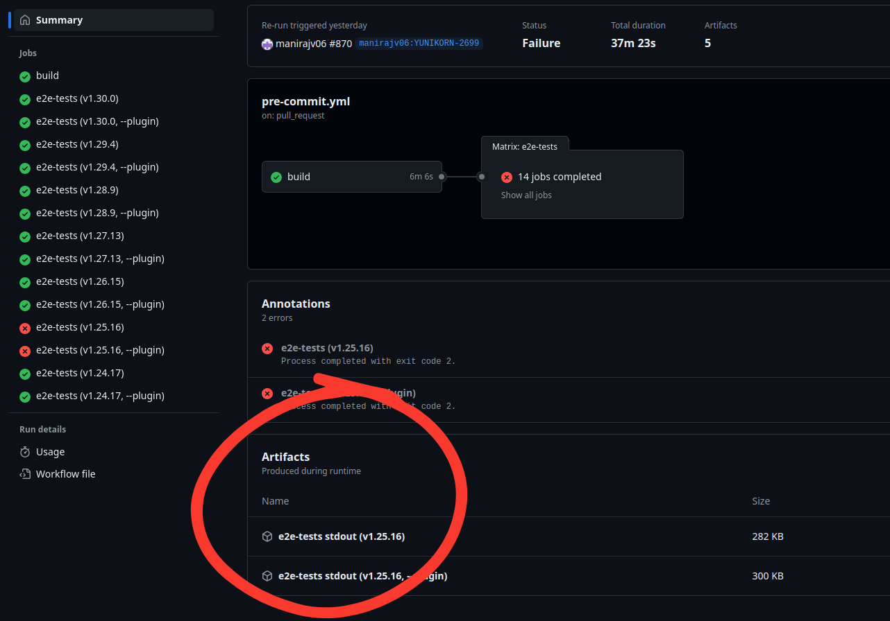

<!--
* Licensed to the Apache Software Foundation (ASF) under one
* or more contributor license agreements.  See the NOTICE file
* distributed with this work for additional information
* regarding copyright ownership.  The ASF licenses this file
* to you under the Apache License, Version 2.0 (the
* "License"); you may not use this file except in compliance
* with the License.  You may obtain a copy of the License at
*
*      http://www.apache.org/licenses/LICENSE-2.0
*
* Unless required by applicable law or agreed to in writing, software
* distributed under the License is distributed on an "AS IS" BASIS,
* WITHOUT WARRANTIES OR CONDITIONS OF ANY KIND, either express or implied.
* See the License for the specific language governing permissions and
* limitations under the License.
-->

End-to-end (e2e) tests for YuniKorn-K8shim provide a mechanism to test end-to-end behavior of the system, and is the last signal to ensure end user operations match developer specifications. 

The primary objectives of the e2e tests are to ensure a consistent and reliable behavior of the yunikorn code base, and to catch hard-to-test bugs before users do, when unit and integration tests are insufficient.

The e2e tests are built atop of [Ginkgo](https://onsi.github.io/ginkgo/) and [Gomega](https://github.com/onsi/gomega). There are a host of features that this Behavior-Driven Development (BDD) testing framework provides, and it is recommended that the developer read the documentation prior to diving into the tests.

Below is the structure of e2e tests, all contained within the [yunikorn-k8shim](https://github.com/apache/yunikorn-k8shim).
* `test/e2e/` contains tests for YuniKorn Features like Scheduling, Predicates etc
* `test/e2e/framework/configManager` manages & maintains the test and cluster configuration
* `test/e2e/framework/helpers` contains utility modules for k8s client, (de)serializers, rest api client and other common libraries.
* `test/e2e/testdata` contains all the test related data like configmaps, pod specs etc

## Pre-requisites
This project requires Go to be installed. On OS X with Homebrew you can just run `brew install go`.
OR follow this doc for deploying go https://golang.org/doc/install

## Understanding the Command Line Arguments
* `yk-namespace` - namespace under which YuniKorn is deployed. [Required]
* `kube-config` - path to kube config file, needed for k8s client [Required]
* `yk-host` - hostname of the YuniKorn REST Server, defaults to localhost.   
* `yk-port` - port number of the YuniKorn REST Server, defaults to 9080.
* `yk-scheme` - scheme of the YuniKorn REST Server, defaults to http.
* `timeout` -  timeout for all tests, defaults to 24 hours

## Launching Tests

### Trigger through CLI
* Begin by installing a new cluster dedicated to testing, such as one named 'yktest'
```shell
./scripts/run-e2e-tests.sh -a install -n yktest -v kindest/node:v1.28.0
```

* Launching CI tests is as simple as below.
```shell
# We need to add a 'kind' prefix to the argument of the run-e2e-tests.sh -n command.
kubectl config use-context kind-yktest 
ginkgo -r -v ci -timeout=2h -- -yk-namespace "yunikorn" -kube-config "$HOME/.kube/config"
```

* Launching all the tests can be done as.
```shell
ginkgo -r -v -timeout=2h -- -yk-namespace "yunikorn" -kube-config "$HOME/.kube/config"
```

* Launching all the tests in specified e2e folder.
e.g. test/e2e/user_group_limit/
```shell 
cd test/e2e/
ginkgo -r user_group_limit -v -- -yk-namespace "yunikorn" -kube-config "$HOME/.kube/config"
```

* Launching specified test file.
```shell
cd test/e2e/
ginkgo run -r -v --focus-file "admission_controller_test.go" -- -yk-namespace "yunikorn" -kube-config "$HOME/.kube/config"
```

* Launching specified test.
e.g. Run test with ginkgo.it() spec name "Verify_maxapplications_with_a_specific_group_limit"
```shell 
cd test/e2e/
ginkgo run -r -v --focus "Verify_maxapplications_with_a_specific_group_limit" -- -yk-namespace "yunikorn" -kube-config "$HOME/.kube/config"
```

* Launching all the tests except specified test file.
```shell
cd test/e2e/
ginkgo run -r -v --skip-file "admission_controller_test.go" -- -yk-namespace "yunikorn" -kube-config "$HOME/.kube/config"
```

* Delete the cluster after we finish testing (this step is optional).
```shell
./scripts/run-e2e-tests.sh -a cleanup -n yktest
```

## Checking E2E Test Logs

The logs of failed E2E tests are stored locally and uploaded to the GitHub Action Artifact. This section explains how to retrieve and understand these logs.

### Local E2E Test Logs

When an E2E test fails, logs are saved locally in the `yunikorn-k8shim/build/e2e/{suite}/` directory. The logs are categorized as follows:

- `{specName}_k8sClusterInfo.txt`: Contains information about the Kubernetes cluster state at the time of the test.
- `{specName}_ykContainerLog.txt`: Includes logs from the YuniKorn containers.
- `{specName}_ykFullStateDump.json`: Provides a full state dump of YuniKorn.

### Steps to Retrieve Local Logs

1. Run the E2E test using `./scripts/run-e2e-tests.sh -a test -n yk8s -v kindest/node:v1.30.0`. (change the k8s version as needed)
2. If the test fails, navigate to the `yunikorn-k8shim/build/e2e/{suite}/` directory.
3. Locate the logs using the above-mentioned naming conventions.

### Downloading Logs from GitHub Actions

In the event of a failed Continuous Integration (CI) run, logs are uploaded to GitHub Actions as artifacts. Follow these steps to download the logs:

1. Navigate to the GitHub repository for YuniKorn k8shim.
2. Go to the "Actions" tab.
3. Find the failed CI run and click on it.
4. In the run summary, look for the "Artifacts" section.
5. Click on the artifact to download the logs.

Here is an example screenshot showing where to find the download link for logs in a failed CI run (at the buttom):


