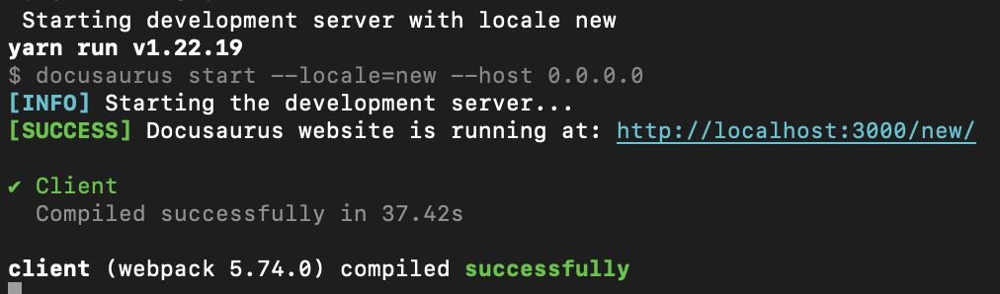

<!--
Licensed to the Apache Software Foundation (ASF) under one
or more contributor license agreements.  See the NOTICE file
distributed with this work for additional information
regarding copyright ownership.  The ASF licenses this file
to you under the Apache License, Version 2.0 (the
"License"); you may not use this file except in compliance
with the License.  You may obtain a copy of the License at

  http://www.apache.org/licenses/LICENSE-2.0

Unless required by applicable law or agreed to in writing,
software distributed under the License is distributed on an
"AS IS" BASIS, WITHOUT WARRANTIES OR CONDITIONS OF ANY
KIND, either express or implied.  See the License for the
specific language governing permissions and limitations
under the License.
-->

Yunikorn website adopting Docusaurus manages documentations.
[Docusaurus i18n system](https://docusaurus.io/docs/i18n/tutorial) allows developer to translate documentations.
For adding a new language translation, developers should do following operations.

## Modifying the docusaurus.config.js for supporting the new language
Assume the translations by a **new language keyword**.
Expected results will be like this figure.


Current Yunikorn website include the en and zh-cn documentaions.
If developer want to add a new translation with **new language keyword** including fr, jp, the developers need to modify the `i18n` in `docusaurus.config.js`.
```
i18n: {
    defaultLocale: 'en',
    locales: ['en', 'zh-cn', '<new language keyword>'],
    localeConfigs: {
      en: {
        label: 'English',
      },
      "zh-cn": {
        label: '中文',
      },
      "<new language keyword>": {
        label: 'test',
      }
    },
  },
```
## Updating the help information in local-build.sh
Adding the **new language keyword** to the locale list in `print_usage` function.
```
Usage: $(basename "$0") run [locale] | build | clean | help
    run     build the website, and launch the server in a docker image.
            a locale can be specified, currently supported: "en", "zh-cn", "<new language keyword>"
```

## Copying latest files to i18n
```
mkdir -p i18n/<new language keyword>/docusaurus-plugin-content-docs/current
cp -r docs/** i18n/<new language keyword>/docusaurus-plugin-content-docs/current
mkdir -p i18n/<new language keyword>/docusaurus-plugin-content-pages
cp -r src/pages/** i18n/<new language keyword>/docusaurus-plugin-content-pages
mkdir -p i18n/<new language keyword>/docusaurus-theme-classic
```

## Adding the translated information in sidebar.json and footer.json
Create sidebar.json and and footer.json in docusaurus-theme-classic.
For example, the footer.json context is following.
```
{
    "link.item.label.Get Involved": {
        "message": "参与"
    },
    "link.title.Code Repositories": {
        "message": "代码库"
    },
    "link.item.label.People": {
        "message": "人们"
    },   
    "link.title.Blog": {
        "message": "博客"
    },
    "link.title.Community": {
        "message": "社区"
    }
}
```


## linking img, assest and styles.module.css
Creating linking files in the `i18n/new language keyword/docusaurus-plugin-content-pages`.

```
# cleaning the duplicate files
rm -rf img
rm styles.module.css
# linking
ln -s ../../../static/img
ln -s ../../../src/pages/styles.module.css
```

Creating the linking file in the 'i18n/new language keyword/docusaurus-plugin-content-docs/current'.
```
# cleaning the duplicate files
rm -rf assests
# linking
ln -s ../../../../docs/assets
```

## Adopting relative paths
There are some image urls adopting absolute path in `src/pages/index.js` and adopting absolute path could cause png missing.
Developers could make sure that the img link in `/i18n/new language keyword/docusaurus-plugin-content-pages/index.js` is work.
For example, there is a `resource-scheduling.png` in `index.js` and the png url is `/img/resource-scheduling.png`.
```
/img/resource-scheduling.png -> ./img/resource-scheduling.png
```
## Test
```
./local-build.sh run <new language keyword>
```

