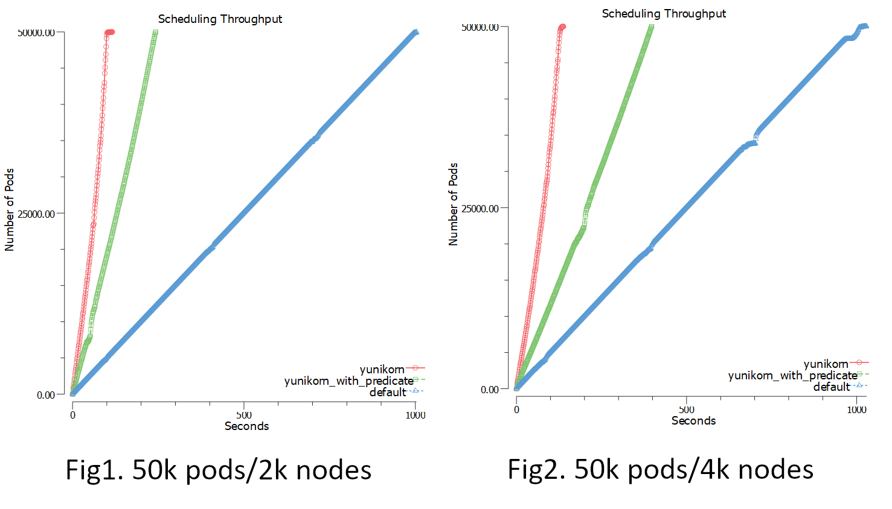
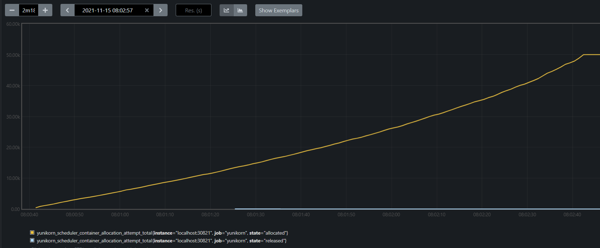
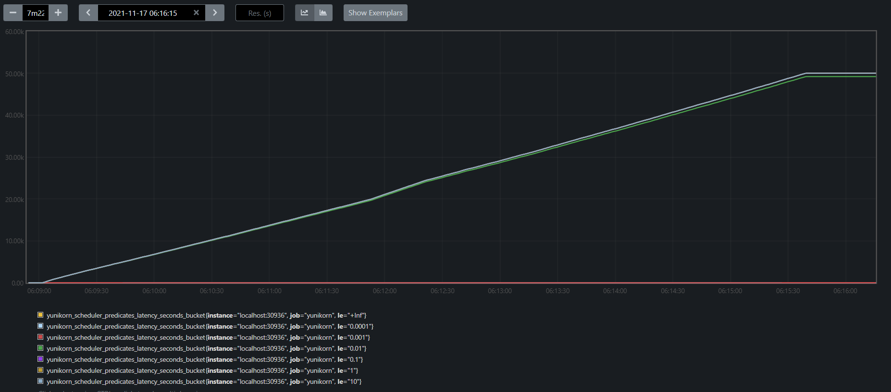
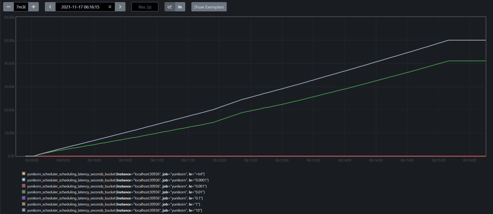
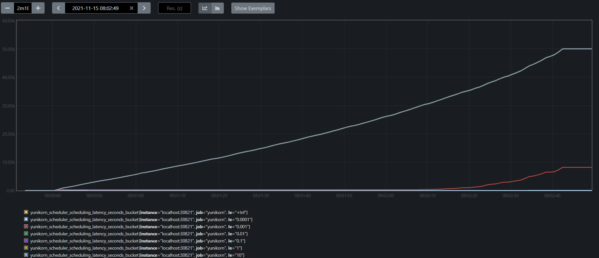

<!--
Licensed to the Apache Software Foundation (ASF) under one
or more contributor license agreements.  See the NOTICE file
distributed with this work for additional information
regarding copyright ownership.  The ASF licenses this file
to you under the Apache License, Version 2.0 (the
"License"); you may not use this file except in compliance
with the License.  You may obtain a copy of the License at

  http://www.apache.org/licenses/LICENSE-2.0

Unless required by applicable law or agreed to in writing,
software distributed under the License is distributed on an
"AS IS" BASIS, WITHOUT WARRANTIES OR CONDITIONS OF ANY
KIND, either express or implied.  See the License for the
specific language governing permissions and limitations
under the License.
-->

The YuniKorn community concerns about the scheduler’s performance and continues to optimize over the releases. The community has developed some tools in order to test and tune the performance repeatedly.

## Environment setup 

We leverage [Kubemark](https://github.com/kubernetes/kubernetes/blob/release-1.3/docs/devel/kubemark-guide.md#starting-a-kubemark-cluster) to evaluate scheduler’s performance. Kubemark is a testing tool that simulates large scale clusters. It create hollow nodes which runs hollow kubelet to pretend original kubelet behavior. Scheduled pods on these hollow nodes won’t actually execute. It is able to create a bigger cluster that meet our experiment requirement when we want to design a experiment to realize yunikorn scheduler performance. Please see the [detail steps](performance/performance_tutorial.md) about how to setup the environment.

## Scheduler Throughput

We have designed some simple benchmarking scenarios on a simulated large scale environment in order to evaluate the scheduler performance. Our tools measure the [throughput](https://en.wikipedia.org/wiki/Throughput) and use this key metrics to evaluate the peformance. In a nutshull, scheduler throughput is the rate of processing pods from discovering them on the cluster to allocating them to nodes.

In this experiment, we setup a simulated 2000/4000 nodes cluster with [Kubemark](https://github.com/kubernetes/kubernetes/blob/release-1.3/docs/devel/kubemark-guide.md#starting-a-kubemark-cluster). Then we launch 10 [deployments](https://kubernetes.io/docs/concepts/workloads/controllers/deployment/), with setting replicas to 5000 in each deployment respectively. This simulates large scale workloads submitting to the K8s cluster simultaneously. Our tool peridocally monitors and checks pods status, counting number of started pods based on podSpec.StartTime as time elapses. As a comparision, we apply the same experiment to the default scheduler on the same environment. And we see the YuniKorn peformance advantage over the default scheduler as illustrated below:

The charts record the time spent until all pods are running on the cluster

|                       	| yunikorn 			| yunikorn 			| k8s default scheduler		|
|-----------------------	|:---------------------:	|:---------------------:	|:---------------------:        |
| ENVIRONMENT		 	| predicate inactive     	| predicate active              |                               |
| 2000(nodes)                  	| 427(pods/sec)                 | 204(pods/sec)			| 49(pods/sec)			|
| 4000(nodes)                 	| 359(pods/sec)                 | 115(pods/sec)			| 48(pods/sec)			|

## More insights

The results we got from upon experiment is promising. We further take a deep dive to analysis the performance by observing more internal YuniKorn metrics, and we have more findings.

### the bottleneck

We found the overall performance actually is capped by the K8s master services, such as api-server, controller-manager and ETCD, we haven’t reached the limit of YuniKorn in all our experiments. If you look at the internal scheduling metrics, you can see

fig 3. Yunikorn metric in 4k nodes 

In fig3, prometheus shows that yunikorn use 122 seconds to schedule 50k pods before scheduled pods in fig2 were waiting k8s componment for 17 seconds to handle these submission.In each scheduling cycle, we found the most time-consuming phases are:
1. node sorting
2. pre-condition checks for a node

To reduce complexity in average node sorting operation, [YUNIKORN-780](https://issues.apache.org/jira/browse/YUNIKORN-780) refactor node sorting policy and then [YUNIKORN-807](https://issues.apache.org/jira/browse/YUNIKORN-807) reduce complexity from O(nlog(n)) to O(log(n)) via implementing B-tree in nodeCollectiion instead of node list.
We do two experiments whcih predicate function is active or inactive to check improvement of node sorting mechanism.
Predicate execution time is fixed process in scheduling and mostly use 0.1 seconds as fig4.
According to this factor,distribution of scheduling time is following.

|				| scheduling time distribution(second)	| predicate execution time distribution(second)	|
|-----------------------	|:---------------------:		|:---------------------:			|
| predicate active		| 0.01 - 0.1				| 0.01-0.1					|
| predicate inactive		| 0.001 - 0.01				| none						|

fig 4. predicate latency 

fig 5. predicate active 

fig 6. predicate inactive 

* shorter scheduling chain
In scheduling cycle, we don’t have too many steps or plugin to handle a application request.We get the partition, find the nodes which have suffcients resource and then try to allocate resources.
* faster node sorting
We use B-tree to reduce node sorting complexity instead of list.
* less overhead while running predicates
In this experiment, we apply applications which don’t have predicate requirement.
So we can focus on the throughput inflution of larger cluster size with no predicate.
* everything in-memory
We update node related information in metadata and reduce much function call to avoid some overhead.

## Summary

In fig1 and fig2, YK which hasn’t predicate overhead mostly keep same performance. In otherwise,its performance will reduce when predicate function is active and cluster size is getting larger.
In future, we will start to set some condition to reduce preidacte overhead and YK can fulfill larger cluster scale reqiurements and keep scheduling performance.
