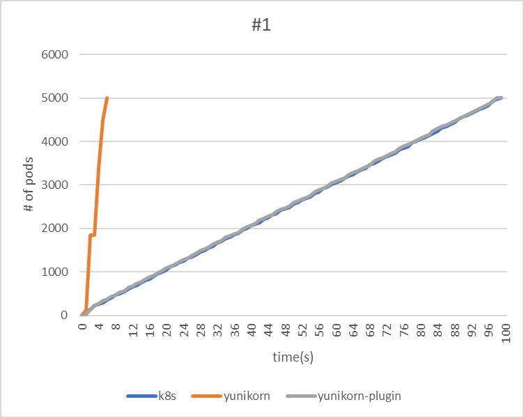
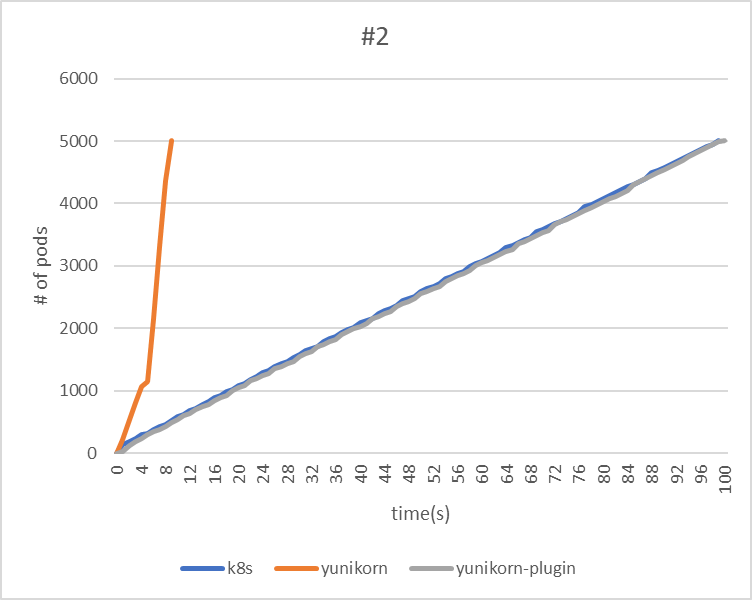
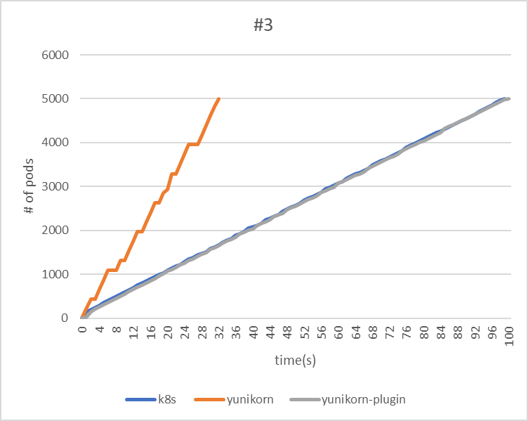

<!--
Licensed to the Apache Software Foundation (ASF) under one
or more contributor license agreements.  See the NOTICE file
distributed with this work for additional information
regarding copyright ownership.  The ASF licenses this file
to you under the Apache License, Version 2.0 (the
"License"); you may not use this file except in compliance
with the License.  You may obtain a copy of the License at

  http://www.apache.org/licenses/LICENSE-2.0

Unless required by applicable law or agreed to in writing,
software distributed under the License is distributed on an
"AS IS" BASIS, WITHOUT WARRANTIES OR CONDITIONS OF ANY
KIND, either express or implied.  See the License for the
specific language governing permissions and limitations
under the License.
-->

[KWOK](https://kwok.sigs.k8s.io/) is a powerful toolkit designed to swiftly establish a cluster of thousands of Nodes within seconds. This page is dedicated to leveraging KWOK for performance testing. The objective is to conduct a comparative analysis between YuniKorn (Standard mode/Plugin mode) and Kube-scheduler, evaluating their capabilities in workload handling.

KWOK conserves memory by emulating only node and pod behavior, unlike Kubemark, which emulates a kubelet and consumes a significant amount of memory.

Using Kwok, we replicated previous performance tests, deploying 10 deployments on 5000 nodes with 5000 replicas each, resulting in a remarkably low total memory usage of 30-40GB. As a result, Kwok enables us to scale up experiments and assess the performance of YuniKorn without the need to consider bandwidth and Kubelet processing speed.

## Environment

The test is conducted using KWOK in a Cluster. The cluster environment is optimized according to the performance tuning settings in the YuniKorn documentation. For more details, refer to the [Benchmarking Tutorial](performance/performance_tutorial.md#performance-tuning).

For data monitoring, Prometheus will be employed to gather metrics. We'll use count(kube_pod_status_scheduled_time{namespace="default"}) as an indicator of throughput.

## Test Cases

We will start a comparative analysis with kube-scheduler to evaluate the throughput of these two different schedulers. In addition, we will compare the performance differences when managing large numbers of Taints and Tolerations, configuring Affinity and Anti-Affinity settings, and handling PriorityClass jobs.

#### Test Cases:
- Throughput
- Taint & Tolerations
- Affinity & Non-Affinity
- PriorityClass

## Test Result
### Throughtput
In this experiment, we will use the following three test cases to measure the throughput and scheduling duration of different schedulers. Each application will be deployed at one-second intervals.

#### Test Case:

| Test Case | Applications | Tasks | Total Pods |
| --------- | ------------ | ----- | ---------- |
| #1        | 1            | 5000  | 5000       |
| #2        | 5            | 1000  | 5000       |
| #3        | 25           | 200   | 5000       |

#### Result:

| #1                   | kube-scheduler | yunikorn | yunikorn plugin mode |
| -------------------- | -------------- | -------- | -------------------- |
| makespan             | 99             | 6        | 99                   |
| throughput(pods/sec) | 50.5           | 833.3    | 50.5                 |

| #2                   | kube-scheduler | yunikorn | yunikorn plugin mode |
| -------------------- | -------------- | -------- | -------------------- |
| makespan             | 99             | 9        | 100                  |
| throughput(pods/sec) | 50.5           | 555.6    | 50                   |

| #3                   | kube-scheduler | yunikorn | yunikorn plugin mode |
| -------------------- | -------------- | -------- | -------------------- |
| makespan             | 99             | 32       | 100                  |
| throughput(pods/sec) | 50.5           | 156.3    | 50                   |

#### Summary

The test results reveal that YuniKorn demonstrates the highest throughput across all three tests. Both Kube-scheduler and YuniKorn plugin mode perform comparably.

Regarding the throughput of the YuniKorn Scheduler, the third test took the longest time. This can be attributed to the fact that the application is deployed only every second, thereby lengthening the makespan.
