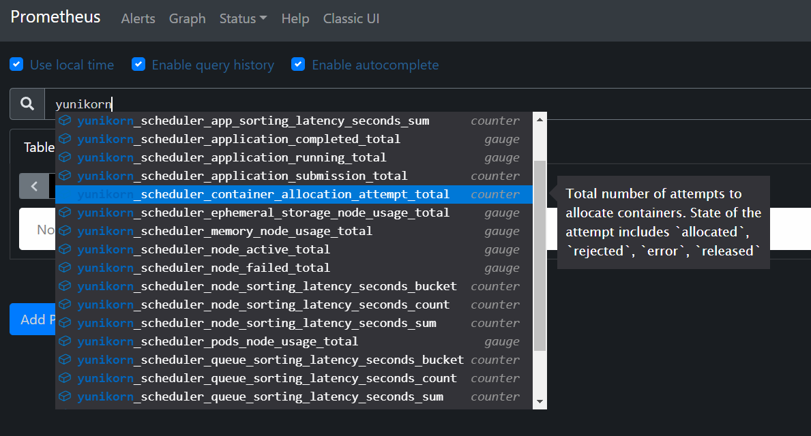

<!--
Licensed to the Apache Software Foundation (ASF) under one
or more contributor license agreements.  See the NOTICE file
distributed with this work for additional information
regarding copyright ownership.  The ASF licenses this file
to you under the Apache License, Version 2.0 (the
"License"); you may not use this file except in compliance
with the License.  You may obtain a copy of the License at

  http://www.apache.org/licenses/LICENSE-2.0

Unless required by applicable law or agreed to in writing,
software distributed under the License is distributed on an
"AS IS" BASIS, WITHOUT WARRANTIES OR CONDITIONS OF ANY
KIND, either express or implied.  See the License for the
specific language governing permissions and limitations
under the License.
-->

## Overview

The YuniKorn community continues to optimize the performance of the scheduler, ensuring that YuniKorn satisfies the performance requirements of large-scale batch workloads. Thus, the community has built some useful tools for performance benchmarking that can be reused across releases. This document introduces all these tools and steps to run them.

## Hardware

Be aware that performance result is highly variable depending on the underlying  hardware. All results published in the doc can only be used as references. We encourage each individual to run similar tests on their own environments in order to get a result based on your own hardware. This doc is just for demonstration purpose.

A list of servers being used in this test are (Huge thanks to [National Taichung University of Education](http://www.ntcu.edu.tw/newweb/index.htm), [Kuan-Chou Lai](http://www.ntcu.edu.tw/kclai/) for providing these servers for running tests):

| Manchine Type         | CPU | Memory | Download/upload(Mbps) |
| --------------------- | --- | ------ | --------------------- |
| HP                    | 16  | 36G    | 525.74/509.86         |
| HP                    | 16  | 30G    | 564.84/461.82         |
| HP                    | 16  | 30G    | 431.06/511.69         |
| HP                    | 24  | 32G    | 577.31/576.21         |
| IBM blade H22         | 16  | 38G    | 432.11/4.15           |
| IBM blade H22         | 16  | 36G    | 714.84/4.14           |
| IBM blade H22         | 16  | 42G    | 458.38/4.13           |
| IBM blade H22         | 16  | 42G    | 445.42/4.13           |
| IBM blade H22         | 16  | 32G    | 400.59/4.13           |
| IBM blade H22         | 16  | 12G    | 499.87/4.13           |
| IBM blade H23         | 8   | 32G    | 468.51/4.14           |
| WS660T                | 8   | 16G    | 87.73/86.30           |
| ASUSPRO D640MB_M640SA | 4   | 8G     | 92.43/93.77           |
| PRO E500 G6_WS720T    | 16  | 8G     | 90/87.18              |
| WS E500 G6_WS720T     | 8   | 40G    | 92.61/89.78           |
| E500 G5               | 8   | 8G     | 91.34/85.84           |
| WS E500 G5_WS690T     | 12  | 16G    | 92.2/93.76            |
| WS E500 G5_WS690T     | 8   | 32G    | 91/89.41              |
| WS E900 G4_SW980T     | 80  | 512G   | 89.24/87.97           |

The following steps are needed for each server, otherwise the large scale testing may fail due to the limited number of users/processes/open-files.

### 1. Set /etc/sysctl.conf
```
kernel.pid_max=400000
fs.inotify.max_user_instances=50000
fs.inotify.max_user_watches=52094
```
### 2. Set /etc/security/limits.conf

```
* soft nproc 4000000
* hard nproc 4000000
root soft nproc 4000000
root hard nproc 4000000
* soft nofile 50000
* hard nofile 50000
root soft nofile 50000
root hard nofile 50000
```
---

## Deploy workflow

Before going into the details, here are the general steps used in our tests:

- [Step 1](#Kubernetes): Properly configure Kubernetes API server and controller manager, then add worker nodes.
- [Step 2](#Setup-Kubemark): Deploy hollow pods,which will simulate worker nodes, name hollow nodes. After all hollow nodes in ready status, we need to cordon all native nodes, which are physical presence in the cluster, not the simulated nodes, to avoid we allocated test workload pod to native nodes.
- [Step 3](#Deploy-YuniKorn): Deploy YuniKorn using the Helm chart on the master node, and scale down the Deployment to 0 replica, and [modify the port](#Setup-Prometheus) in `prometheus.yml` to match the port of the service.
- [Step 4](#Run-tests): Deploy 50k Nginx pods for testing, and the API server will create them. But since the YuniKorn scheduler Deployment has been scaled down to 0 replica, all Nginx pods will be stuck in pending.
- [Step 5](../user_guide/trouble_shooting.md#restart-the-scheduler): Scale up The YuniKorn Deployment back to 1 replica, and cordon the master node to avoid YuniKorn allocating Nginx pods there. In this step, YuniKorn will start collecting the metrics.
- [Step 6](#Collect-and-Observe-YuniKorn-metrics): Observe the metrics exposed in Prometheus UI.
---

## Setup Kubemark

[Kubemark](https://github.com/kubernetes/kubernetes/tree/master/test/kubemark) is a performance testing tool which allows users to run experiments on simulated clusters. The primary use case is the scalability testing. The basic idea is to run tens or hundreds of fake kubelet nodes on one physical node in order to simulate large scale clusters. In our tests, we leverage Kubemark to simulate up to a 4K-node cluster on less than 20 physical nodes.

### 1. Build image

##### Clone kubernetes repo, and build kubemark binary file

```
git clone https://github.com/kubernetes/kubernetes.git
```
```
cd kubernetes
```
```
KUBE_BUILD_PLATFORMS=linux/amd64 make kubemark GOFLAGS=-v GOGCFLAGS="-N -l"
```

##### Copy kubemark binary file to the image folder and build kubemark docker image

```
cp _output/bin/kubemark cluster/images/kubemark
```
```
IMAGE_TAG=v1.XX.X make build
```
After this step, you can get the kubemark image which can simulate cluster node. You can upload it to Docker-Hub or just deploy it locally.

### 2. Install Kubermark

##### Create kubemark namespace

```
kubectl create ns kubemark
```

##### Create configmap

```
kubectl create configmap node-configmap -n kubemark --from-literal=content.type="test-cluster"
```

##### Create secret

```
kubectl create secret generic kubeconfig --type=Opaque --namespace=kubemark --from-file=kubelet.kubeconfig={kubeconfig_file_path} --from-file=kubeproxy.kubeconfig={kubeconfig_file_path}
```
### 3. Label node

We need to label all native nodes, otherwise the scheduler might allocate hollow pods to other simulated hollow nodes. We can leverage Node selector in yaml to allocate hollow pods to native nodes.

```
kubectl label node {node name} tag=tagName
```

### 4. Deploy Kubemark

The hollow-node.yaml is down below, there are some parameters we can configure.

```
apiVersion: v1
kind: ReplicationController
metadata:
  name: hollow-node
  namespace: kubemark
spec:
  replicas: 2000  // the node number you want to simulate
  selector:
      name: hollow-node
  template:
    metadata:
      labels:
        name: hollow-node
    spec:
      nodeSelector:  // leverage label to allocate to native node
        tag: tagName  
      initContainers:
      - name: init-inotify-limit
        image: docker.io/busybox:latest
        imagePullPolicy: IfNotPresent
        command: ['sysctl', '-w', 'fs.inotify.max_user_instances=200'] // set as same as max_user_instance in actual node 
        securityContext:
          privileged: true
      volumes:
      - name: kubeconfig-volume
        secret:
          secretName: kubeconfig
      - name: logs-volume
        hostPath:
          path: /var/log
      containers:
      - name: hollow-kubelet
        image: 0yukali0/kubemark:1.20.10 // the kubemark image you build 
        imagePullPolicy: IfNotPresent
        ports:
        - containerPort: 4194
        - containerPort: 10250
        - containerPort: 10255
        env:
        - name: NODE_NAME
          valueFrom:
            fieldRef:
              fieldPath: metadata.name
        command:
        - /kubemark
        args:
        - --morph=kubelet
        - --name=$(NODE_NAME)
        - --kubeconfig=/kubeconfig/kubelet.kubeconfig
        - --alsologtostderr
        - --v=2
        volumeMounts:
        - name: kubeconfig-volume
          mountPath: /kubeconfig
          readOnly: true
        - name: logs-volume
          mountPath: /var/log
        resources:
          requests:    // the resource of hollow pod, can modify it.
            cpu: 20m
            memory: 50M
        securityContext:
          privileged: true
      - name: hollow-proxy
        image: 0yukali0/kubemark:1.20.10 // the kubemark image you build 
        imagePullPolicy: IfNotPresent
        env:
        - name: NODE_NAME
          valueFrom:
            fieldRef:
              fieldPath: metadata.name
        command:
        - /kubemark
        args:
        - --morph=proxy
        - --name=$(NODE_NAME)
        - --use-real-proxier=false
        - --kubeconfig=/kubeconfig/kubeproxy.kubeconfig
        - --alsologtostderr
        - --v=2
        volumeMounts:
        - name: kubeconfig-volume
          mountPath: /kubeconfig
          readOnly: true
        - name: logs-volume
          mountPath: /var/log
        resources:  // the resource of hollow pod, can modify it.
          requests:
            cpu: 20m
            memory: 50M
      tolerations:
      - effect: NoExecute
        key: node.kubernetes.io/unreachable
        operator: Exists
      - effect: NoExecute
        key: node.kubernetes.io/not-ready
        operator: Exists
```

once done editing, apply it to the cluster:

```
kubectl apply -f hollow-node.yaml
```

---

## Deploy YuniKorn

#### Install YuniKorn with helm

We can install YuniKorn with Helm, please refer to this [doc](https://yunikorn.apache.org/docs/#install).
We need to tune some parameters based on the default configuration. We recommend to clone the [release repo](https://github.com/apache/incubator-yunikorn-release) and modify the parameters in `value.yaml`.

```
git clone https://github.com/apache/incubator-yunikorn-release.git
cd helm-charts/yunikorn
```

#### Configuration

The modifications in the `value.yaml` are:

- increased memory/cpu resources for the scheduler pod
- disabled the admission controller
- set the app sorting policy to FAIR

please see the changes below:

```
resources:
  requests:
    cpu: 14
    memory: 16Gi
  limits:
    cpu: 14
    memory: 16Gi
```
```
embedAdmissionController: false
```
```
configuration: |
  partitions:
    -
      name: default
      queues:
        - name: root
          submitacl: '*'
          queues:
            -
              name: sandbox
              properties:
                application.sort.policy: fair
```

#### Install YuniKorn with local release repo

```
Helm install yunikorn . --namespace yunikorn
```

---

## Setup Prometheus

YuniKorn exposes its scheduling metrics via Prometheus. Thus, we need to set up a Prometheus server to collect these metrics.

### 1. Download Prometheus release

```
wget https://github.com/prometheus/prometheus/releases/download/v2.30.3/prometheus-2.30.3.linux-amd64.tar.gz
```
```
tar xvfz prometheus-*.tar.gz
cd prometheus-*
```

### 2. Configure prometheus.yml

```
global:
  scrape_interval:     3s
  evaluation_interval: 15s

scrape_configs:
  - job_name: 'yunikorn'
    scrape_interval: 1s
    metrics_path: '/ws/v1/metrics'
    static_configs:
    - targets: ['docker.for.mac.host.internal:9080'] 
    // 9080 is internal port, need port forward or modify 9080 to service's port
```

### 3. Launch Prometheus
```
./prometheus --config.file=prometheus.yml
```

---
## Run tests

Once the environment is setup, you are good to run workloads and collect results. YuniKorn community has some useful tools to run workloads and collect metrics, more details will be published here.

---

## Collect and Observe YuniKorn metrics

After Prometheus is launched, YuniKorn metrics can be easily collected. Here is the [docs](metrics.md) of YuniKorn metrics. YuniKorn tracks some key scheduling metrics which measure the latency of some critical scheduling paths. These metrics include:

 - **scheduling_latency_seconds:** Latency of the main scheduling routine, in seconds.
 - **app_sorting_latency_seconds**: Latency of all applications sorting, in seconds.
 - **node_sorting_latency_seconds**: Latency of all nodes sorting, in seconds.
 - **queue_sorting_latency_seconds**: Latency of all queues sorting, in seconds.
 - **container_allocation_attempt_total**: Total number of attempts to allocate containers. State of the attempt includes `allocated`, `rejected`, `error`, `released`. Increase only.

you can select and generate graph on Prometheus UI easily, such as:




---

## Performance Tuning

### Kubernetes

The default K8s setup has limited concurrent requests which limits the overall throughput of the cluster. In this section, we introduced a few parameters that need to be tuned up in order to increase the overall throughput of the cluster.

#### kubeadm

Set pod-network mask

```
kubeadm init --pod-network-cidr=10.244.0.0/8
```

#### CNI

Modify CNI mask and resources.

```
  net-conf.json: |
    {
      "Network": "10.244.0.0/8",
      "Backend": {
        "Type": "vxlan"
      }
    }
```
```
  resources:
    requests:
      cpu: "100m"
      memory: "200Mi"
    limits:
      cpu: "100m"
      memory: "200Mi"
```


#### Api-Server

In the Kubernetes API server, we need to modify two parameters: `max-mutating-requests-inflight` and `max-requests-inflight`. Those two parameters represent the API request bandwidth. Because we will generate a large amount of pod request, we need to increase those two parameters. Modify `/etc/kubernetes/manifest/kube-apiserver.yaml`:

```
--max-mutating-requests-inflight=3000
--max-requests-inflight=3000
```

#### Controller-Manager

In the Kubernetes controller manager, we need to increase the value of three parameters: `node-cidr-mask-size`, `kube-api-burst` and `kube-api-qps`. `kube-api-burst` and `kube-api-qps` control the server side request bandwidth. `node-cidr-mask-size` represents the node CIDR. it needs to be increased as well in order to scale up to thousands of nodes. 


Modify `/etc/kubernetes/manifest/kube-controller-manager.yaml`:

```
--node-cidr-mask-size=21 //log2(max number of pods in cluster)
--kube-api-burst=3000
--kube-api-qps=3000
```

#### kubelet

In single worker node, we can run 110 pods as default. But to get higher node resource utilization, we need to add some parameters in Kubelet launch command, and restart it.

Modify start arg in `/etc/systemd/system/kubelet.service.d/10-kubeadm.conf`, add `--max-Pods=300` behind the start arg and restart

```
systemctl daemon-reload
systemctl restart kubelet
```

---

## Summary

With Kubemark and Prometheus, we can easily run benchmark testing, collect YuniKorn metrics and analyze the performance. This helps us to identify the performance bottleneck in the scheduler and further eliminate them. The YuniKorn community will continue to improve these tools in the future, and continue to gain more performance improvements.