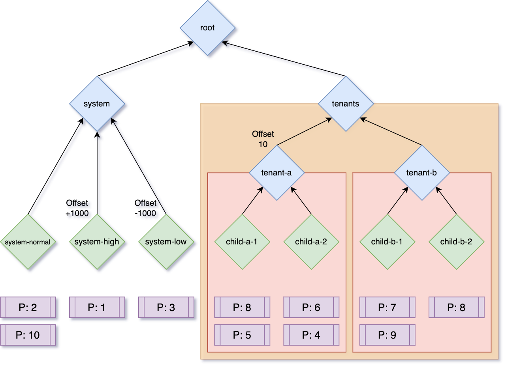

<!--
 * Licensed to the Apache Software Foundation (ASF) under one
 * or more contributor license agreements.  See the NOTICE file
 * distributed with this work for additional information
 * regarding copyright ownership.  The ASF licenses this file
 * to you under the Apache License, Version 2.0 (the
 * "License"); you may not use this file except in compliance
 * with the License.  You may obtain a copy of the License at
 *
 *     http://www.apache.org/licenses/LICENSE-2.0
 *
 * Unless required by applicable law or agreed to in writing, software
 * distributed under the License is distributed on an "AS IS" BASIS,
 * WITHOUT WARRANTIES OR CONDITIONS OF ANY KIND, either express or implied.
 * See the License for the specific language governing permissions and
 * limitations under the License.
 -->

YuniKorn has advanced support for priority scheduling. Priorities are
specified on a per-task basis, but how those priorities are used can be
customized for each queue.

## Request Priority

Every allocation request to the scheduler has a numeric priority associated
with it. Any 32-bit integer value (positive or negative) may be used. Larger
values indicate higher relative priorities.

When using Kubernetes, priorities are defined in `PriorityClass`
objects, which are referenced by `Pod` objects via a `priorityClassName`
property. If no priority class is referenced, a `Pod` inherits the cluster
default priority, typically `0`.

See the Kubernetes [Pod Priority and Preemption](https://kubernetes.io/docs/concepts/scheduling-eviction/pod-priority-preemption/)
documentation for more details.

## Application Priority

During scheduling, applications have a dynamic priority value which resolves
to the highest priority outstanding request in that application. This allows
the scheduler to dynamically reprioritize scheduling decisions.

For example, if an application has two requests, one with priority `10` and
another with priority `20`, the application's dynamic priority will be `20`.
If the higher-priority request is satisfied, the application's priority will
drop to `10`.

When choosing between applications to schedule, the application sorting policy
will (by default) schedule requests from higher-priority applications first.
Priority can be ignored when sorting applications by setting the queue
property `application.sort.priority` to `disabled` on a _leaf_ queue.

## Queue Priority

As with applications, queue priorities are also dynamically computed. For
_parent_ queues, the queue's priority will be equal to the highest priority
child queue it contains. For _leaf_ queues, the queue's priority will be
equal to the highest priority application it contains.

Queue priorities can also be adjusted automatically up or down by a fixed
amount, specified in the `priority.offset` queue property. This can be useful
in larger queue hierarchies to establish low or high priority queues.

For example, if a _leaf_ queue with an offset of `5` contains two
applications, one with priority `10` and another with priority `20`, the
queue's priority will evaluate to `25` (`20 + 5`). If the higher-priority
application no longer has requests, the queue's priority will drop to `15`
(`10 + 5`).

When choosing between child queues to schedule from, the queue sorting policy
will (by default) schedule requests from higher-priority queues first.
Priority can be ignored when sorting queues by setting the queue
property `application.sort.priority` to `disabled` on a _parent_ queue.

## Priority Fencing

By default, priorities have global scope, meaning that higher-priority queues
will be serviced before lower-priority queues regardless of their location
in the queue hierarchy.

However, it can be useful to limit prioritization to a subset of queues. This
can be accomplished by setting the `priority.policy` queue property to
`fence`. When a queue's priority is fenced, priorities are still evaluated
within that queue (and subqueues), but the queue's priority itself will always
evaluate to the `priority.offset` value or `0` if not specified.

## Effective Priority

Because of offsets and fencing, at any time a request may be thought of as
having an _effective_ (or computed) priority based on its location within
the queue hierarchy. Requests with higher effective priorities will be
scheduled before those with lower effective priorities.

## Examples

### Single queue

This example demonstrates a single leaf queue with all properties specified:

```yaml
partitions:
  - name: default
    queues:
    - name: root
      queues:
      - name: default
        properties:
          application.sort.policy: fifo
          application.sort.priority: enabled
          priority.policy: default
          priority.offset: "0"
```

### Multitenancy 

This example demonstrates a complex queue tree containing multiple tenants
with subqueues along with a multiple system queues:


```yaml
partitions:
  - name: default
    queues:
    - name: root
      queues:
      - name: system
        queues:
        - name: system-normal
          properties:
            priority.offset: "0"
        - name: system-high
          properties:
            priority.offset: "1000"
        - name: system-low
          properties:
            priority.offset: "-1000"
      - name: tenants
        properties:
          priority.policy: "fence"
        queues:
          - name: tenant-a
            properties:
              priority.policy: "fence"
              priority.offset: "10"
            queues:
              - name: child-a-1
              - name: child-a-2
          - name: tenant-b
            properties:
              priority.policy: "fence"
              priority.offset: "0"
            queues:
              - name: child-b-1
              - name: child-b-2

```


The `system-normal`, `system-high` and `system-low` queues are unfenced, and
can therefore be prioritized above any other queue in the system. The
`system-high` and `system-low` queues have offsets of `1000` and `-1000`
respectively, so the priority of requests in those queues will be adjusted
accordingly.

The `tenants` _parent_ queue is priority-fenced, and has no `priority.offset`
defined, so this queue will always be treated as though it has priority `0`.
This ensures that normal and high-priority system tasks schedule ahead of
tenant tasks, and low priority system tasks schedule after tenant tasks.

The `tenant-a` and `tenant-b` _parent_ queues are also priority-fenced,
preventing tenants from adjusting their priority relative to one another.
The `tenant-a` queue also has a priority offset to ensure that it always
schedules before `tenant-b`.

The _leaf_ queues of `tenant-a` and `tenant-b` are not fenced, so tasks from
the entire `tenant-a` or `tenant-b` subtree will prioritize relative to each
other, but not outside their respective subtrees.



In the figure above, multiple requests are shown with various priorities.
Before scheduling, the queue priorities will be as follows:

* root
  * system: 1001
    * system-normal: 10
    * system-high: 1001
    * system-low: -997
  * tenants: 0 (fence)
    * tenant-a: 10 (fence)
      * child-a-1: 8
      * child-a-2: 6
    * tenant-b: 0 (fence)
      * child-b-1: 9
      * child-b-2: 8

Queue traversal starts from the root, descending into each child queue in order
starting with the highest effective priority. Assuming sufficient scheduling
resources, the order of schedulding and effective queue priority changes are
as follows:

| Step | Queue                           | Task | Result                                                                                 |
|------|---------------------------------|------|----------------------------------------------------------------------------------------|
|  1   | root.system.system-high         | P1   | **system-high**: `1001` -> n/a <br/> **system**: `1001` -> `10`                        |
|  2   | root.system.system-normal       | P10  | **system-normal**: `10` -> `2` <br/> **system**: `10` -> `2`                           |
|  3   | root.system.system-normal       | P2   | **system-normal**: `2` -> n/a <br/> **system**: `2` -> `-997`                          |
|  4   | root.tenants.tenant-a.child-a-1 | P8   | **child-a-1**: `8` -> `5`                                                              |
|  5   | root.tenants.tenant-a.child-a-2 | P6   | **child-a-2**: `6` -> `4`                                                              |
|  6   | root.tenants.tenant-a.child-a-1 | P5   | **child-a-1**: `5` -> n/a                                                              |
|  7   | root.tenants.tenant-a.child-a-2 | P4   | **child-a-2**: `4` -> n/a <br/> **tenant-a**: `10` -> n/a                              |
|  8   | root.tenants.tenant-b.child-b-1 | P9   | **child-b-1**: `9` -> `7`                                                              |
|  9   | root.tenants.tenant-b.child-b-2 | P8   | **child-b-2**: `8` -> n/a                                                              |
| 10   | root.tenants.tenant-b.child-b-1 | P7   | **child-b-1**: `7` -> n/a <br/> **tenant-b**: `0` -> n/a <br/> **tenants**: `0` -> n/a |
| 11   | root.system.system-low          | P3   | **system-low**: `-997` -> n/a <br/> **system**: `-997` -> n/a                          |

