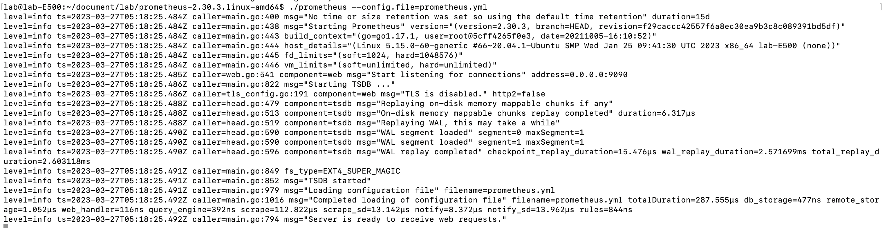
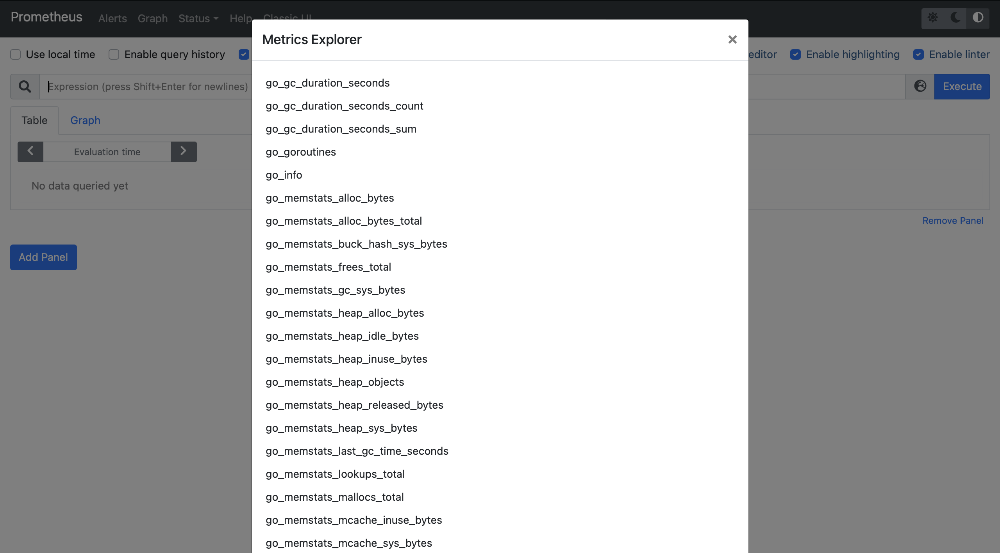
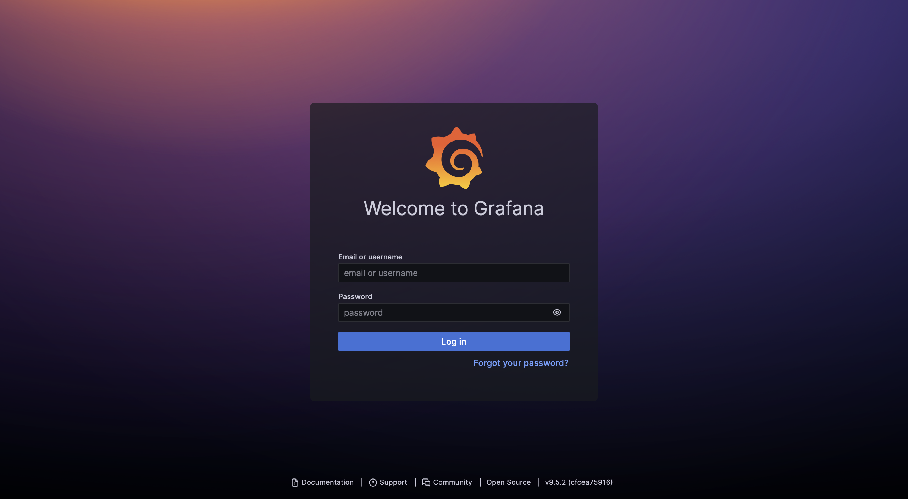
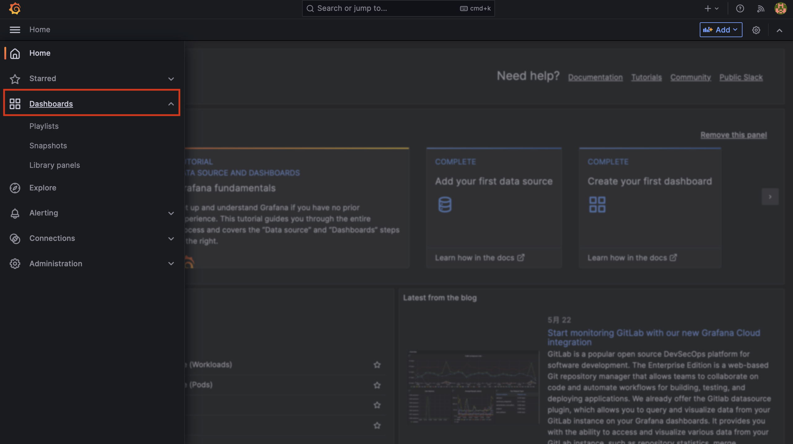
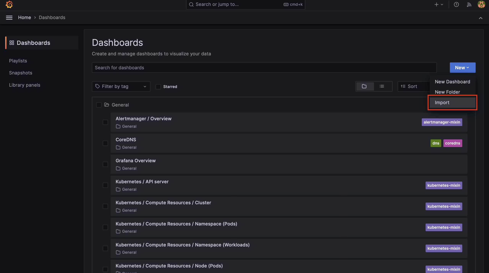
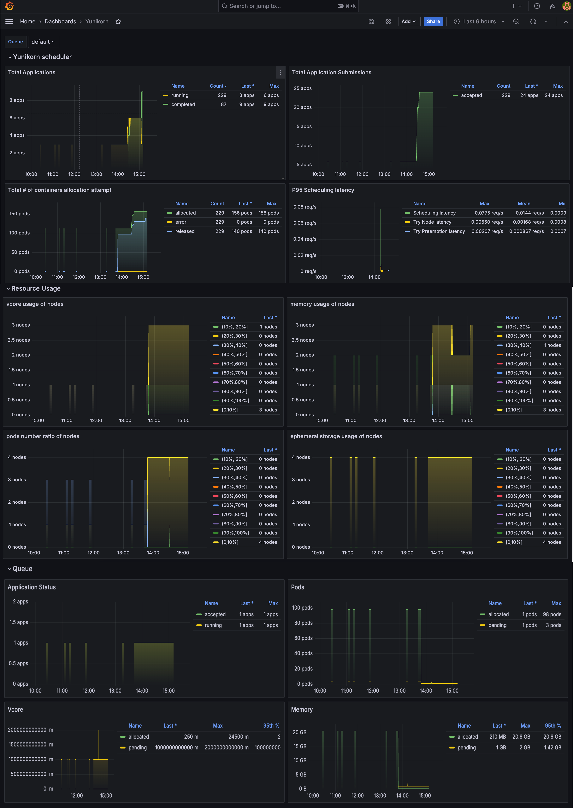

<!--
Licensed to the Apache Software Foundation (ASF) under one
or more contributor license agreements.  See the NOTICE file
distributed with this work for additional information
regarding copyright ownership.  The ASF licenses this file
to you under the Apache License, Version 2.0 (the
"License"); you may not use this file except in compliance
with the License.  You may obtain a copy of the License at

  http://www.apache.org/licenses/LICENSE-2.0

Unless required by applicable law or agreed to in writing,
software distributed under the License is distributed on an
"AS IS" BASIS, WITHOUT WARRANTIES OR CONDITIONS OF ANY
KIND, either express or implied.  See the License for the
specific language governing permissions and limitations
under the License.
-->

YuniKorn exposes its scheduling metrics via Prometheus. Thus, we need to set up a Prometheus server to collect these metrics.

We will provide two methods for building Prometheus: either running it locally or using Helm to deploy it in your cluster. Additionally, in the Helm version, we will explain how to integrate it with Grafana and provide generic Grafana Dashboards for monitoring Yunikorn's metrics and observing the changes over time.

If you don't know what metric can be used, you can use [REST API](scheduler#metrics).

## Run Prometheus locally

### 1. Download Prometheus release

```bash
wget https://github.com/prometheus/prometheus/releases/download/v2.30.3/prometheus-2.30.3.linux-amd64.tar.gz
```

```bash
tar xvfz prometheus-*.tar.gz
cd prometheus-*
```

### 2. Configure prometheus.yml

Prometheus collects metrics from *targets* by scraping metrics HTTP endpoints.

```yaml
global:
  scrape_interval:     3s
  evaluation_interval: 15s

scrape_configs:
  - job_name: 'yunikorn'
    scrape_interval: 1s
    metrics_path: '/ws/v1/metrics'
    static_configs:
    - targets: ['localhost:9080'] 
    # 9080 is internal port, need port forward or modify 9080 to service's port
```

### 3. Start port-forward

Port forwarding for the core's web service on the standard port can be turned on via:

```bash
kubectl port-forward svc/yunikorn-service 9080:9080 -n yunikorn
```

`9080`is the default port for core's web service. 

### 4. Execute prometheus

```bash
./prometheus --config.file=prometheus.yml
```



### 5. Access the Prometheus UI

You should be able to browse to a status page at [localhost:9090](http://localhost:9090/). Give it a couple of seconds to collect data about itself from its own HTTP metrics endpoint.



You can also verify that Prometheus is serving metrics by navigating to its metrics endpoint:[localhost:9090/metrics](http://localhost:9090/metrics)

## Deploy Prometheus and Grafana in a cluster.

### 1. Add Prometheus repository to helm
    
```yaml
# add helm repo
helm repo add prometheus-community https://prometheus-community.github.io/helm-charts
helm repo update
```
    
### 2. Configuring yunikorn for prometheus

Get the config from repository.
```yaml
helm show values prometheus-community/kube-prometheus-stack > /tmp/values.yaml
```

Add a new job in Prometheus to collect metrics by scraping the metrics HTTP endpoints of the targets.

```yaml
vim /tmp/values.yaml
```
```yaml
...
additionalScrapeConfigs:
  - job_name: "yunikorn"
    scrape_interval: 1s
    metrics_path: '/ws/v1/metrics'
    static_configs:
      - targets: ["yunikorn-service.yunikorn.svc.cluster.local:9080"]
...
```
    
### 3. Use helm to create Prometheus

```yaml
# create k8s namespace
kubectl create namespace prometheus

# deploy chart
helm install prometheus prometheus-community/kube-prometheus-stack -n prometheus -f /tmp/values.yaml
```
    
### 4. Access the Prometheus Web UI
    
```yaml
kubectl port-forward -n prometheus svc/prometheus-kube-prometheus-prometheus 9090:9090
```

After running port-forward, you can enter [localhost:9090](http://localhost:9090) to access Prometheus Web UI.

## Access Grafana Dashboard

Port forwarding for the Grafana web service on the standard port can be turned on via:

```yaml
kubectl port-forward -n prometheus svc/prometheus-grafana 7070:80
```

After running port-forward, you can enter [localhost:7070](http://localhost:7070) to access grafana, and in the login page, enter account:`admin` ,password:`prom-operator`.


    
### Download JSON files for Yunikorn Dashboard
    
A dashboard consists of multiple panels that are organized and arranged in rows. Each panel has the ability to interact with data from any Grafana data source that has been configured. For more detailed information, please refer to the [Grafana Dashboards](https://grafana.com/docs/grafana/latest/dashboards).

We provide a sample dashboard JSON file. To access it, you can navigate to the `/deployments/grafana-dashboard` directory in the Yunikorn-k8shim repository.

You can refer to the [REST API](scheduler#metrics) to build your own custom Dashboard.

### Import the JSON files in the Dashboard

Once you access the Dashboard page, you can proceed to import the provided JSON file.





Once the import is complete, you will be able to locate Yunikorn's Dashboard on the page. From there, you can regularly monitor the status of Yunikorn.


