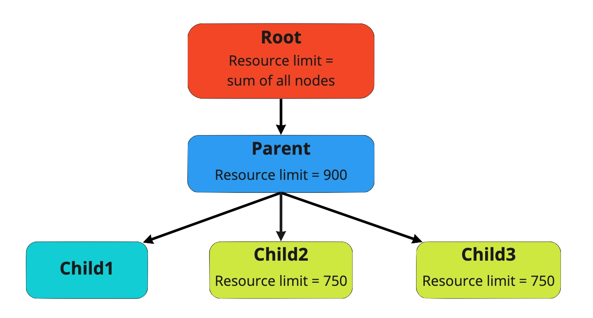

<!--
Licensed to the Apache Software Foundation (ASF) under one
or more contributor license agreements.  See the NOTICE file
distributed with this work for additional information
regarding copyright ownership.  The ASF licenses this file
to you under the Apache License, Version 2.0 (the
"License"); you may not use this file except in compliance
with the License.  You may obtain a copy of the License at

  http://www.apache.org/licenses/LICENSE-2.0

Unless required by applicable law or agreed to in writing,
software distributed under the License is distributed on an
"AS IS" BASIS, WITHOUT WARRANTIES OR CONDITIONS OF ANY
KIND, either express or implied.  See the License for the
specific language governing permissions and limitations
under the License.
-->

## Quota configuration and rules
YuniKorn can offer a finer grained resource quota management setup compared to the simple namespace resource quota provided by Kubernetes.

On Kubernetes a pod must fit into the namespace quota when the pod is submitted. 
If the pod does not fit in the namespace quota the pod is rejected.
The client must implement a retry-mechanism and re-submit the pod if it needs the pod to be scheduled.

Contrary to quotas in Kubernetes YuniKorn does not enforce quotas on submission but only on actively consumed resources.
To explain the difference: when using YuniKorn for quota enforcement a new pod submitted to Kubernetes is always accepted.
Yunikorn will queue the pod without counting the queued pod's resources towards the consumed quota.
When YuniKorn tries to schedule the pod it checks at scheduling time if the pod fits in the quota configured for the queue the pod is assigned to.
If at that point the pod does not fit in the quota the pod is skipped and not counted in the resource consumption. 
This means that until a scheduling attempt of a pod is successful a pod it is not consuming resources in the YuniKorn quota system.

Resource quotas in YuniKorn are linked to the queue and its place in the queue hierarchy.
The base of the queue structure, the `root` queue, does not allow setting a quota as it reflects the current size of the cluster.
Node additions and removals update the `root` queue quota automatically.

Beside the `root` queue the quotas can be set, and is enforced, at any point in the hierarchy. 
Every queue can have a quota set. The quota is enforced recursively throughout the hierarchy.
This means that a child queue can never use more resources than the **configured** quota of the parent queue.
Setting a quota on a child queue larger than its parent queue's quota would thus not have any effect and is handled as a configuration error.

In the hierarchy there are some further rules that need to be considered.
If a parent queue has multiple children the sum of the **usage** of all children combined can never exceed the quota **configured** on the parent.
However, from a configuration perspective this does not mean that the sum of the **configured** quotas for all children must be smaller than the parent quota.



As an example the `root.parent` queue has a quota of 900.
It contains three child queues, two with a quota set.
The `root.parent.child1` has no quota set and will thus be limited to the `root.parent` quota.
The two other queues `root.parent.child2` and `root.parent.child3` each have a quota of 750 set.
During normal operation the total usage of the 3 child queues together will be 900.
The applications running in each child queue have a demand of more than 1000 each.  

Distribution in that case could be any of:
* all 900 used by just the `child1` queue
* spread out evenly over the 3 queues (300 by each)
* `child2` maxed out using 750, and the left over 150 used by `child3`  

The exact distribution between the queues will fluctuate and is dependent on the scheduling policies.

## Converting Kubernetes resources and quotas
Resource support for pods is limited to the resources specified as part of the _requests_ specification:
* _cpu_ is mapped to _vcore_ with the value in milli cpu.
* _memory_ is mapped to _memory_ with the value in MB (1 MB = 10^6 B = 1 000 000 B).
* all other resources are mapped as provided.

Extended resource as per the [Kubernetes documentation](https://kubernetes.io/docs/concepts/configuration/manage-resources-containers/) are supported.

Example pod with a single container:
```yaml
apiVersion: v1
kind: Pod
spec:
  containers:
  - name: container-1
    resources:
      requests:
        cpu: "250m"
        memory: "1Gi"
        hugepages-1Gi: "1"
```
The above specification will set pod resources request for scheduling in YuniKorn to:
* _vcore_ -> 250
* _memory_ -> 1074
* _hugepages-1Gi_ -> 1

Two remarks:  
Multiple container specifications will be aggregated into one total pod resource request automatically.  
All memory is reported in MB with unit conversions applied where needed. 

In the case that static queue definitions are used for a queue there is no limit on the type of resource that can be specified in a quota.
Quota annotations on namespaces, used as part of the automatic queue creation, are limited to the equivalent _cpu_ and _memory_ resources.
See the [setup](#Namespace-quota) below for the annotations on the namespace for quotas.

## Kubernetes and YuniKorn quota interaction
The recommendation is to turn off, not configure, the Kubernetes Namespace quotas.
Using only YuniKorn queue quotas provides a more flexible setup and allows queueing of workloads.  

In a setup that has both YuniKorn and Kubernetes quotas turned on consider the following points:
* Two separate configurations need to be maintained.
  This increases the maintenance burden, and the possibility of configuration mistakes.
* Both quotas will be enforced.
  
Having both quotas turned on can lead to unexpected behaviour.
The main issue is the fact that the Kubernetes namespace quota is enforced on submit.
There are three combinations of quota configuration that are possible. 
The 3 combinations could have two effects when used in combination with the YuniKorn quota.

1. Both quotas are _equal_: workloads will not be queued, the full configured quota can be used.  
   - Maximum usage and queueing will be limited to the set quota
2. Kubernetes quota is _lower_ than YuniKorn: the YuniKorn quota will never be reached and workloads will not be queued.   
   - Maximum usage will be limited to the Kubernetes quota.
3. Kubernetes quota is _higher_ than YuniKorn: YuniKorn will limit the usage to the quota set in YuniKorn.
   The Kubernetes quota will be enforced on submit and thus set the limit for the workload that can be queued on top of the YuniKorn quota.  
   - Maximum usage will be limited to the YuniKorn quota.
   - Workload queueing will be limited to the Kubernetes quota.

:::note
The following configuration examples are just to demonstrate the format needed
to create a queue hierarchy with quotas set.
:::

## Static queue definition

### Goal
A preconfigured hierarchy of queues with a maximum and guaranteed capacity.
The users can only submit applications to the leaf queues.
This approach manages the resource capacity for each of the queues, which is suitable to the scenarios that queues do not change too often.

### Configuration
Apply the following configuration to YuniKorn's configmap to:
* setup 3 queues under `root`
* each queue has a specific guaranteed and maximum capacity
* anyone can submit to any queue

```yaml
partitions:
  - name: default
    queues:
      - name: root
        submitacl: '*'
        queues:
          - name: advertisement
            resources:
              guaranteed:
                memory: 500000
                vcore: 50000
              max:
                memory: 800000
                vcore: 80000
          - name: search
            resources:
              guaranteed:
                memory: 400000
                vcore: 40000
              max:
                memory: 600000
                vcore: 60000
          - name: sandbox
            resources:
              guaranteed:
                memory: 100000
                vcore: 10000
              max:
                memory: 100000
                vcore: 10000
```

### Run a workload
In order to run applications in specific queues, you will need to set the following labels in all pod specs.
All pods with the same `applicationID` label are considered ti be one application.
In the below example the application `my-test-app` will run in the queue `root.sandbox`: 

```yaml
labels:
  app: my-test-app
  applicationId: "my-test-app-01"
  queue: root.sandbox
```

## Namespace to queue mapping

### Goal
Automatically map a Kubernetes `namespace` to a queue in YuniKorn.
The user creates the required namespaces in Kubernetes. 
The YuniKorn k8s shim and core scheduler automatically pass the required information and map the namespace to a queue, creating the queue if it does not exist.
The resource quota will be managed by YuniKorn instead of using the Kubernetes namespace quota.
This does require the namespaces to be setup without Kubernetes quota enforcement and tags as per the [setup](#Namespace-quota) below.

### Configuration
Apply the following configuration to YuniKorn's configmap:

```yaml
partitions:
  - name: default
    placementrules:
      - name: tag
        value: namespace
        create: true
    queues:
      - name: root
        submitacl: '*'
        properties:
          application.sort.policy: stateaware
```

This configuration places an application based on the `tag` rule.
The tag selected is the `namespace` tag which is automatically added by the k8s shim to all applications that get created.
The `create` flag is set to true which will trigger the creation of the queue with the same name as the namespace if it does not exist. 

Applications within the automatically created child queues will be sorted based sorting policy set on the parent queue.
In this case the property `application.sort.policy` is in this configuration set to `stateaware`.
This is a simple app sorting policy applicable for batch jobs, you can find more document [here](sorting_policies.md#StateAwarePolicy).

You can change the configuration using the helm charts during the installation by overwriting the configuration in the
[helm chart template](https://github.com/apache/incubator-yunikorn-release/blob/master/helm-charts/yunikorn/values.yaml#L71-L81).

### Namespace quota
Namespaces in Kubernetes contain the quota information. 
If a quota is set on a namespace Kubernetes will automatically enforce the quota.
In the case that YuniKorn is used for quota enforcement no quota must be set on the namespace.

To allow specifying a quota on the namespace the following annotations should be set in the namespace object:
```yaml
yunikorn.apache.org/namespace.max.cpu: "64"
yunikorn.apache.org/namespace.max.memory: "100Gi"
```
YuniKorn will parse these annotations and set the maximum capacity of the queue mapped to this namespace.
The values specified follow the standard Kubernetes formatting and unit specification.
Currently, we only support mapping memory and cpu not other resource types.

The example above will limit the queue mapped to the annotated namespace to 64 CPUs and 100GB memory.

### Run a workload

Applications, and the pods that are part of the application, can be submitted without specific labels. 
YuniKorn will automatically add the required tags.
The configured placement rule will create the queue, if required, and add the application to the queue.
 
For example, if an application is submitted to namespace `development`, then the application will run in the `root.development` queue.

## Parent queue mapping for namespaces

### Goal
Though the tag placement rule using the `namespace` tag is capable of placing an application in a queue this might not be enough in all setups.
In some cases, multi tenancy for example, namespaces need to be grouped together.
Administrators could annotate namespaces which allows dynamic placement of applications based on multiple annotations if placement rules were setup.
YuniKorn cannot and does not just add all annotations from a namespace to an application.

To help support this grouping case a parent queue can be tagged on a namespace.   

### Configuration
The configuration for this functionality consists of two pieces:
1. the mapping rule
1. the namespace annotation

First we set the following configuration to YuniKorn's configmap:

```yaml
partitions:
  - name: default
    placementrules:
    - name: tag
      value: namespace
      create: true
      parent:
      - name: tag
        value: namespace.parentqueue
    queues:
    - name: root
      queues:
      - name: production
      - name: development
```

The configuration used for the namespace to queue mapping is the same as [above](#Namespace-to-queue-mapping).
As an extension to the placement rule a `parent` rule is added to support the grouping.
The parent rule is used to generate the parent, or the queue above, in the hierarchy.
The rule uses the tag `namespace.parentqueue` from the application to generate the parent queue name.
The `namespace.parentqueue` tag is automatically added by the Kubernetes shim but does require a namespace annotation (see below).

In the example rule configuration given the `create` flag is not set on the parent rule.
This means that the parent queue must exist in the configuration otherwise the application submit will fail.
For the example configuration this means supported values for the parent are thus limited to `production` and `development`.

Quotas cannot be set on the parent queue using any of these mappings.
The quota linked to the namespace is set on the namespace queue not the parent  as per the namespace mapping provided earlier.

Parent queue quotas must always be set directly in the configuration.
This requires the `create` flag to be set to `false` on the parent rule.

### Namespace parent queue
Contrary to the namespace name itself, and inline with the quota settings, the namespaces need to be annotated to use the parent queue mapping.
Namespace names must be unique in Kubernetes which is not affected by this annotation.
The same annotation value may be used for multiple namespaces:
```yaml
yunikorn.apache.org/parentqueue: root.production
```

The example annotation above will map the parent queue to the existing `root.production` queue.
Note that the rule will fully qualify the name if needed, you can thus omit the `root.` part in the annotation.
If the annotation starts with `root.` the system assumes it is a fully qualified queue name.

To complete the picture here is an image that shows the mapping from Kubernetes namespaces to queues in YuniKorn.
It uses the annotations on the namespaces in Kubernetes as described, and the example configuration for the mapping rules.
The `finance` and `sales` namespaces become queues grouped under the parent queue `production`.
The namespaces `dev` and `test` are placed under the `development` parent queue.   


### Run a workload
Applications, and the pods that are part of the application, can be submitted without specific labels or changes.
YuniKorn will add the tags, the placement rules will do the rest.
The configured placement rule will create the queues, if required, and add the application to the queue.

Since the namespace `finance` is annotated with the example value, and the rules are in place.
Applications in the `finance` namespace will run in the `root.production.finance` queue that is created dynamically.
