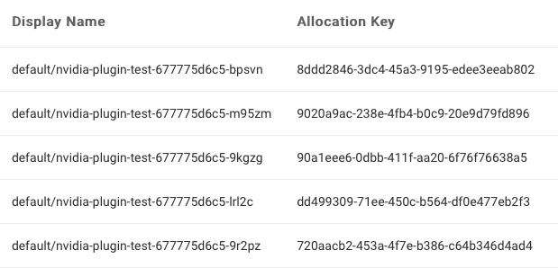

<!--
Licensed to the Apache Software Foundation (ASF) under one
or more contributor license agreements.  See the NOTICE file
distributed with this work for additional information
regarding copyright ownership.  The ASF licenses this file
to you under the Apache License, Version 2.0 (the
"License"); you may not use this file except in compliance
with the License.  You may obtain a copy of the License at

  http://www.apache.org/licenses/LICENSE-2.0

Unless required by applicable law or agreed to in writing,
software distributed under the License is distributed on an
"AS IS" BASIS, WITHOUT WARRANTIES OR CONDITIONS OF ANY
KIND, either express or implied.  See the License for the
specific language governing permissions and limitations
under the License.
-->

## Yunikorn with NVIDIA GPUs
This guide gives an overview of how to set up NVIDIA Device Plugin which enable user to run GPUs with Yunikorn, for more details please check [**Kubernetes with GPUs**](https://docs.nvidia.com/datacenter/cloud-native/kubernetes/install-k8s.html#option-2-installing-kubernetes-using-kubeadm).

### Prerequisite
Before following the steps below, Yunikorn need to deploy on the [**Kubernetes with GPUs**](https://docs.nvidia.com/datacenter/cloud-native/kubernetes/install-k8s.html#install-kubernetes).

### Install NVIDIA Device Plugin
Add the nvidia-device-plugin helm repository.
```
helm repo add nvdp https://nvidia.github.io/k8s-device-plugin
helm repo update
helm repo list
```

Verify the latest release version of the plugin is available.
```
helm search repo nvdp --devel
NAME                     	  CHART VERSION  APP VERSION	   DESCRIPTION
nvdp/nvidia-device-plugin	  0.12.3         0.12.3         A Helm chart for ...
```

Deploy the device plugin
```
kubectl create namespace nvidia
helm install --generate-name nvdp/nvidia-device-plugin --namespace nvidia --version 0.12.3
```

Check the status of the pods to ensure NVIDIA device plugin is running
```
kubectl get pods -A

NAMESPACE      NAME                                      READY   STATUS    RESTARTS      AGE
kube-flannel   kube-flannel-ds-j24fx                     1/1     Running   1 (11h ago)   11h
kube-system    coredns-78fcd69978-2x9l8                  1/1     Running   1 (11h ago)   11h
kube-system    coredns-78fcd69978-gszrw                  1/1     Running   1 (11h ago)   11h
kube-system    etcd-katlantyss-nzxt                      1/1     Running   3 (11h ago)   11h
kube-system    kube-apiserver-katlantyss-nzxt            1/1     Running   4 (11h ago)   11h
kube-system    kube-controller-manager-katlantyss-nzxt   1/1     Running   3 (11h ago)   11h
kube-system    kube-proxy-4wz7r                          1/1     Running   1 (11h ago)   11h
kube-system    kube-scheduler-katlantyss-nzxt            1/1     Running   4 (11h ago)   11h
kube-system    nvidia-device-plugin-1659451060-c92sb     1/1     Running   1 (11h ago)   11h
```

### Testing NVIDIA Device Plugin
Create a gpu test yaml file.
```
# gpu-pod.yaml
	apiVersion: v1
	kind: Pod
	metadata:
	  name: gpu-operator-test
	spec:
	  restartPolicy: OnFailure
	  containers:
	  - name: cuda-vector-add
	    image: "nvidia/samples:vectoradd-cuda10.2"
	    resources:
	      limits:
	         nvidia.com/gpu: 1
```
Deploy the application.
```
kubectl apply -f gpu-pod.yaml
```
Check the logs to ensure the app completed successfully.
```
kubectl get pods gpu-operator-test

NAME                READY   STATUS      RESTARTS   AGE
gpu-operator-test   0/1     Completed   0          9d
```
Check the result.
```
kubectl logs gpu-operator-test
	
[Vector addition of 50000 elements]
Copy input data from the host memory to the CUDA device
CUDA kernel launch with 196 blocks of 256 threads
Copy output data from the CUDA device to the host memory
Test PASSED
Done
```

---
## Enable GPU Time-Slicing (Optional)
GPU time-slicing allow multi-tenant to share single GPU.
To know how the GPU time-slicing works, please refer to [**Time-Slicing GPUs in Kubernetes**](https://docs.nvidia.com/datacenter/cloud-native/gpu-operator/gpu-sharing.html#introduction). This page covers ways to enable GPU scheduling in Yunikorn using [**NVIDIA GPU Operator**](https://catalog.ngc.nvidia.com/orgs/nvidia/containers/gpu-operator).


### Configuration
Specify multiple configurations in a `ConfigMap` as in the following example.
```yaml
# time-slicing-config.yaml
apiVersion: v1
kind: ConfigMap
metadata:
  name: time-slicing-config
  namespace: nvidia
data:
    a100-40gb: |-
        version: v1
        sharing:
          timeSlicing:
            resources:
            - name: nvidia.com/gpu
              replicas: 8
            - name: nvidia.com/mig-1g.5gb
              replicas: 2
            - name: nvidia.com/mig-2g.10gb
              replicas: 2
            - name: nvidia.com/mig-3g.20gb
              replicas: 3
            - name: nvidia.com/mig-7g.40gb
              replicas: 7
    rtx-3070: |-
        version: v1
        sharing:
          timeSlicing:
            resources:
            - name: nvidia.com/gpu
              replicas: 8
```

:::note
If the GPU type in nodes do not include the a100-40gb or rtx-3070, you could modify the yaml file based on existing GPU types.
For example, there are only multiple rtx-2080ti in the local kubernetes cluster.
MIG is not supported by rtx-2080ti, so it could not replace the a100-40gb.
Time slicing is supported by rtx-2080ti, so it could replace rtx-3070.
:::

:::info
MIG support was added to Kubernetes in 2020. Refer to [**Supporting MIG in Kubernetes**](https://www.google.com/url?q=https://docs.google.com/document/d/1mdgMQ8g7WmaI_XVVRrCvHPFPOMCm5LQD5JefgAh6N8g/edit&sa=D&source=editors&ust=1655578433019961&usg=AOvVaw1F-OezvM-Svwr1lLsdQmu3) for details on how this works.
:::

Create a `ConfigMap` in the operator namespace. 
```bash
kubectl create namespace nvidia
kubectl create -f time-slicing-config.yaml
```

### Install NVIDIA GPU Operator
Add the nvidia-gpu-operator helm repository.
```bash
helm repo add nvidia https://helm.ngc.nvidia.com/nvidia
helm repo update
helm repo list
```

Enabling shared access to GPUs with the NVIDIA GPU Operator.
- During fresh install of the NVIDIA GPU Operator with time-slicing enabled.
  ```bash
  helm install gpu-operator nvidia/gpu-operator \
      -n nvidia \
      --set devicePlugin.config.name=time-slicing-config
  ```

- For dynamically enabling time-slicing with GPU Operator already installed.
  ```bash
  kubectl patch clusterpolicy/cluster-policy \
  -n nvidia --type merge \
  -p '{"spec": {"devicePlugin": {"config": {"name": "time-slicing-config"}}}}'
  ```

### Applying the Time-Slicing Configuration
There are two methods:
- Across the cluster

  Install the GPU Operator by passing the time-slicing `ConfigMap` name and the default configuration.
  ```bash
  kubectl patch clusterpolicy/cluster-policy \
    -n nvidia --type merge \
    -p '{"spec": {"devicePlugin": {"config": {"name": "time-slicing-config", "default": "rtx-3070"}}}}'
  ```

- On certain nodes

  Label the node with the required time-slicing configuration in the `ConfigMap`.
  ```bash
  kubectl label node <node-name> nvidia.com/device-plugin.config=rtx-3070
  ```

Once the GPU Operator and Time-Slicing GPUs is installed, check the status of the pods to ensure all the containers are running and the validation is complete.
```bash
kubectl get pods -n nvidia
```

```bash
NAME                                                          READY   STATUS      RESTARTS   AGE
gpu-feature-discovery-qbslx                                   2/2     Running     0          20h
gpu-operator-7bdd8bf555-7clgv                                 1/1     Running     0          20h
gpu-operator-node-feature-discovery-master-59b4b67f4f-q84zn   1/1     Running     0          20h
gpu-operator-node-feature-discovery-worker-n58dv              1/1     Running     0          20h
nvidia-container-toolkit-daemonset-8gv44                      1/1     Running     0          20h
nvidia-cuda-validator-tstpk                                   0/1     Completed   0          20h
nvidia-dcgm-exporter-pgk7v                                    1/1     Running     1          20h
nvidia-device-plugin-daemonset-w8hh4                          2/2     Running     0          20h
nvidia-device-plugin-validator-qrpxx                          0/1     Completed   0          20h
nvidia-operator-validator-htp6b                               1/1     Running     0          20h
```
Verify that the time-slicing configuration is applied successfully.
```bash
kubectl describe node <node-name>
```

```bash
...
Capacity:
  nvidia.com/gpu: 8
...
Allocatable:
  nvidia.com/gpu: 8
...
```

### Testing GPU Time-Slicing
Create a wordload test file `plugin-test.yaml`.
```yaml
# plugin-test.yaml
apiVersion: apps/v1
kind: Deployment
metadata:
  name: nvidia-plugin-test
  labels:
    app: nvidia-plugin-test
spec:
  replicas: 5
  selector:
    matchLabels:
      app: nvidia-plugin-test
  template:
    metadata:
      labels:
        app: nvidia-plugin-test
    spec:
      tolerations:
        - key: nvidia.com/gpu
          operator: Exists
          effect: NoSchedule
      containers:
        - name: dcgmproftester11
          image: nvidia/samples:dcgmproftester-2.1.7-cuda11.2.2-ubuntu20.04
          command: ["/bin/sh", "-c"]
          args:
            - while true; do /usr/bin/dcgmproftester11 --no-dcgm-validation -t 1004 -d 300; sleep 30; done
          resources:
            limits:
              nvidia.com/gpu: 1
          securityContext:
            capabilities:
              add: ["SYS_ADMIN"]
```

Create a deployment with multiple replicas.
```bash
kubectl apply -f plugin-test.yaml
```

Verify that all five replicas are running.
- In pods
  ```bash
  kubectl get pods
  ```

  ```bash
  NAME                                  READY   STATUS    RESTARTS   AGE
  nvidia-plugin-test-677775d6c5-bpsvn   1/1     Running   0          8m8s
  nvidia-plugin-test-677775d6c5-m95zm   1/1     Running   0          8m8s
  nvidia-plugin-test-677775d6c5-9kgzg   1/1     Running   0          8m8s
  nvidia-plugin-test-677775d6c5-lrl2c   1/1     Running   0          8m8s
  nvidia-plugin-test-677775d6c5-9r2pz   1/1     Running   0          8m8s
  ```
- In node
  ```bash
  kubectl describe node <node-name>
  ```

  ```bash
  ...
  Allocated resources:
    (Total limits may be over 100 percent, i.e., overcommitted.)
    Resource           Requests    Limits
    --------           --------    ------
    ...
    nvidia.com/gpu     5           5
  ...
  ```
- In NVIDIA system management Interface
  ```bash
  nvidia-smi
  ```

  ```bash
  +-----------------------------------------------------------------------------+
  | NVIDIA-SMI 520.61.05    Driver Version: 520.61.05    CUDA Version: 11.8     |
  |-------------------------------+----------------------+----------------------+
  | GPU  Name        Persistence-M| Bus-Id        Disp.A | Volatile Uncorr. ECC |
  | Fan  Temp  Perf  Pwr:Usage/Cap|         Memory-Usage | GPU-Util  Compute M. |
  |                               |                      |               MIG M. |
  |===============================+======================+======================|
  |   0  NVIDIA GeForce ...  On   | 00000000:01:00.0  On |                  N/A |
  | 46%   86C    P2   214W / 220W |   4297MiB /  8192MiB |    100%      Default |
  |                               |                      |                  N/A |
  +-------------------------------+----------------------+----------------------+
                                                                                
  +-----------------------------------------------------------------------------+
  | Processes:                                                                  |
  |  GPU   GI   CI        PID   Type   Process name                  GPU Memory |
  |        ID   ID                                                   Usage      |
  |=============================================================================|
  |    0   N/A  N/A   1776886      C   /usr/bin/dcgmproftester11         764MiB |
  |    0   N/A  N/A   1776921      C   /usr/bin/dcgmproftester11         764MiB |
  |    0   N/A  N/A   1776937      C   /usr/bin/dcgmproftester11         764MiB |
  |    0   N/A  N/A   1777068      C   /usr/bin/dcgmproftester11         764MiB |
  |    0   N/A  N/A   1777079      C   /usr/bin/dcgmproftester11         764MiB |
  +-----------------------------------------------------------------------------+
  ```

- In Yunikorn UI applications

