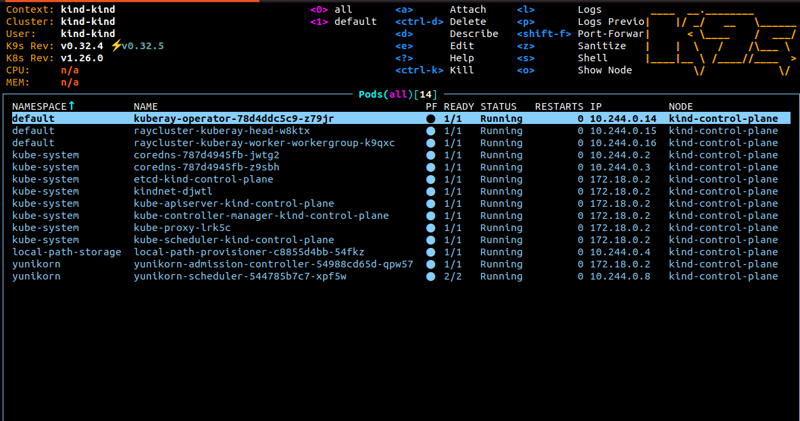

<!--
Licensed to the Apache Software Foundation (ASF) under one
or more contributor license agreements.  See the NOTICE file
distributed with this work for additional information
regarding copyright ownership.  The ASF licenses this file
to you under the Apache License, Version 2.0 (the
"License"); you may not use this file except in compliance
with the License.  You may obtain a copy of the License at

  http://www.apache.org/licenses/LICENSE-2.0

Unless required by applicable law or agreed to in writing,
software distributed under the License is distributed on an
"AS IS" BASIS, WITHOUT WARRANTIES OR CONDITIONS OF ANY
KIND, either express or implied.  See the License for the
specific language governing permissions and limitations
under the License.
-->

## Note
This example demonstrates how to set up [KubeRay](https://docs.ray.io/en/master/cluster/kubernetes/getting-started.html) and run a [Ray Cluster](https://docs.ray.io/en/master/cluster/kubernetes/getting-started/raycluster-quick-start.html) with the YuniKorn scheduler. It relies on an admission controller to configure the default applicationId and queue name.If you want more details, please refer to [Yunikorn supported labels](https://yunikorn.apache.org/docs/user_guide/labels_and_annotations_in_yunikorn) and [Yunikorn queue setting](https://yunikorn.apache.org/docs/user_guide/queue_config).

## Modify YuniKorn settings
Follow [YuniKorn install guide](https://yunikorn.apache.org/docs/) and modify YuniKorn configmap "yunikorn-defaults" to allow ray operator based on k8s service account.
```
kubectl patch configmap yunikorn-defaults -n yunikorn --patch '{"data":{"admissionController.accessControl.systemUsers": "^system:serviceaccount:kube-system:,^system:serviceaccount:default:"}}' 
```

## Setup a KubeRay operator
```
helm repo add kuberay https://ray-project.github.io/kuberay-helm/
helm repo update
helm install kuberay-operator kuberay/kuberay-operator --version 1.1.1
```
- The result should be as shown below


## Create Ray Cluster 
```
helm install raycluster kuberay/ray-cluster --version 1.1.1
```
- Ray Cluster result
  
- YuniKorn UI
  
  
### Configure your Ray Cluster(optional)
If you disable admission controller, you need to add the schedulerName: yunikorn in [raycluster spec](https://github.com/ray-project/kuberay/blob/master/helm-chart/ray-cluster/templates/raycluster-cluster.yaml#L40). By using applicationId label, pods with the same applicationId are marked under the same application .
```
#example
metadata:
  labels:
    applicaionId: ray-cluster-0001
    queue: root.ray.clusters
spec:
  schedulerName: yunikorn # k8s will inform yunikorn based on this
```

## Submit a RayJob to Ray Cluster
```
export HEAD_POD=$(kubectl get pods --selector=ray.io/node-type=head -o custom-columns=POD:metadata.name --no-headers)
echo $HEAD_POD

kubectl exec -it $HEAD_POD -- python -c "import ray; ray.init(); print(ray.cluster_resources())"
```

Services in Kubernetes aren't directly accessible by default. However, you can use port-forwarding to connect to them locally.
```
kubectl port-forward service/raycluster-kuberay-head-svc 8265:8265
```
After port-forward set up, you can access the Ray dashboard by going to `http://localhost:8265` in your web browser.

- Ray Dashboard
  

