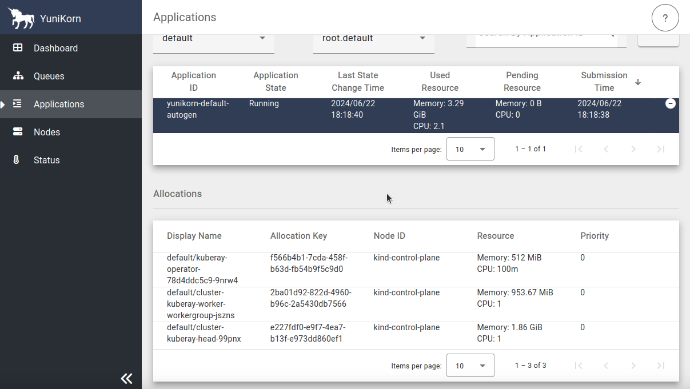

<!--
Licensed to the Apache Software Foundation (ASF) under one
or more contributor license agreements.  See the NOTICE file
distributed with this work for additional information
regarding copyright ownership.  The ASF licenses this file
to you under the Apache License, Version 2.0 (the
"License"); you may not use this file except in compliance
with the License.  You may obtain a copy of the License at

  http://www.apache.org/licenses/LICENSE-2.0

Unless required by applicable law or agreed to in writing,
software distributed under the License is distributed on an
"AS IS" BASIS, WITHOUT WARRANTIES OR CONDITIONS OF ANY
KIND, either express or implied.  See the License for the
specific language governing permissions and limitations
under the License.
-->

This example is how to setup [KubeRay](https://docs.ray.io/en/master/cluster/kubernetes/getting-started.html) and run [Ray Cluster](https://docs.ray.io/en/master/cluster/kubernetes/getting-started/raycluster-quick-start.html) with YuniKorn scheduler

## Modify YuniKorn settings
Follow [YuniKorn install guide](https://yunikorn.apache.org/docs/) and modify YuniKorn configmap "yunikorn-defaults" to allow ray operator based on k8s service account.
```
kubectl patch configmap yunikorn-defaults -n yunikorn --patch '{"data":{"admissionController.accessControl.systemUsers": "^system:serviceaccount:kube-system:,^system:serviceaccount:default:"}}' 
```

## Install Helm
Follow commands to install the Helm ,or refer to the [Helm installation method](https://helm.sh/docs/intro/install/)
```
curl -fsSL -o get_helm.sh https://raw.githubusercontent.com/helm/helm/master/scripts/get-helm-3 \
    && chmod 700 get_helm.sh \
    && ./get_helm.sh
```

## Setup a KubeRay operator
```
helm repo add kuberay https://ray-project.github.io/kuberay-helm/
helm repo update
helm install kuberay-operator kuberay/kuberay-operator --version 1.1.1
```
- The result should be as shown below


## Create Ray Cluster 
```
helm install raycluster kuberay/ray-cluster --version 1.1.1
```
- Ray Cluster result
  
- YuniKorn UI
  

## Submit a RayJob to Ray Cluster
```
export HEAD_POD=$(kubectl get pods --selector=ray.io/node-type=head -o custom-columns=POD:metadata.name --no-headers)
echo $HEAD_POD

kubectl exec -it $HEAD_POD -- python -c "import ray; ray.init(); print(ray.cluster_resources())"
```
- Ray Dashboard
  

