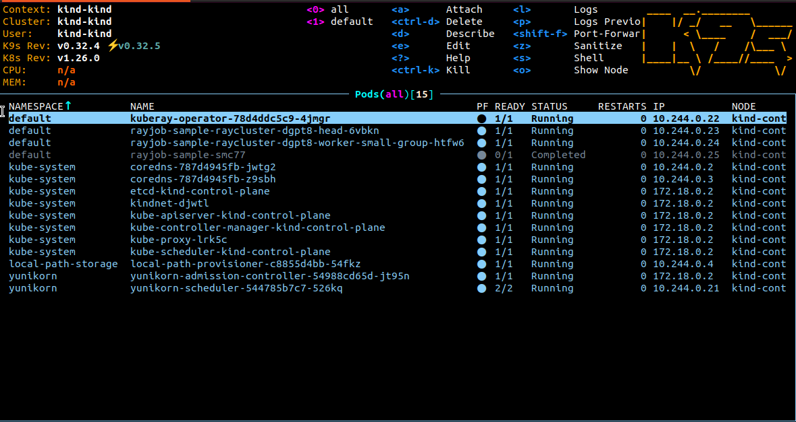

<!--
Licensed to the Apache Software Foundation (ASF) under one
or more contributor license agreements.  See the NOTICE file
distributed with this work for additional information
regarding copyright ownership.  The ASF licenses this file
to you under the Apache License, Version 2.0 (the
"License"); you may not use this file except in compliance
with the License.  You may obtain a copy of the License at

  http://www.apache.org/licenses/LICENSE-2.0

Unless required by applicable law or agreed to in writing,
software distributed under the License is distributed on an
"AS IS" BASIS, WITHOUT WARRANTIES OR CONDITIONS OF ANY
KIND, either express or implied.  See the License for the
specific language governing permissions and limitations
under the License.
-->

This example is how to setup [KubeRay](https://docs.ray.io/en/master/cluster/kubernetes/getting-started.html) and run [Ray Job](https://docs.ray.io/en/master/cluster/kubernetes/getting-started/rayjob-quick-start.html) with YuniKorn scheduler

## Modify YuniKorn settings
Follow [YuniKorn install](https://yunikorn.apache.org/docs/) and modify YuniKorn configmap "yunikorn-defaults"
```
kubectl patch configmap yunikorn-defaults -n yunikorn --patch '{"data":{"admissionController.accessControl.systemUsers": "^system:serviceaccount:kube-system:,^system:serviceaccount:default:"}}' 
```

## Setup a KubeRay operator
```
helm repo add kuberay https://ray-project.github.io/kuberay-helm/
helm repo update
helm install kuberay-operator kuberay/kuberay-operator --version 1.1.1
```
### Configure your application(optional)
If you disable admin controller, you need to add the schedulerName: yunikorn in [operator spec](https://github.com/ray-project/kuberay/blob/master/helm-chart/kuberay-operator/templates/deployment.yaml#L31).

## Run a RayJob
```
kubectl apply -f https://raw.githubusercontent.com/ray-project/kuberay/v1.1.1/ray-operator/config/samples/ray-job.sample.yaml
```

- View the job status
    
- Ray Dashboard
    
- YuniKorn UI
    