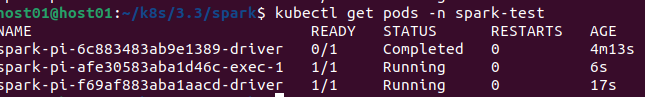
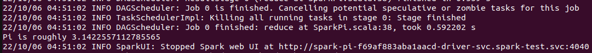

<!--
Licensed to the Apache Software Foundation (ASF) under one
or more contributor license agreements.  See the NOTICE file
distributed with this work for additional information
regarding copyright ownership.  The ASF licenses this file
to you under the Apache License, Version 2.0 (the
"License"); you may not use this file except in compliance
with the License.  You may obtain a copy of the License at

  http://www.apache.org/licenses/LICENSE-2.0

Unless required by applicable law or agreed to in writing,
software distributed under the License is distributed on an
"AS IS" BASIS, WITHOUT WARRANTIES OR CONDITIONS OF ANY
KIND, either express or implied.  See the License for the
specific language governing permissions and limitations
under the License.
-->

:::note
This document assumes you have YuniKorn and its admission-controller both installed. Please refer to
[get started](../../get_started/get_started.md) to see how that is done.
:::

## Prepare the docker image for Spark

To run Spark on Kubernetes, you'll need the Spark docker images. You can 1) use the docker images provided by the Spark
team, or 2) build one from scratch.
If you want to build your own Spark docker image, you can find the [full instructions](https://spark.apache.org/docs/latest/building-spark.html)
in the Spark documentation. Simplified steps:
* Download a Spark version that has Kubernetes support, URL: https://github.com/apache/spark
* Build spark with Kubernetes support:
```shell script
./build/mvn -Pkubernetes -DskipTests clean package
```
Recommendation is to use the official images with different spark versions in the [dockerhub](https://hub.docker.com/r/apache/spark/tags)


## Create a namespace for Spark jobs

Create a namespace:

```shell script
cat <<EOF | kubectl apply -f -
apiVersion: v1
kind: Namespace
metadata:
  name: spark-test
EOF
```

## Create service account and role binding

Create service account and role bindings inside the `spark-test` namespace:

```shell script
cat <<EOF | kubectl apply -n spark-test -f -
apiVersion: v1
kind: ServiceAccount
metadata:
  name: spark
  namespace: spark-test
---
apiVersion: rbac.authorization.k8s.io/v1
kind: Role
metadata:
  name: spark-role
  namespace: spark-test
rules:
- apiGroups: [""]
  resources: ["pods"]
  verbs: ["get", "watch", "list", "create", "delete"]
- apiGroups: [""]
  resources: ["configmaps"]
  verbs: ["get", "create", "delete"]
---
apiVersion: rbac.authorization.k8s.io/v1
kind: RoleBinding
metadata:
  name: spark-role-binding
  namespace: spark-test
subjects:
- kind: ServiceAccount
  name: spark
  namespace: spark-test
roleRef:
  kind: Role
  name: spark-role
  apiGroup: rbac.authorization.k8s.io
EOF
```

:::note
Do NOT use `ClusterRole` and `ClusterRoleBinding` to run Spark jobs in production, please configure a more fine-grained
security context for running Spark jobs. See more about how to configure proper RBAC rules [here](https://kubernetes.io/docs/reference/access-authn-authz/rbac/).
:::

## Submit a Spark job

If this is running from local machine, you will need to start the proxy in order to talk to the api-server.
```shell script
kubectl proxy
```

There are official images with different spark versions in the [dockerhub](https://hub.docker.com/r/apache/spark/tags)
Run a simple SparkPi job, this assumes that the Spark binaries are installed locally in the `/usr/local` directory.
```shell script
export SPARK_HOME=/usr/local/spark/
${SPARK_HOME}/bin/spark-submit --master k8s://http://localhost:8001 --deploy-mode cluster --name spark-pi \
   --master k8s://http://localhost:8001 --deploy-mode cluster --name spark-pi \
   --class org.apache.spark.examples.SparkPi \
   --conf spark.executor.instances=1 \
   --conf spark.kubernetes.namespace=spark-test \
   --conf spark.kubernetes.executor.request.cores=1 \
   --conf spark.kubernetes.container.image=docker.io/apache/spark:v3.3.0 \
   --conf spark.kubernetes.authenticate.driver.serviceAccountName=spark \
   local:///opt/spark/examples/jars/spark-examples_2.12-3.3.0.jar
```

:::note
There are more options for setting the driver and executor in the [spark](https://spark.apache.org/docs/latest/running-on-kubernetes.html#configuration).
Assigning the applicationId and the queue path are possible.
```
--conf spark.kubernetes.executor.label.applicationId=application-spark-0001
--conf spark.kubernetes.driver.label.applicationId=application-spark-0001
--conf spark.kubernetes.executor.label.queue=root.default.sandbox
--conf spark.kubernetes.driver.label.queue=root.default.sandbox
```
:::

You'll see Spark driver and executors been created on Kubernetes:



The spark-pi result is in the driver pod.



## What happens behind the scenes?

When the Spark job is submitted to the cluster, the job is submitted to `spark-test` namespace. The Spark driver pod will
be firstly created under this namespace. Since this cluster has YuniKorn admission-controller enabled, when the driver pod
get created, the admission-controller mutates the pod's spec and injects `schedulerName=yunikorn`, by doing this, the
default K8s scheduler will skip this pod and it will be scheduled by YuniKorn instead. See how this is done by [configuring
another scheduler in Kubernetes](https://kubernetes.io/docs/tasks/extend-kubernetes/configure-multiple-schedulers/).

The default configuration has placement rule enabled, which automatically maps the `spark-test` namespace to a YuniKorn
queue `root.spark-test`. All Spark jobs submitted to this namespace will be automatically submitted to the queue first.
To see more about how placement rule works, please see doc [placement-rules](user_guide/placement_rules.md). By far,
the namespace defines the security context of the pods, and the queue determines how the job and pods will be scheduled
with considering of job ordering, queue resource fairness, etc. Note, this is the simplest setup, which doesn't enforce
the queue capacities. The queue is considered as having unlimited capacity.

YuniKorn reuses the Spark application ID set in label `spark-app-selector`, and this job is submitted
to YuniKorn and being considered as a job. The job is scheduled and running as there is sufficient resources in the cluster.
YuniKorn allocates the driver pod to a node, binds the pod and starts all the containers. Once the driver pod gets started,
it requests for a bunch of executor pods to run its tasks. Those pods will be created in the same namespace as well and
scheduled by YuniKorn as well.
