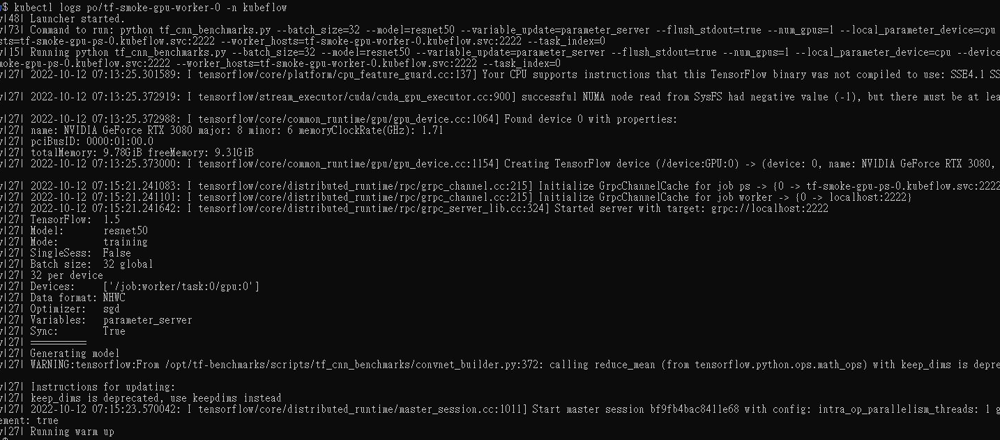

<!--
Licensed to the Apache Software Foundation (ASF) under one
or more contributor license agreements.  See the NOTICE file
distributed with this work for additional information
regarding copyright ownership.  The ASF licenses this file
to you under the Apache License, Version 2.0 (the
"License"); you may not use this file except in compliance
with the License.  You may obtain a copy of the License at

  http://www.apache.org/licenses/LICENSE-2.0

Unless required by applicable law or agreed to in writing,
software distributed under the License is distributed on an
"AS IS" BASIS, WITHOUT WARRANTIES OR CONDITIONS OF ANY
KIND, either express or implied.  See the License for the
specific language governing permissions and limitations
under the License.
-->

This guide gives an overview of how to set up [training-operator](https://github.com/kubeflow/training-operator)
and how to run a Tensorflow job with YuniKorn scheduler. The training-operator is a unified training operator maintained by
Kubeflow. It not only supports TensorFlow but also PyTorch, XGboots, etc.

## Install training-operator
You can use the following command to install training operator in kubeflow namespace by default. If you have problems with installation,
please refer to [this doc](https://github.com/kubeflow/training-operator#installation) for details.
```
kubectl apply -k "github.com/kubeflow/training-operator/manifests/overlays/standalone?ref=v1.3.0"
```

## Prepare the docker image
Before you start running a TensorFlow job on Kubernetes, you'll need to build the docker image.
1. Download files from [deployment/examples/tfjob](https://github.com/apache/yunikorn-k8shim/tree/master/deployments/examples/tfjob)
2. To build this docker image with the following command

```
docker build -f Dockerfile -t kubeflow/tf-dist-mnist-test:1.0 .
```

## Run a TensorFlow job
Here is a TFJob yaml for MNIST [example](https://github.com/apache/yunikorn-k8shim/blob/master/deployments/examples/tfjob/tf-job-mnist.yaml).

```yaml
apiVersion: kubeflow.org/v1
kind: TFJob
metadata:
  name: dist-mnist-for-e2e-test
  namespace: kubeflow
spec:
  tfReplicaSpecs:
    PS:
      replicas: 2
      restartPolicy: Never
      template:
        metadata:
          labels:
            applicationId: "tf_job_20200521_001"
            queue: root.sandbox
        spec:
          schedulerName: yunikorn
          containers:
            - name: tensorflow
              image: kubeflow/tf-dist-mnist-test:1.0
    Worker:
      replicas: 4
      restartPolicy: Never
      template:
        metadata:
          labels:
            applicationId: "tf_job_20200521_001"
            queue: root.sandbox
        spec:
          schedulerName: yunikorn
          containers:
            - name: tensorflow
              image: kubeflow/tf-dist-mnist-test:1.0
```
Create the TFJob
```
kubectl create -f deployments/examples/tfjob/tf-job-mnist.yaml
```
You can view the job info from YuniKorn UI. If you do not know how to access the YuniKorn UI,
please read the document [here](../../get_started/get_started.md#access-the-web-ui).


## Using Time-Slicing GPU

### Prerequisite
To use Time-Slicing GPU your cluster must be configured to use GPUs and Time-Slicing GPUs.
- Nodes must have GPUs attached.
- Kubernetes version 1.24
- GPU drivers must be installed on the cluster
- Use the [GPU Operator](https://docs.nvidia.com/datacenter/cloud-native/gpu-operator/getting-started.html) to automatically setup and manage the NVIDA software components on the worker nodes.
- Set the Configuration of [Time-Slicing GPUs in Kubernetes](https://docs.nvidia.com/datacenter/cloud-native/gpu-operator/gpu-sharing.html)


Once the GPU Operator and Time-Slicing GPUs is installed, check the status of the pods to ensure all the containers are running and the validation is complete :
```shell script
kubectl get pod -n gpu-operator
```
```shell script
NAME                                                          READY   STATUS      RESTARTS       AGE
gpu-feature-discovery-fd5x4                                   2/2     Running     0              5d2h
gpu-operator-569d9c8cb-kbn7s                                  1/1     Running     14 (39h ago)   5d2h
gpu-operator-node-feature-discovery-master-84c7c7c6cf-f4sxz   1/1     Running     0              5d2h
gpu-operator-node-feature-discovery-worker-p5plv              1/1     Running     8 (39h ago)    5d2h
nvidia-container-toolkit-daemonset-zq766                      1/1     Running     0              5d2h
nvidia-cuda-validator-5tldf                                   0/1     Completed   0              5d2h
nvidia-dcgm-exporter-95vm8                                    1/1     Running     0              5d2h
nvidia-device-plugin-daemonset-7nzvf                          2/2     Running     0              5d2h
nvidia-device-plugin-validator-gj7nn                          0/1     Completed   0              5d2h
nvidia-operator-validator-nz84d                               1/1     Running     0              5d2h
```
Verify that the time-slicing configuration is applied successfully :

```shell script
kubectl describe node
```

```shell script
Capacity:
  nvidia.com/gpu:     16
...
Allocatable:
  nvidia.com/gpu:     16
...
```
### Teasting TensorFlow job with GPUs
This section covers a workload test scenario to validate TFJob with Time-slicing GPU.

1. Create a workload test file `tf-gpu.yaml` as follows:
  ```shell script
  vim tf-gpu.yaml
  ```
  ```yaml
  apiVersion: "kubeflow.org/v1"
  kind: "TFJob"
  metadata:
    name: "tf-smoke-gpu"
    namespace: kubeflow
  spec:
    tfReplicaSpecs:
      PS:
        replicas: 1
        template:
          metadata:
            creationTimestamp: 
            labels:
              applicationId: "tf_job_20200521_001"
          spec:
            schedulerName: yunikorn
            containers:
              - args:
                  - python
                  - tf_cnn_benchmarks.py
                  - --batch_size=32
                  - --model=resnet50
                  - --variable_update=parameter_server
                  - --flush_stdout=true
                  - --num_gpus=1
                  - --local_parameter_device=cpu
                  - --device=cpu
                  - --data_format=NHWC
                image: docker.io/kubeflow/tf-benchmarks-cpu:v20171202-bdab599-dirty-284af3
                name: tensorflow
                ports:
                  - containerPort: 2222
                    name: tfjob-port
                workingDir: /opt/tf-benchmarks/scripts/tf_cnn_benchmarks
            restartPolicy: OnFailure
      Worker:
        replicas: 1
        template:
          metadata:
            creationTimestamp: null
            labels:
              applicationId: "tf_job_20200521_001"
          spec:
            schedulerName: yunikorn
            containers:
              - args:
                  - python
                  - tf_cnn_benchmarks.py
                  - --batch_size=32
                  - --model=resnet50
                  - --variable_update=parameter_server
                  - --flush_stdout=true
                  - --num_gpus=1
                  - --local_parameter_device=cpu
                  - --device=gpu
                  - --data_format=NHWC
                image: docker.io/kubeflow/tf-benchmarks-gpu:v20171202-bdab599-dirty-284af3
                name: tensorflow
                ports:
                  - containerPort: 2222
                    name: tfjob-port
                resources:
                  limits:
                    nvidia.com/gpu: 2
                workingDir: /opt/tf-benchmarks/scripts/tf_cnn_benchmarks
            restartPolicy: OnFailure
  ```
2. Create the TFJob
  ```shell script
  kubectl apply -f tf-gpu.yaml
  ```
3. Verify that TFJob are running on YuniKorn:
  
    Check the log of the pod:
    ```shell script
    kubectl logs logs po/tf-smoke-gpu-worker-0 -n kubeflow
    ```
    ```
    .......
    ..Found device 0 with properties:
    ..name: NVIDIA GeForce RTX 3080 major: 8 minor: 6 memoryClockRate(GHz): 1.71

    .......
    ..Creating TensorFlow device (/device:GPU:0) -> (device: 0, name: NVIDIA GeForce RTX 3080, pci bus id: 0000:01:00.0, compute capability: 8.6)
    .......
    ```
    