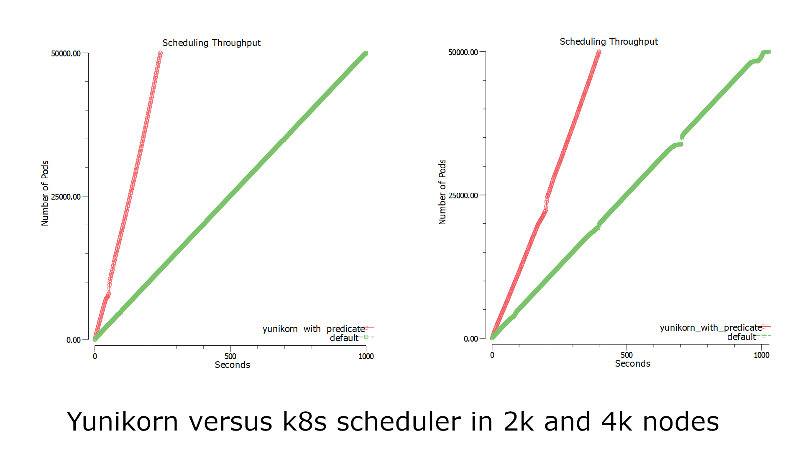
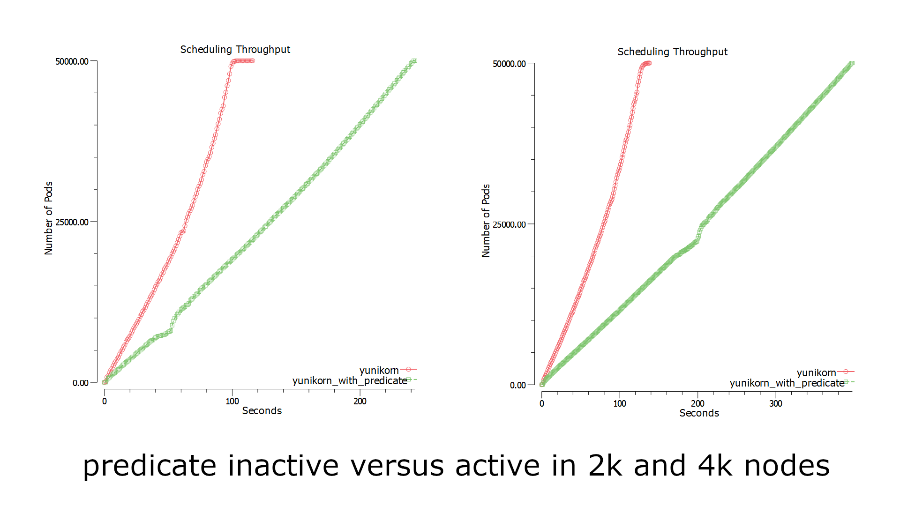
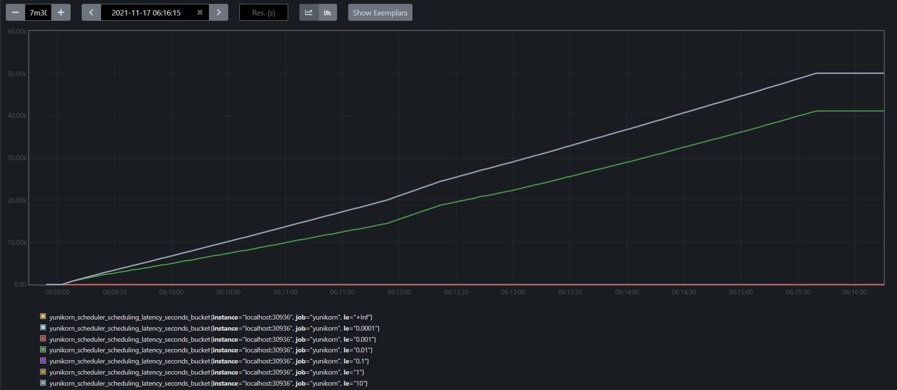
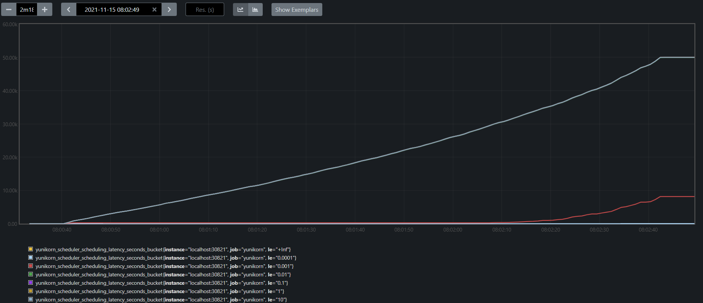

<!--
Licensed to the Apache Software Foundation (ASF) under one
or more contributor license agreements.  See the NOTICE file
distributed with this work for additional information
regarding copyright ownership.  The ASF licenses this file
to you under the Apache License, Version 2.0 (the
"License"); you may not use this file except in compliance
with the License.  You may obtain a copy of the License at

  http://www.apache.org/licenses/LICENSE-2.0

Unless required by applicable law or agreed to in writing,
software distributed under the License is distributed on an
"AS IS" BASIS, WITHOUT WARRANTIES OR CONDITIONS OF ANY
KIND, either express or implied.  See the License for the
specific language governing permissions and limitations
under the License.
-->

The YuniKorn community concerns about the scheduler’s performance and continues to optimize it over the releases. The community has developed some tools in order to test and tune the performance repeatedly.

## Environment setup 

We leverage [Kubemark](https://github.com/kubernetes/kubernetes/blob/release-1.3/docs/devel/kubemark-guide.md#starting-a-kubemark-cluster) to evaluate scheduler’s performance. Kubemark is a testing tool that simulates large scale clusters. It create hollow nodes which runs hollow kubelet to pretend original kubelet behavior. Scheduled pods on these hollow nodes won’t actually execute. It is able to create a big cluster that meets our experiment requirement that reveals the yunikorn scheduler performance. Please see the [detail steps](performance/performance_tutorial.md) about how to setup the environment.

## Scheduler Throughput

We have designed some simple benchmarking scenarios on a simulated large scale environment in order to evaluate the scheduler performance. Our tools measure the [throughput](https://en.wikipedia.org/wiki/Throughput) and use these key metrics to evaluate the performance. In a nutshull, scheduler throughput is the rate of processing pods from discovering them on the cluster to allocating them to nodes.

In this experiment, we setup a simulated 2000/4000 nodes cluster with [Kubemark](https://github.com/kubernetes/kubernetes/blob/release-1.3/docs/devel/kubemark-guide.md#starting-a-kubemark-cluster). Then we launch 10 [deployments](https://kubernetes.io/docs/concepts/workloads/controllers/deployment/), with setting replicas to 5000 in each deployment respectively. This simulates large scale workloads submitting to the K8s cluster simultaneously. Our tool periodically monitors and checks pods status, counting the number of started pods based on `podSpec.StartTime` as time elapses. As a comparison, we apply the same experiment to the default scheduler in the same environment. And we see the YuniKorn performance advantage over the default scheduler as illustrated below:

Fig 1. Yunikorn and default scheduler throughput 

The charts record the time spent until all pods are running on the cluster:

|  Number of Nodes  | yunikorn        | k8s default scheduler		| Diff    |
|------------------	|:--------------:	|:---------------------: |:-----:  |
| 2000(nodes)       | 204(pods/sec)			| 49(pods/sec)			        |   416%  |
| 4000(nodes)       | 115(pods/sec)			| 48(pods/sec)			        |   240%  |

In order to normalize the result, we have been running the tests for several rounds. As shown above, YuniKorn achieves a `2x` ~ `4x` performance gain comparing to the default scheduler.

:::note

Like other performance testing, the result is highly variable depending on the underlying hardware, e.g server CPU/memory, network bandwidth, I/O speed, etc. To get an accurate result that applies to your environment, we encourage you to run these tests on a cluster that is close to your production environment.

:::

## Performance Analysis

The results we got from the experiment are promising. We further take a deep dive to analyze the performance by observing more internal YuniKorn metrics, and we are able to locate a few key areas affecting the performance.

### K8s Limitation

We found the overall performance actually is capped by the K8s master services, such as api-server, controller-manager and etcd, it did not reached the limit of YuniKorn in all our experiments. If you look at the internal scheduling metrics, you can see:

Fig 2. Yunikorn metric in 4k nodes 

Figure 2 is a screenshot from Prometheus, which records the [internal metrics](performance/metrics.md) `containerAllocation` in YuniKorn. They are the number of pods being allocated by the scheduler, but have not necessarily been bound to nodes. It consumes roughly 122 seconds to finish scheduling 50k pods, i.e 410 pod/sec. The actual throughput drops to 115 pods/sec, and the extra time was used to bind the pods on different nodes. If K8s side could catch up, we will see a better result. Actually, when we tune the performance on a large scale cluster, the first thing we do is to tune up some parameters in API-server, controller manager in order to increase the throughput. See more in the [performance tutorial doc](performance/performance_tutorial.md).

### Node Sorting

When the cluster size grows, we see an obvious performance drop in YuniKorn. This is because in YuniKorn, we do a full sorting of the cluster nodes in order to find the **"best-fit"** node for a given pod. Such strategy makes the pods distribution more optimal based on the [node sorting policy](../../user_guide/sorting_policies#node-sorting) being used. However, sorting nodes is expensive, doing this in the scheduling cycle creates a lot of overhead. To overcome this, we have improved our node sorting mechanism in [YUNIKORN-807](https://issues.apache.org/jira/browse/YUNIKORN-807), the idea behind of this is to use a [B-Tree](https://en.wikipedia.org/wiki/B-tree) to store all nodes and applies an incremental updates when necessary. This significantly improves the latency, according to our benchmark testing, this improves 35x, 42x, 51x, 74x respectively on 500, 1000, 2000 and 5000 nodes clusters.

### Per Node Precondition Checks

In each scheduling cycle, another time consuming part is the "Precondition Checks" for a node. In this phase, YuniKorn evaluates all K8s standard predicates, e.g node-selector, pod affinity/anti-affinity, etc, in order to qualify a pod is fit onto a node. These evaluations are expensive.

We have done two experiments to compare the case where the predicates evaluation was enabled with being disabled. See the results below:

Fig 3. Predicate effect comparison in yunikorn 

When the predicates evaluation is disabled, the throughput improves a lot. We looked further into the latency distribution of the entire scheduling cycle and the predicates-eval latency. And found: 

Fig 4. predicate latency 

Fig 5. Scheduling time with predicate active 

Fig 6. Scheduling time with predicate inactive 

Overall, YuniKorn scheduling cycle runs really fast, and the latency drops in **0.001s - 0.01s** range per cycle. And the majority of the time was used for predicates evaluation, 10x to other parts in the scheduling cycle.

|				| scheduling latency distribution(second)	| predicates-eval latency distribution(second)	|
|-----------------------	|:---------------------:		|:---------------------:			|
| predicates enabled		| 0.01 - 0.1				| 0.01-0.1					|
| predicates disabled		| 0.001 - 0.01				| none						|

## Why YuniKorn is faster?

The default scheduler was created as a service-oriented scheduler; it is less sensitive in terms of throughput compared to YuniKorn. YuniKorn community works really hard to keep the performance outstanding in the line and keep improving it. The reasons that YuniKorn can run faster than the default scheduler are:

* Short Circuit Scheduling Cycle

YuniKorn keeps the scheduling cycle short and efficient. YuniKorn uses all async communication protocol to make sure all the critical paths are non-blocking calls. Most of the places are just doing in-memory calculation which can be highly efficient. The default scheduler leverages [scheduling framework](https://kubernetes.io/docs/concepts/scheduling-eviction/scheduling-framework/), it provides lots of flexibility to extend the scheduler, however, the trade-off is the performance. The scheduling cycle becomes to be a really long chain because it needs to visit all these plugins.

* Async Events Handling

YuniKorn leverages an async event handling framework to deal with internal states. And this allows the core scheduling cycle can run fast without being blocked by any expensive calls. An example is the default scheduler needs to write state updates, events to pod objects, that is done inside of the scheduling cycle. This involves persisting data to etcd which could be slow. YuniKorn, instead, caches all such events in a queue and writes back to the pod in asynchronous manner. 

* Faster Node Sorting

After [YUNIKORN-807](https://issues.apache.org/jira/browse/YUNIKORN-807), YuniKorn does the incremental node sorting which is highly efficient. This is built on top of the so-called "resource-weight" based node scoring mechanism, and it is also extensible via plugins. All these together reduce the overhead while computing node scores. In comparison, the default scheduler provides a few extension points for calculating node scores, such as `PreScore`, `Score` and `NormalizeScore`. These computations are heavy and they are called in every scheduling cycle. See details in [code lines](https://github.com/kubernetes/kubernetes/blob/481459d12dc82ab88e413886e2130c2a5e4a8ec4/pkg/scheduler/framework/runtime/framework.go#L857).

## Summary

During the tests, we found YuniKorn is performing really well, especially compared to the default scheduler. We have identified the major factors in YuniKorn where we can continue to improve the performance, and also explained why YuniKorn is performing better than the default scheduler. We also realized the limitations while scaling Kubernetes to thousands of nodes, that can be alleviated by using other techiques such as, e.g federation. At a result, YuniKorn is a high-efficient, high-throughput scheduler that perfectly positioned for running batch/mixed workloads on Kubernetes.
