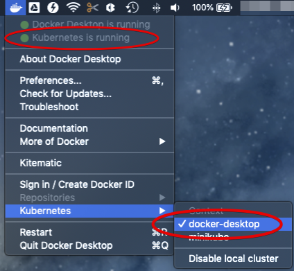
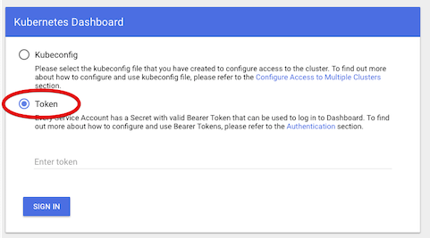
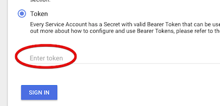
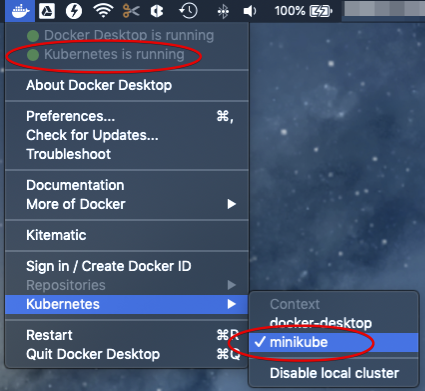
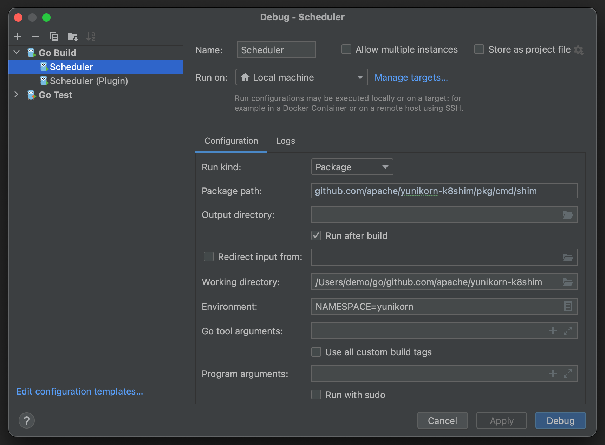

<!--
Licensed to the Apache Software Foundation (ASF) under one
or more contributor license agreements.  See the NOTICE file
distributed with this work for additional information
regarding copyright ownership.  The ASF licenses this file
to you under the Apache License, Version 2.0 (the
"License"); you may not use this file except in compliance
with the License.  You may obtain a copy of the License at

  http://www.apache.org/licenses/LICENSE-2.0

Unless required by applicable law or agreed to in writing,
software distributed under the License is distributed on an
"AS IS" BASIS, WITHOUT WARRANTIES OR CONDITIONS OF ANY
KIND, either express or implied.  See the License for the
specific language governing permissions and limitations
under the License.
-->

There are several ways to setup a local development environment for Kubernetes.
The three most common ones are **Minikube** ([docs](https://kubernetes.io/docs/setup/minikube/)),
**Docker Desktop** and **Kind** ([docs](https://kind.sigs.k8s.io/)).
**Minikube** provisions a local Kubernetes cluster on several Virtual Machines
(via VirtualBox or something similar).

**Docker Desktop**, on the other hand, sets up Kubernetes cluster using a local
Docker installation.

**Kind** provides lightweight Kubernetes clusters for Windows, Linux and Mac
using an existing Docker installation.

## Local Kubernetes cluster using Docker Desktop

In this tutorial, we will base all the installs on Docker Desktop.
Even in this case we can use a lightweight [minikube](#local-kubernetes-cluster-with-minikube)
setup which gives the same functionality with less impact.

### Installation

Download and install [Docker Desktop](https://www.docker.com/products/docker-desktop).
Newer Docker versions have an embedded version of Kubernetes so no additional
installation is needed. Follow the instructions [here](https://docs.docker.com/docker-for-mac/#kubernetes)
to get Kubernetes up and running within Docker Desktop.
Alternatively, a Kind cluster may be created (see instructions
[here](https://kind.sigs.k8s.io/docs/user/quick-start/#creating-a-cluster).

Once Kubernetes is started in Docker Desktop, you should see something similar
to this:



This means that:

1. Kubernetes is running.
2. The command line tool `kubectl` is installed in the `/usr/local/bin` directory.
3. The Kubernetes context is set to `docker-desktop`.

### Deploy and access dashboard

Optionally, after setting up Kubernetes you may wish to deploy the Kubernetes
Dashboard Web UI. The dashboard may be deployed using the following steps:

1. Follow the instructions [here](https://github.com/kubernetes/dashboard) to deploy the dashboard.
2. Start the Kubernetes proxy in the background from a terminal to get access on the dashboard on the local host:   
    ```shell script
    kubectl proxy &
    ```
3. Access the dashboard [here](http://localhost:8001/api/v1/namespaces/kube-system/services/https:kubernetes-dashboard:/proxy/#!/login).

### Access local Kubernetes cluster

The dashboard as deployed in the previous step requires a token or config to
sign in. Here we use the token to sign in. The token is generated
automatically and can be retrieved from the system.

1. Retrieve the name of the dashboard token:
    ```shell script
    kubectl -n kube-system get secret | grep kubernetes-dashboard-token
    ```
2. Retrieve the content of the token. Note that the token name ends with a random
   5 character code and needs to be replaced with the result of step 1. As an
   example:
    ```shell script
    kubectl -n kube-system describe secret kubernetes-dashboard-token-tf6n8
    ```
3. Copy the token value which is part of the `Data` section with the tag `token`.
4. Select the **Token** option in the dashboard web UI:<br/>
    
5. Paste the token value into the input box and sign in:<br/>
    

## Local Kubernetes cluster with Minikube
Minikube can be added to an existing Docker Desktop install. Minikube can
either use the pre-installed hypervisor or use a hypervisor of your choice.
These instructions use [HyperKit](https://github.com/moby/hyperkit) which is
embedded in Docker Desktop.

If you want to use a different hypervisor then HyperKit make sure that you
follow the generic minikube install instructions. Do not forget to install
the correct driver for the chosen hypervisor if required. The minikube
installation instructions can be found [here](https://kubernetes.io/docs/tasks/tools/install-minikube/).

Docker Desktop should have already installed HyperKit. To verify this, open a
terminal and run: `hyperkit`. Any response other than
`hyperkit: command not found` confirms that HyperKit is installed and on
the path. If it is not found you can choose a different hypervisor or
fix the Docker Desktop install.

### Installing Minikube
1. Install minikube, either via `brew` or directly via these steps: 
    ```shell script
    curl -Lo minikube https://storage.googleapis.com/minikube/releases/latest/minikube-darwin-amd64
    chmod +x minikube
    sudo mv minikube /usr/local/bin
    ```
2. Install HyperKit driver (required). You can either use `brew` or directly via these steps:
    ```shell script
    curl -LO https://storage.googleapis.com/minikube/releases/latest/docker-machine-driver-hyperkit
    sudo install -o root -g wheel -m 4755 docker-machine-driver-hyperkit /usr/local/bin/
    ```
3. Update the minikube configuration to default to using HyperKit:
   ```shell script
   minikube config set vm-driver hyperkit
   ```
4. Change Docker Desktop to use minikube for Kubernetes:<br/>
    

### Deploy and access the cluster
After the installation is done you can start a new cluster.
1. Start the minikube cluster:
   ```shell script
   minikube start --kubernetes-version v1.24.7
   ```
2. Start the minikube dashboard:
   ```shell script
   minikube dashboard &
   ```

### Build impact
When you create images make sure that the build is run after pointing it to
the correct cluster. Without setting the environment minikube might not find
the docker images when deploying the scheduler.

1. Make sure minikube is started.
2. In the terminal where you wll run the build, execute:
   ```shell script
   eval $(minikube docker-env)
   ```
3. Run the image build from the yunikorn-k8shim repository root:
   ```shell script
   make image
   ```
4. Deploy the scheduler as per the normal instructions.

## Local Kubernetes Cluster with Kind

Kind (Kubernetes in Docker) is a lightweight tool for running lightweight
Kubernetes environments. It is very easy to test different Kubernetes versions
with Kind by specifing the version during cluster setup.

### Installation

If you have go installed, you can run:
```shell script
go install sigs.k8s.io/kind@latest
```

Other installation methods can be found on the Kind
[website](https://kind.sigs.k8s.io/docs/user/quick-start/#installation).

Kind version 0.15 is required for Kubernetes 1.25 or later.
Later versions of Kind add Kubernetes 1.26, 1.27 and 1.28.
Check the Kind release notes for the specific Kubernetes releases supported.

### Using Kind

To test a new version of Kubernetes, you can pull a corresponding image from
kind's repository.

For example, to create a cluster running Kubernetes 1.26.6:
```shell script
kind create cluster --name test --image kindest/node:v1.26.6
```

Kind will download the appropriate image and launch a new cluster named
`test`. The active Kubernetes cluster will also be changed to `test`.

To delete the kind cluster:
```shell script
kind delete cluster --name test
```

### Loading your images

In order to use a local image, you have to load your images into kind's
registry.  If you run `make image`, you could use the following command
to load your kind image.  This assumes AMD64 architecture.

The scheduler, web-ui and admission-controller examples are below:

```shell script
kind load docker-image apache/yunikorn:scheduler-amd64-latest
kind load docker-image apache/yunikorn:web-amd64-latest
kind load docker-image apache/yunikorn:admission-amd64-latesta
```

If running on an ARM system, replace `amd64` with `arm64` above.

## Debug code locally

The scheduler may be run locally for debugging. This example assumes
you have installed the GoLand IDE for development.

In GoLand, open the `yunikorn-k8shim` project. Then click "Run" ->
"Debug..." -> "Edit Configuration..." to get the pop-up configuration
window. Note, you need to click "+" to create a new profile if the `Go Build`
option is not available at the first time.



Set the following values in the dialog (as shown):

- Run Kind: Package
- Package path: `github.com/apache/yunikorn-k8shim/pkg/cmd/shim`
- Working directory: Project base directory (`yunikorn-k8shim`)
- Program arguments: Empty
- Environment: If `KUBECONFIG` is not set globally, ensure it is set here.
  Additionally, you may want to set `NAMESPACE=yunikorn`, as otherwise
  YuniKorn will look for the `yunikorn-configs` ConfigMap under the
  `default` Kubernetes namespace.

Once the changes are done, click "Apply", then "Debug". You will need to
set proper breakpoints in order to debug the program.

## Debug the scheduler plugin

The scheduler may also be run in plugin mode. In this mode, the YuniKorn
scheduler is built on top of the default scheduler and runs as a
plugin (rather than completely standalone). Functionally, it performs the
same tasks, but relies on the upstream Kubernetes scheduler codebase for
common functionality.

The run configuration for the scheduler in plugin mode is as follows:

- Run Kind: Package
- Package path: `github.com/apache/yunikorn-k8shim/pkg/cmd/schedulerplugin`
- Working directory: Project base directory (`yunikorn-k8shim`)
- Program arguments:
  ```
  --bind-address=0.0.0.0
  --leader-elect=false
  --config=conf/scheduler-config-local.yaml
  -v=2
  ```
- Environment: If `KUBECONFIG` is not set globally, ensure it is set here.
  Additionally, you may want to set `NAMESPACE=yunikorn`, as otherwise
  YuniKorn will look for the `yunikorn-configs` ConfigMap under the
  `default` Kubernetes namespace.

Additionally, before running for the first time, run `make init` from a
terminal in the root of the `yunikorn-k8shim` repository. This will
generate the contents of `conf/scheduler-config-local.yaml`, which is
required.

## Access remote Kubernetes cluster

This setup assumes you have already installed a remote Kubernetes cluster. 
For a generic view on how to access a multiple cluster and integrate it follow
the [accessing multiple clusters](https://kubernetes.io/docs/tasks/access-application-cluster/configure-access-multiple-clusters/)
documentation from Kubernetes.

Or follow these simplified steps:
1. Get the Kubernetes `config` file from remote cluster, copy it to the local
   machine and give it a unique name i.e. `config-remote`
2. Save the `KUBECONFIG` environment variable (if set)
    ```shell script
    export KUBECONFIG_SAVED=$KUBECONFIG
    ```
3. Add the new file to the environment variable
    ```shell script
    export KUBECONFIG=$KUBECONFIG:config-remote
    ``` 
4. Run the command `kubectl config view` to check that both configs can be accessed
5. Switch context using `kubectl config use-context remote-cluster`
6. Confirm that the current context is now switched to the remote cluster config:
    ```text
    kubectl config get-contexts
    CURRENT NAME           CLUSTER                AUTHINFO
            docker-desktop docker-desktop-cluster docker-for-desktop
    *       remote-cluster kubernetes             kubernetes-admin
    ```

More documentation can be found
[here](https://kubernetes.io/docs/concepts/configuration/organize-cluster-access-kubeconfig/).
