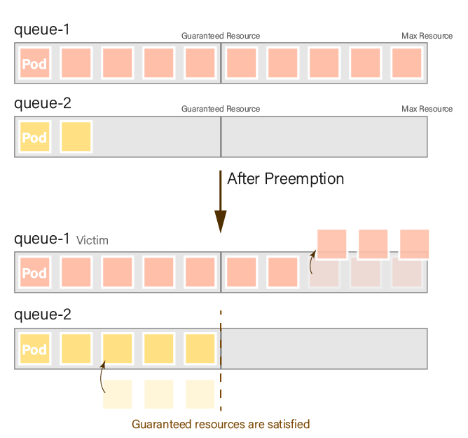
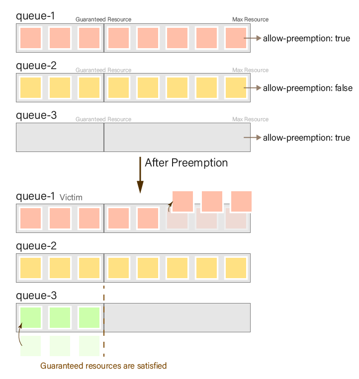
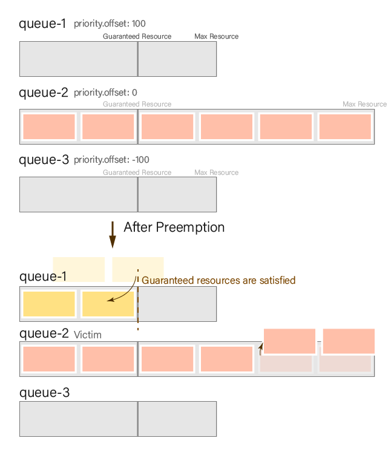
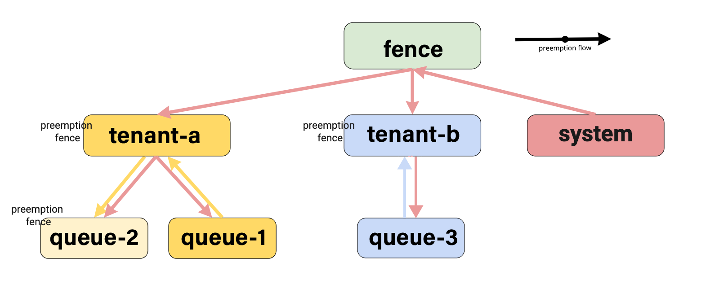
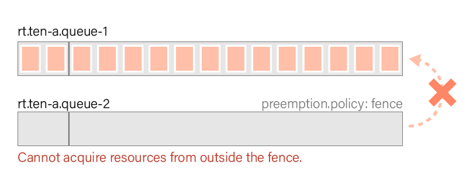
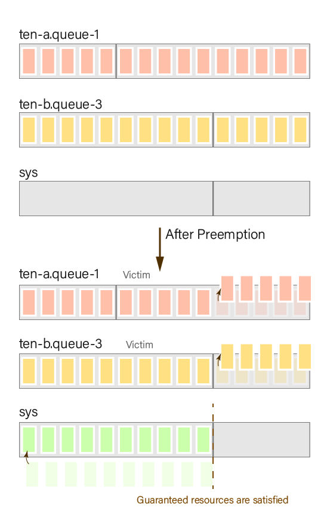

<!--
Licensed to the Apache Software Foundation (ASF) under one
or more contributor license agreements.  See the NOTICE file
distributed with this work for additional information
regarding copyright ownership.  The ASF licenses this file
to you under the Apache License, Version 2.0 (the
"License"); you may not use this file except in compliance
with the License.  You may obtain a copy of the License at

  http://www.apache.org/licenses/LICENSE-2.0

Unless required by applicable law or agreed to in writing,
software distributed under the License is distributed on an
"AS IS" BASIS, WITHOUT WARRANTIES OR CONDITIONS OF ANY
KIND, either express or implied.  See the License for the
specific language governing permissions and limitations
under the License.
-->

Preemption is an essential feature found in most schedulers, and it plays a crucial role in enabling key system functionalities like DaemonSets in K8s, as well as SLA and prioritization-based features.

This document provides a brief introduction to the concepts and configuration methods of preemption in YuniKorn. For a more comprehensive understanding of YuniKorn's design and practical ideas related to preemption, please refer to the [design document](design/preemption.md).

## Kubernetes Preemption

Preemption in Kubernetes operates based on priorities. Starting from Kubernetes 1.14, you can configure preemption by adding a `preemptionPolicy` to the `PriorityClass`. However, it is important to note that preemption in Kubernetes is solely based on the priority of the pod during scheduling. The full documentation can be found [here](https://kubernetes.io/docs/concepts/scheduling-eviction/pod-priority-preemption/#preemption).

While Kubernetes does support preemption, it does have some limitations. Preemption in Kubernetes only occurs during the scheduling cycle and does not change once the scheduling is complete. However, when considering batch or data processing workloads, it becomes necessary to account for the possibility of opting out at runtime.

## YuniKorn Preemption

In Yunikorn, we offer two preemption types: general and DaemonSet. DaemonSet preemption is much more straightforward, as it ensures that pods which must run on a particular node are allowed to do so. The rest of the documentation only concerns generic preemption. For a comprehensive explanation of DaemonSet preemption, please consult the [design document](design/simple_preemptor.md).

YuniKorn's generic preemption is based on a hierarchical queue model, enabling pods to opt out of running. Preemption is triggered after a specified delay, ensuring that each queue's resource usage reaches at least the guaranteed amount of resources. To configure the delay time for preemption triggering, you can utilize the `preemption.delay` property in the configuration.

To prevent the occurrence of preemption storms or loops, where subsequent preemption tasks trigger additional preemption tasks, we have designed seven preemption laws. These laws are as follows:

1. Preemption policies are strong suggestions, not guarantees
2. Preemption can never leave a queue lower than its guaranteed capacity
3. A task cannot preempt other tasks in the same application
4. A task cannot trigger preemption unless its queue is under its guaranteed capacity
5. A task cannot be preempted unless its queue is over its guaranteed capacity
6. A task can only preempt a task with lower or equal priority
7. A task cannot preempt tasks outside its preemption fence

For a detailed explanation of these preemption laws, please refer to the preemption [design document](design/preemption.md#the-laws-of-preemption).

Next, we will provide a few examples to help you understand the functionality and impact of preemption, allowing you to deploy it effectively in your environment. You can find the necessary files for the examples in the yunikorn-k8shim/deployment/example/preemption directory.

Included in the files is a YuniKorn configuration that defines the queue configuration as follows:

```bash
queues.yaml: |
    partitions: 
    - name: default
      placementrules:
        - name: provided
          create: true
      queues:
        - name: root
          submitacl: '*'
          properties:
            preemption.policy: fence
            preemption.delay: 10s
          queues:
          - name: 1-normal ...
          - name: 2-no-guaranteed ...
          - name: 3-priority-class ...
          - name: 4-priority-queue ...
          - name: 5-fence ...
```

Each queue corresponds to a different example, and the preemption will be triggered 10 seconds after deployment, as indicated in the configuration `preemption.delay: 10s`.

### General Preemption Case

In this case, we will demonstrate the outcome of triggering preemption when the queue resources are distributed unevenly in a general scenario.

We will deploy 10 pods with a resource requirement of 1 to both `queue-1` and `queue-2`. First, we deploy to `queue-1` and then introduce a few seconds delay before deploying to `queue-2`. This ensures that the resource usage in `queue-1` will exceed that of `queue-2`, depleting all resources in the parent queue and triggering preemption.

| Queue            | Max Resource | Guaranteed Resource |
| ---------------- | ------------ | ------------------- |
| `normal`         | 12           | - (not configured)  |
| `normal.queue-1` | 10           | 5                   |
| `normal.queue-2` | 10           | 5                   |

Result:

When a set of guaranteed resources is defined, preemption aims to ensure that all queues satisfy their guaranteed resources. Preemption stops once the guaranteed resources are met (law 4). A queue may be preempted if it has more resources than its guaranteed amount. For instance, in this case, if queue-1 has fewer resources than its guaranteed amount (\<5), it will not be preempted (law 5).

| Queue            | Resource before preemption | Resource after preemption |
| ---------------- | -------------------------- | ------------------------- |
| `normal.queue-1` | 10 (victim)                | 7                         |
| `normal.queue-2` | 2                          | 5 (guaranteed minimum)    |



### Priority

In general, a pod can preempt a pod with equal or lower priority. You can set the priority by defining a [PriorityClass](https://kubernetes.io/docs/concepts/scheduling-eviction/pod-priority-preemption/) or by utilizing [queue priorities](priorities).

While preemption allows service-type pods to scale up or down through preemption, it can also lead to the preemption of pods that should not be preempted in certain scenarios:

1. Spark Jobs, where the driver pod manages a large number of jobs, and if preempted, all jobs will be affected.
2. Interactive pods, such as Python notebooks, have a significant impact when restarted and should be avoided from preemption.

To address this issue, we have designed a "do not preempt me" flag. You can set the annotation `yunikorn.apache.org/allow-preemption` to `false` in the PriorityClass to prevent pod requests from being preempted. 
> **_NOTE:_** The flag `yunikorn.apache.org/allow-preemption` is a request only. It is not guaranteed but Pods annotated with this flag will be preempted last.


### PriorityClass

In this example, we will demonstrate the configuration of `yunikorn.apache.org/allow-preemption` using PriorityClass and observe its effect. The default value for this configuration is set to `true`.

```bash
apiVersion: scheduling.k8s.io/v1
kind: PriorityClass
metadata:
  name: preemption-not-allow
  annotations:
    "yunikorn.apache.org/allow-preemption": "false"
value: 0
```

We will deploy 8 pods with a resource requirement of 1 to `queue-1`, `queue-2`, and `queue-3`, respectively. We will deploy to `queue-1` and `queue-2` first, followed by a few seconds delay before deploying to `queue-3`. This ensures that the resource usage in `queue-1` and `queue-2` will be greater than that in `queue-3`, depleting all resources in the parent queue and triggering preemption.

| Queue        | Max Resource | Guaranteed Resource | `allow-preemption` |
| ------------ | ------------ | ------------------- | ------------------ |
| `rt`         | 16           | -                   |                    |
| `rt.queue-1` | 8            | 3                   | `true`             |
| `rt.queue-2` | 8            | 3                   | `false`            |
| `rt.queue-3` | 8            | 3                   | `true`             |

Result:

When preemption is triggered, `queue-3` will start searching for a victim. However, since `queue-2` is set with allow-preemption as false, the resources of `queue-1` will be preempted.

Please note that setting `yunikorn.apache.org/allow-preemption` is a strong recommendation but does not guarantee the lack of preemption. When this flag is set to `false`, it moves the Pod to the back of the preemption list, giving it a lower priority for preemption compared to other Pods. However, in certain scenarios, such as when no other preemption options are available, Pods with this flag may still be preempted.

For example, even with `allow-preemption` set to `false`, DaemonSet pods can still trigger preemption. Additionally, if an application in `queue-1` has a higher priority than one in `queue-3`, the application in `queue-2` will be preempted because an application can never preempt another application with a higher priority. In such cases where no other preemption options exist, the `allow-preemption` flag may not prevent preemption.


| Queue        | Resource before preemption | Resource after preemption |
| ------------ | -------------------------- | ------------------------- |
| `rt.queue-1` | 8 (victim)                 | 5                         |
| `rt.queue-2` | 8                          | 8                         |
| `rt.queue-3` | 0                          | 3 (guaranteed minimum)    |



### Priority Queue

In addition to utilizing the default PriorityClass in Kubernetes, you can configure priorities directly on a [YuniKorn queue](priorities).

In the following example, we will demonstrate preemption based on queue priority.

We will deploy five pods with a resource demand of 3 in the `high-pri` queue, `norm-pri` queue, and `low-pri` queue, respectively. We will deploy them to the `norm-pri` queue first, ensuring that the resources in the `root`(parent queue) will be fully utilized. This will result in uneven resource distribution among the queues, triggering preemption.

| Queue           | Max Resource | Guaranteed Resource | priority.offset |
| --------------- | ------------ | ------------------- | --------------- |
| `root`          | 18           | -                   |                 |
| `root.high-pri` | 10           | 6                   | 100             |
| `root.norm-pri` | 18           | 6                   | 0               |
| `root.low-pri`  | 10           | 6                   | -100            |

Result:

A queue with higher priority can preempt resources from a queue with lower priority, and preemption stops when the queue has preempted enough resources to satisfy its guaranteed resources.

| Queue           | Resource before preemption | Resource after preemption |
| --------------- | -------------------------- | ------------------------- |
| `root.high-pri` | 0                          | 6 (guaranteed minimum)    |
| `root.norm-pri` | 18 (victim)                | 12                        |
| `root.low-pri`  | 0                          | 0                         |



### Preeemption Fence

In a multi-tenant environment, it is essential to prevent one tenant from occupying the resources of another tenant. In YuniKorn, we map tenants to a queue hierarchy, the queue hierarchy can thus cross tenant boundaries.

To address this issue, YuniKorn introduces a [preemption fence](design/preemption.md#preemption-fence), which is a setting on the queue that prevents preemption from looking at queues outside the fence boundary.  The fence is a one-way fence. It prevents going out (i.e. higher up the queue hierarchy), but does not prevent coming in (or down) the queue hierarchy.

```bash
...
queues:
- name: default
  properties:
    preemption.policy: fence
```

We will use the following diagram as an example:



In this example, we will sequentially deploy 15 pods with a resource requirement of 1 to each sub-queue.

First, we deploy `queue-1` in `tenant-a` and wait until the application in `queue-1` occupies all the resources of `tenant-a`. Then, we deploy `queue-2` after the resources of `tenant-a` are fully utilized. Next, we deploy the application `ten-b.queue-3` and allocate resources to the system when the fence queue is full.

| Queue              | Max Resource | Guaranteed Resource | fence |
| ------------------ | ------------ | ------------------- | ----- |
| `rt`               | 3            | -                   | true  |
| `rt.ten-a`         | 15           | 5                   | true  |
| `rt.ten-a.queue-1` | 15           | 2                   |       |
| `rt.ten-a.queue-2` | 15           | 2                   | true  |
| `rt.ten-b`         | 15           | 10                  | true  |
| `rt.ten-b.queue-3` | 15           | 10                  |       |
| `rt.sys`           | 15           | 10                  |       |

Result:

In this example, two imbalances are observed:

- Within `ten-a`, `queue-1` occupies all the resources, while `queue-2` has no resources. However, since `queue-2` is configured with a fence, it cannot acquire resources from outside the fence.
  
- Inside the `rt` queue, both `ten-a` and `ten-b` occupy all the resources, while the `sys` queue has no resources, and no fence is set up. Therefore, the `sys` queue can acquire resources from the queues in the hierarchy until its guaranteed resources are met. In this case, the `sys` queue acquires resources from both `ten-a` and `ten-b`.
  

| Queue              | Resource before preemption | Resource after preemption |
| ------------------ | -------------------------- | ------------------------- |
| `rt.ten-a`         | 15                         | 10                        |
| `rt.ten-a.queue-1` | 15                         | 10                        |
| `rt.ten-a.queue-2` | 0                          | 0                         |
| `rt.ten-b`         | 15                         | 10                        |
| `rt.ten-b.queue-3` | 15                         | 10                        |
| `rt.sys`           | 0                          | 10                        |