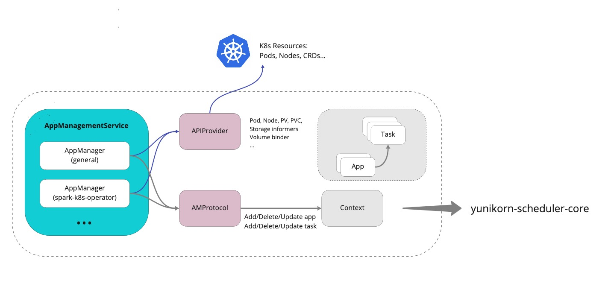

<!--
Licensed to the Apache Software Foundation (ASF) under one
or more contributor license agreements.  See the NOTICE file
distributed with this work for additional information
regarding copyright ownership.  The ASF licenses this file
to you under the Apache License, Version 2.0 (the
"License"); you may not use this file except in compliance
with the License.  You may obtain a copy of the License at

  http://www.apache.org/licenses/LICENSE-2.0

Unless required by applicable law or agreed to in writing,
software distributed under the License is distributed on an
"AS IS" BASIS, WITHOUT WARRANTIES OR CONDITIONS OF ANY
KIND, either express or implied.  See the License for the
specific language governing permissions and limitations
under the License.
-->

## The Problem

Currently, we schedule and group an application is based on a label on the pod.
This generic way works for any type of workload. It does however give us a limited information on the lifecycle
and application. On the K8s side, operators have been introduced to provide more detail on the application
and help scheduling. We cannot use them currently and want to add that functionality.

## K8s Operator Pattern

[K8s operator](https://kubernetes.io/docs/concepts/extend-kubernetes/operator/)
is a pattern in K8s to manage applications, it's a handy way to manage application's lifecycle out-of-box on K8s.
You define several CRDs and some controllers to monitor and mutate the state of the application based on the CRD definition.

For example in [spark-k8s-operator](https://github.com/GoogleCloudPlatform/spark-on-k8s-operator),
it defines a CRD called `SparkApplication`, the controller watches the events of add/update/delete of this CRD
and trigger corresponding actions on event notifications. The `SparkApplication` looks like
[this example](https://github.com/GoogleCloudPlatform/spark-on-k8s-operator/blob/master/examples/spark-pi.yaml). There
are a lot more popular operators, such as [flink-k8s-operator](https://github.com/GoogleCloudPlatform/flink-on-k8s-operator),
 [tf-operator](https://github.com/kubeflow/tf-operator), [pytorch-operator](https://github.com/kubeflow/pytorch-operator), etc. 

Use Spark as an example. YuniKorn is able to schedule resources for all pods in K8s, that seamlessly supports Spark. It
works with [native Spark on K8s](https://spark.apache.org/docs/latest/running-on-kubernetes.html), or
[spark on K8s with operator](https://github.com/GoogleCloudPlatform/spark-on-k8s-operator/blob/master/docs/design.md#architecture),
you'll find the difference from the design architecture chart from the given link. To support native Spark on K8s,
YuniKorn reads pods' spec and group Spark pods by a label-selector, based on `spark-app-selector`.
The operator approach gives us more context about the Spark job, such as a better understanding about job state.
But all these info requires us to look at `SparkApplication` CRD, currently, there is no neat way to
add such functionality. That's why we need to design a flexible approach to support 3rd party operators
(retrieving info from their CRDs), so we can easily integrate with other operators with small effort.

## Design

The key issue here is we need a app-management interface, that can be easily extended.
It needs to be decoupled with existing scheduling logic. For each operator, we create a service to manage this type app's lifecycle,
and communicate with the scheduling cache independently. The high-level design looks like below:

Where
- `AppManagementService` is a composite set of services that can be managed together.
- `AppManager` is a specific app management service for a particular type of application. In each service, it has
   access to K8s clients, such as informers, listers, in order to monitor CRD events. And it collects necessary info
   and talk with scheduler cache through `AMProtocol`.
- `APIProvider` encapsulate a set of useful APIs that can be shared, such as kube-client, pod/node/storage informers, etc.
   Each of such informers, it can be shared with multiple app managers, to avoid the overhead.
- `AMProtocol` defines the basic interaction contract between app manager and the scheduler cache, that helps the cache
   to performs app lifecycle management without understanding what type of the application it is.

In the upon chart, the AppManagementService has 2 services, the _general_ one is managing normal applications, that
recognizes applications by pod labels; the _spark-k8s-operator_ one watches `SparkApplication` CRD and manage jobs'
lifecycle defined by this CRD.