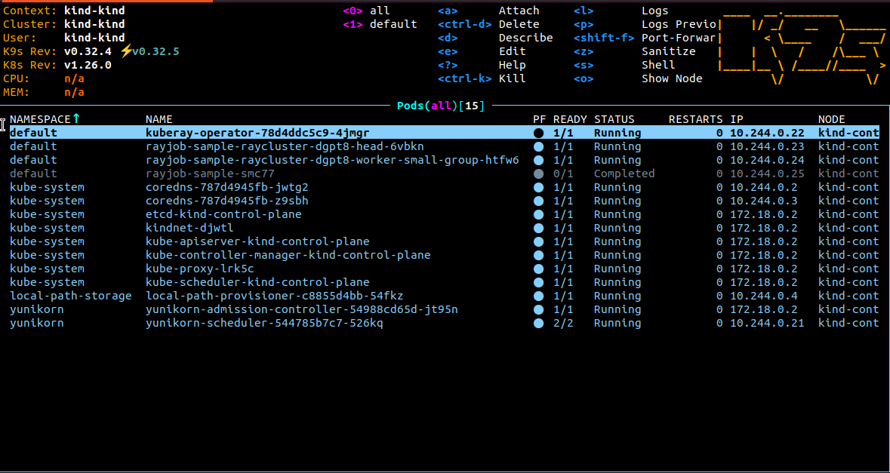

import RayOperator from './kuberay/_ray_operator.mdx';
import RayCRDYunikornConfig from './kuberay/_ray_crd_yunikorn_config.mdx';
import YunikornConfigMapPatch from './utils/_yunikorn_configmap_patch.mdx';

<!--
Licensed to the Apache Software Foundation (ASF) under one
or more contributor license agreements.  See the NOTICE file
distributed with this work for additional information
regarding copyright ownership.  The ASF licenses this file
to you under the Apache License, Version 2.0 (the
"License"); you may not use this file except in compliance
with the License.  You may obtain a copy of the License at

  http://www.apache.org/licenses/LICENSE-2.0

Unless required by applicable law or agreed to in writing,
software distributed under the License is distributed on an
"AS IS" BASIS, WITHOUT WARRANTIES OR CONDITIONS OF ANY
KIND, either express or implied.  See the License for the
specific language governing permissions and limitations
under the License.
-->

:::info[Note]
This example is how to setup [KubeRay](https://docs.ray.io/en/master/cluster/kubernetes/getting-started.html) and run [Ray Job](https://docs.ray.io/en/master/cluster/kubernetes/getting-started/rayjob-quick-start.html) with YuniKorn scheduler. It relies on an admission controller to configure the default applicationId and queue name. If you want more details, please refer to [Yunikorn supported labels](https://yunikorn.apache.org/docs/user_guide/labels_and_annotations_in_yunikorn) and [Yunikorn queue setting](https://yunikorn.apache.org/docs/user_guide/queue_config).
:::

<YunikornConfigMapPatch />
<RayOperator/>
<RayCRDYunikornConfig />

## Run a RayJob
```
kubectl apply -f https://raw.githubusercontent.com/ray-project/kuberay/v1.1.1/ray-operator/config/samples/ray-job.sample.yaml
```

- View the job status
    

Services in Kubernetes aren't directly accessible by default. However, you can use port-forwarding to connect to them locally.
```
kubectl port-forward service/raycluster-kuberay-head-svc 8265:8265
```
After port-forward set up, you can access the Ray dashboard by going to `http://localhost:8265` in your web browser.

- Ray Dashboard
    
- YuniKorn UI
    