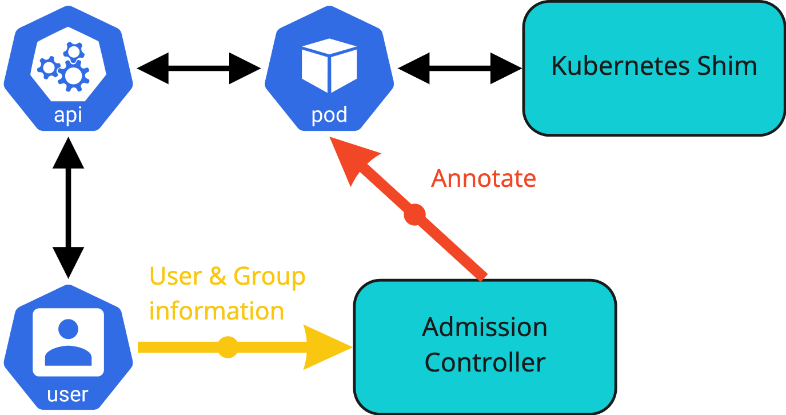
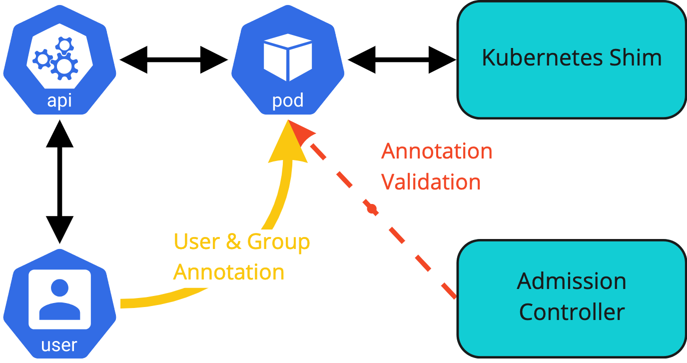

<!--
Licensed to the Apache Software Foundation (ASF) under one
or more contributor license agreements.  See the NOTICE file
distributed with this work for additional information
regarding copyright ownership.  The ASF licenses this file
to you under the Apache License, Version 2.0 (the
"License"); you may not use this file except in compliance
with the License.  You may obtain a copy of the License at

  http://www.apache.org/licenses/LICENSE-2.0

Unless required by applicable law or agreed to in writing,
software distributed under the License is distributed on an
"AS IS" BASIS, WITHOUT WARRANTIES OR CONDITIONS OF ANY
KIND, either express or implied.  See the License for the
specific language governing permissions and limitations
under the License.
-->

## Introduction

Currently, user-handling in YuniKorn is handled in a relatively simple manner. If the submitted pod contains a user label the content will be set as the username. The label name is configurable and defaults to yunikorn.apache.org/username. The value is extracted in the shim code [GetUserFromPod](https://github.com/apache/yunikorn-k8shim/blob/v1.0.0/pkg/common/utils/utils.go#L220) and passed to the core. If the label is not present or no value is set the username will be set to default.

However, this makes it possible for every authenticated user to freely impersonate anyone. This allows a user to circumvent quotas and other user-based restrictions inside YuniKorn. Therefore, we need a robust, secure way to make sure that users are who they say they are. This impersonation should not be confused with [Kubernetes impersonation](https://kubernetes.io/docs/reference/access-authn-authz/authentication/#user-impersonation).
 
In the core part of YuniKorn, we also perform group resolution, similar to a unix based system or for instance Hadoop. The default implementation is a nil-lookup. It simply populates the group slice with a single entry which is the same as the username. This is not fit for purpose and was only added as a placeholder until proper user and group resolution could be added.

## Goals

- Define a stable way for user & group retrieval from Kubernetes
- Assess fit of the current group resolution in the shim 
- Definition of user and group info on Kubernetes objects
    
## Non Goals

- Authorisation or Authentication as part of:
  - YuniKorn
  - Kubernetes
- Changes to the way users are propagated between the shim and the core
    

## Kubernetes user and group handling

Dealing with how users are actually managed in Kubernetes is out of scope. What is important is the definitions that are used by Kubernetes for users. In Kubernetes, there are two kinds of accounts defined: [service and user accounts](https://kubernetes.io/docs/reference/access-authn-authz/service-accounts-admin/). User accounts are for humans. Service accounts are set up for processes which run inside a pod and want to access the API server.

### User model

Kubernetes, at this point in time, only manages service accounts, not users. Kubernetes does not have objects which represent user accounts. A user with valid credentials is considered authenticated.

During the authentication phase the user account is mapped to a service account. For authorisation Kubernertes uses a sophisticated role-based (RBAC) or a simpler attribute-based (ABAC) model. All authorisation is linked to the service accounts, not to the user accounts. Beside the authentication there is thus no need for the user accounts. This is reflected in Kubernetes as after the authentication phase the user account is no longer tracked or available.

The model used by Kubernetes thus limits what we can do to retrieve the user and or group details. All objects that are available inside the cluster to a scheduler, like YuniKorn, only have the service account information available. Getting access to the user account means that we need to intercept the information at an earlier stage.

### User information as part of authentication

User accounts are required during the authentication stage. Authentication in Kubernetes is configurable via plugins. For more details, see the official document on [Kubernetes authentication](https://kubernetes.io/docs/reference/access-authn-authz/authentication/). The list of supported authentication plugins, not all of these plugins will be configured and or active by default:
- X.509 certificate
- Static token file
- OpenID connect tokens
- Authentication proxy
- Authentication webhooks ([LDAP example](https://itnext.io/implementing-ldap-authentication-for-kubernetes-732178ec2155))
- Bootstrap token
- Service Account Tokens
  

When using test clusters created by Minikube or KIND, X509 authentication is used by default and the current context is updated with the appropriate certificates and keys, making cluster access transparent.

Authentication, independent of which option is used, provides the following details:
- Username
- userID
- Groups
- Extra information

Where the details are stored or how they are retrieved depends on the authentication plugin used.

Kubernetes defines a special user for anonymous access, the `system:anonymous` user belonging to the `system:unauthenticated` group. Anonymous access is a security issue and should have been turned off in most clusters. This default mapping to a standardised user does provide the possibility to process authenticated and anonymous workloads in the same way.

### Groups in authentication

Users may belong to zero or more groups. The authentication system of Kubernetes adds one of two default groups to each user. The `system:authenticated` group is added to the list of groups for authenticated users, the `system:unauthenticated` group is added for anonymous users.

For example, when generating an X509 certificate, we can define the username and organisation information like this:
```
openssl req -new -key alice.key \
-out alice.csr \
-subj "/CN=alice/O=users/O=devops"
```
This certificate, after being processed, provides an authenticated user with the username alice and sets the groups list to users, devops and system:authenticated. Other authentication methods allow specifying groups in their specific way. How groups are specified for each authentication option is not relevant to this design as it is encapsulated in the authentication layer and not in the exposed model.

### Current findings and challenges

None of the objects in Kubernetes contain the authentication information and thus the user details. After the authentication has been processed the objects inside Kubernetes either use the service account that was specified as part of the object definition or the Default service account.
  

That means that the pod which is processed by YuniKorn, represented by the `k8s.io/api/core/v1/Pod` object, only has the service account as a reference.This is similar to the details available to someone using the Kubernetes tools to describe the object.

The only way to retrieve the authentication information is during the admission phase of a new object into the Kubernetes system. This process is handled by the admission controllers which are part of the decision process to allow or disallow the new object to be created, modified or removed.

This finding does allow YuniKorn, via its admission controller, to retrieve the authentication information of objects.

  


However there are some further complications to this process. Pods are the units that the scheduler works with. Objects like deployments or jobs do not get scheduled, they in turn create a pod to be scheduled. Pods could thus be created in a number of ways.

If a pod is created by a direct request, then the pod creation process contains the authentication information. This allows the YuniKorn admission controller to access and propagate the authenticated user information as part of the MutatingAdmissionWebhook.

An example of a review of a direct call to create a pod with the user information shown:
```
INFO  webhook/admission_controller.go:180  AdmissionReview  {"Namespace": "default", "UID": "3f8c8df5-0272-4c85-874f-0aa1ece74fbc", "Operation": "CREATE", "UserInfo": {"username":"minikube-user","groups":["system:masters","system:authenticated"]}}
```

On the other hand, if a deployment, job or replica set is submitted, then the pod is not directly created. This also means that the user is not identifiable. The pod that YuniKorn, via the admission controller, sees is created by a controller. The user in the authentication information is not the end user that created the original object but the controller service account.

An example review of a pod created as part of a Kubernetes job with the user information shown:

```
INFO  webhook/admission_controller.go:177  AdmissionReview  {"Namespace": "default", "UID": "be94ea46-c1d2-442a-a46a-60589d582abd", "Operation": "CREATE", "UserInfo": {"username":"system:serviceaccount:kube-system:job-controller","uid":"32abc062-eb53-4dca-9669-55251d687939","groups":["system:serviceaccounts","system:serviceaccounts:kube-system","system:authenticated"]}}
```
It is possible to create separate webhooks for the API objects that could result in the creation of pods. Other objects that we should watch and mutate if necessary:
- Deployment
- ReplicaSet
- DaemonSet
- StatefulSet
- Job
- CronJob
- ReplicationController (deprecated)
 
For example, adding a modification on the admission controller which instals a MutatingAdmissionWebhook for deployments, the username can be determined:

```
INFO  webhook/admission_controller.go:483  Deployment validation - pass through  {"User": {"username":"minikube-user","groups":["system:masters","system:authenticated"]}}
```

By intercepting the original object the submitting user information can be retrieved in the admission controller. The set of objects of interest, mentioned in the list above, all contain a pod template to specify the pod that will be created by the controller. As part of the mutating admission webhook the pod template can be updated with the user information.

To confirm that this approach is viable a simple proof of concept (POC) was created. The example POC code for the current admission controller adds the currently defined yunikorn.apache.org/username label to the pod template of a deployment: [Github commit](https://github.com/pbacsko/incubator-yunikorn-k8shim/commit/478d688675a1ca98afb895672295d61b47172d19)
  
There is an interaction with the processing of a directly created pod. Pods that are created via a controller will have the user information already set via the pod template. The admission controller processing the request should allow for the user information to be present and not overwrite or replace it with the controller service account. This case will be further defined and detailed in the chapter on [Providing user and group externally](#providing-user-and-group-externally) due to the similarity in solution design.

## YuniKorn group retrieval

As mentioned in the introduction, the YuniKorn core can retrieve a group for a given user by doing a lookup (see implementation in [usergroup.go](https://github.com/apache/yunikorn-core/blob/161c38100317ec239965e21806ebb35c6583ddcd/pkg/common/security/usergroup.go)). The lookup is pluggable and the current implementations provided are a simple OS-based and a dummy lookup.

The dummy lookup mimics the simple unix OS behaviour for new users. It sets the group to the same value as the username. The dummy lookup is enabled as the default lookup.

Resolving users using the OS-based resolver has limited functionality. The container that the scheduler runs in has only a base OS installed. There is no integration with an external identity provider. That means resolving groups for users running pods would normally fail as they do not exist on the OS layer that is accessible from the scheduler.

The YuniKorn core only performs a group lookup if the UserGroupInformation object passed from the shim to the core does not define a list of groups. This is independent of the resolver defined in the code. By default the shim in its current implementation only passes the user name to the core. That means it always triggers the group resolution.

For our purposes, both options are too simplistic. YuniKorn core should not perform any group retrieval but instead rely on the shim and the group and user information retrieved there. With the current functionality to only resolve if no group details are provided changes required should be minimal. The current default dummy resolver should be updated to not set any group and just leave the current groups. Even if that means the user is not part of any group. Based on the [Groups in authentication](#groups-in-authentication) details when using the Kubernetes shim we should always have at least one group set. All users are members of either system:authenticated or system:unauthenticated. Even without changes the current group retrieval code could be used as is.

The design does not require any code changes in the core code.

## Proposed user information object

The admission controller has access to more detailed user information than what is available on the objects that are available to the shim. See the [Current findings and challenges](#current-findings-and-challenges) for more details.
  

First change is that we need to use annotations instead of [labels](https://kubernetes.io/docs/concepts/overview/working-with-objects/labels/). The value of labels is limited to 63 characters, which will not be flexible enough to hold group information. If a user is a member of multiple groups it could easily exceed the value limit. Spitting the groups over multiple labels or encoding is not a viable option as stability is not a guarantee.

Supporting a single label for the user’s name and annotations for the groups is not a good user experience. We must provide a single object that can contain the user name as well as the group details.

### Annotation name

The new name for the annotation should clearly cover the content and not interfere with existing annotations. Beside that we are free to use any name that complies with the naming [conventions for names](https://kubernetes.io/docs/concepts/overview/working-with-objects/annotations/#syntax-and-character-set).

The proposal is to use one annotation:
`yunikorn.apache.org/user.info`

### Annotation content

There is already a definition for the user information as part of the scheduler interface.The definition in the scheduler interface is:

```
message UserGroupInformation {
// the user name
string user = 1;
// the list of groups of the user, can be empty
repeated string groups = 2;
}
```

The content of the `UserGroupInformation` message as defined in the Scheduler Interface provides a stable Go object with defined group ordering. Since the content of an annotation must be a simple string we should use a simple json representation for the user info that contains the user name and a list of groups. This also guarantees the ordering of the groups to be stable and will not change when read from the pod.


An example of the annotation for a user called joe who is a member of the group developers. The system:authenticated group is added by the Kubernetes authentication layer:

```json
yunikorn.apache.org/user.info = "
{
  username: \"joe\",
  groups: [
    \"developers\",
    \"system:authenticated\"
  ]
}"
```

### Annotation mutation

In the current design a restriction on mutating the annotation is required to prevent users from updating the pod after creation. After YuniKorn is informed of the pod’s existence and the application is created the user information will not change inside YuniKorn. Kubernetes however does not guarantee that the shim will be informed of the pod creation before any modifications are made to the pod. This would leave a short window for a user to create a pod and then update the pod. Allowing a user to overwrite the annotation must be prevented to make sure we have guaranteed and auditable user information.

The admission controller must therefore validate update requests that include changes to the annotation. It is the only way to guarantee that the user information in the annotations cannot be modified.

The YuniKorn admission controller is currently only registered as a mutating admission controller for pods with the operation type “create”. This can be extended to include operation type “update” for pods. A validating hook is registered for the configmap object, this one could be extended to include the pod object.

This means that there are two options for the update operation:
-   mutating
-   validating
 
In the validating case we can simply reject the change if the annotation is changed as part of the update request. In the mutating case we can undo the change by overwriting the annotation with the original value. Both solutions will work, and will take about the same amount of processing time in the admission controller.
  
The proposal is to add the pod object to the validating webhook for update operations.

### Backwards compatibility

The current label will remain supported for the 1.x minor releases. Deprecation will be announced with the first release that supports the new annotation. Messages mentioning the processing of the old label will also be logged at a WARN level in the logs. The existing behaviour might require changes to the default setting see [Configuration](#configuration) for more details.

Removal of processing of the currently supported label should be part of the next major release. The next major release is 2.0.0. This is based on the fact that we do not have a deprecation policy defined as yet.

Preference in processing will be with the new annotations. In the case that both the user label and new annotations are present on the namespace the new annotation will be used. Using both the user label and new annotations, i.e. merging of the two, will not be supported.

## Providing user and group externally

As with the current label for the username we could allow for providing user and group information via annotations on the submitted objects. Although this is not a secure solution, as is pointed out in the introduction, support for this option might be a requirement to support certain use cases.

We must build in an option to turn the functionality off and or mitigations to limit the possibility to bypass reading the authentication information. Based on the earlier diagram of the admission controller being used to intercept the authentication information a similar diagram for this use case. The admission controller will validate the annotation provided by the user, or system, and enforce compliance with the rules set by the administrator.

  


### Pods from controllers

The first use case for allowing the user information to be provided on pods when they are created is linked to controller created pods.

To correctly account for these pods the admission controller should be able to not overwrite the user information if the submitting user is one of a specific group of users. Depending on the way the system is configured all controllers run as the same service account or each controller uses a specifically created service account. The [RBAC documentation](https://kubernetes.io/docs/reference/access-authn-authz/rbac/#controller-roles) describes the two options.

If the controller manager runs with the option `--use-service-account-credentials` each controller uses a service account in the kube-system namespace. Running with the option set is recommended from an auditing point of view.

If the option is not enabled, which seems to be the default, the controller submits the pods as the user `system:kube-controller-manager`.

Both values of the option must be supported by the admission controller. That means the admission controller must have an allow list which contains at least the following users:
- `system:serviceaccount:kube-system:*`
- `system:kube-controller-manager`

An option would be to further limit the service accounts to a subset of the service account from the kube-system namespace. The configuration should support this without changes, it would come down to a change of the default value for the allow list.

There is only a limited set of controllers that can create pods. The group information does, at this point in time, not look deterministic enough to warrant a group allow list.

Note that the user system:kube-controller-manager name is based on some older github issue references and needs to be confirmed in a test setup.

### External applications

In a similar setup applications could be used to provide a frontend for pod creation. These front-ends might or might not use individual users to submit pods. They could even leverage jobs or other objects to indirectly create pods.

As an example an application might be used to provide a simple user interface to create a Spark application. Apache Airflow, Livy or similar tools come to mind.

The admission controller should allow the annotation to be provided as part of the pod creation. This follows the same code and configuration path as designed for the pods submitted by the controllers.

This functionality must be configurable separately from the pods created by the controllers. A similar allow list should be configurable to limit the user. For this use case we also should support an allow list for groups of users. This should allow administrators to specify one or more groups of users that are allowed to set the user information on the pods.

For the first design there are no plans to add deny lists for either groups or users.

## Configuration

As described in the previous sections, making the behaviour configurable is a requirement. The proposal is to add the following configuration values for the behaviour. All configuration options are prefixed by “ADMISSION_CONTROLLER_”.
 

The setting should be migrated to a configuration object or file when that is implemented for the admission controller. At this point the configuration uses environment settings as part of the deployment file.
  

|Name|Description|Default|
|--|--|--|
|`BYPASS_AUTH`|Allow external users to create pods with user information set. Type: boolean |false
|`BYPASS_CONTROLLERS`|Allow controller users to create pods with user information set. Type: boolean |true
|`SYSTEM_USERS`|Regular expression for the allowed controller service account list. Type: string|"system:serviceaccount:kube-system:*"
|`EXTERNAL_USERS`|Regular expression for the allowed external user list. Type: string|""
|`EXTERNAL_GROUPS`|Regular expression for the allowed external group list. Type: string|""

The configuration will be read as part of the startup of the admission controller. Automatic refresh or reload of the settings to allow changes while the admission controller is running is not part of the design as it is not supported for any other settings at this moment.

If `BYPASS_AUTH` is set to true the admission controller will not add the annotation to a pod if the annotation is not present and the deprecated user labell is set. If the annotation is not set and the user label is not set the new annotation will be added. In the case that `BYPASS_AUTH` is false, the default, the admission controller will always add the new annotation, regardless of the existence of the deprecated label.

The behaviour will take into account the user and group filters as defined in `EXTERNAL_USERS` and `EXTERNAL_GROUPS`. This means that retaining the existing behaviour and preferencing the existing label will require changing a default setting.
