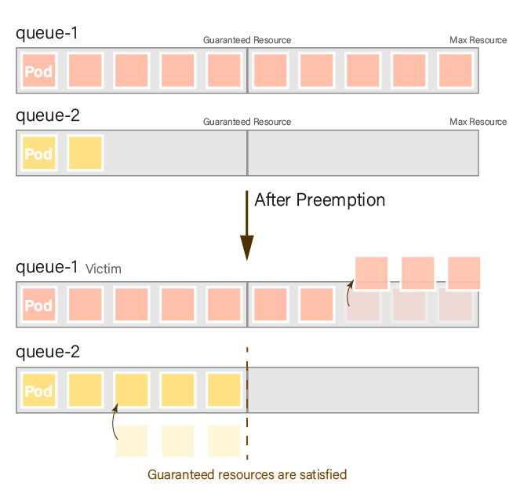
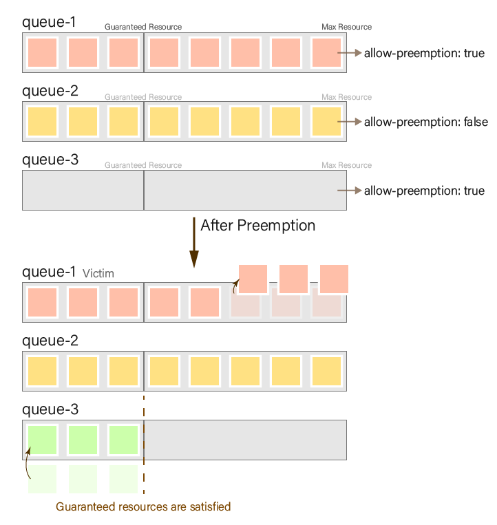
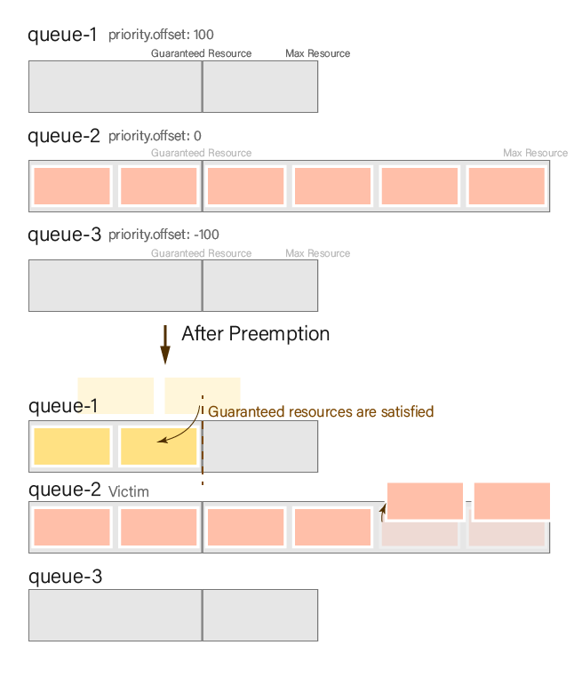
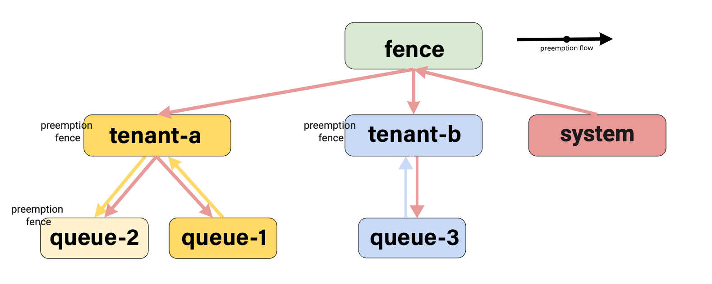
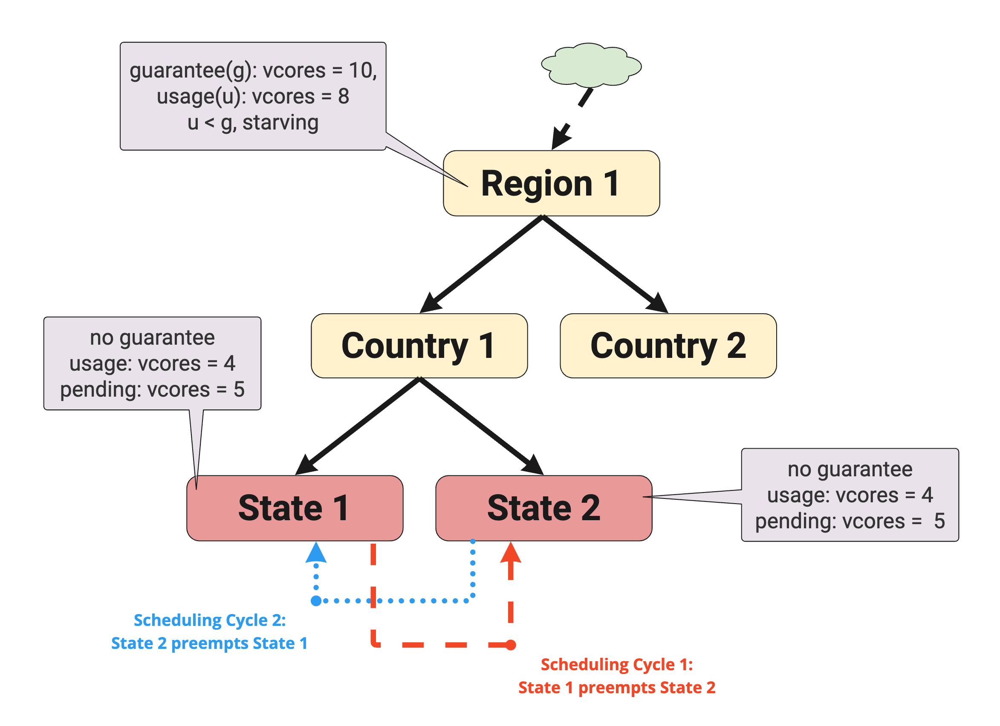

<!--
Licensed to the Apache Software Foundation (ASF) under one
or more contributor license agreements.  See the NOTICE file
distributed with this work for additional information
regarding copyright ownership.  The ASF licenses this file
to you under the Apache License, Version 2.0 (the
"License"); you may not use this file except in compliance
with the License.  You may obtain a copy of the License at

  http://www.apache.org/licenses/LICENSE-2.0

Unless required by applicable law or agreed to in writing,
software distributed under the License is distributed on an
"AS IS" BASIS, WITHOUT WARRANTIES OR CONDITIONS OF ANY
KIND, either express or implied.  See the License for the
specific language governing permissions and limitations
under the License.
-->

Preemption is an essential feature found in most schedulers, and it plays a crucial role in enabling key system functionalities like DaemonSets in K8s, as well as SLA and prioritization-based features.

This document provides a brief introduction to the concepts and configuration methods of preemption in YuniKorn. For a more comprehensive understanding of YuniKorn's design and practical ideas related to preemption, please refer to the [design document](design/preemption.md).

## Kubernetes Preemption

Preemption in Kubernetes operates based on priorities. Starting from Kubernetes 1.14, you can configure preemption by adding a `preemptionPolicy` to the `PriorityClass`. However, it is important to note that preemption in Kubernetes is solely based on the priority of the pod during scheduling. The full documentation can be found [here](https://kubernetes.io/docs/concepts/scheduling-eviction/pod-priority-preemption/#preemption).

While Kubernetes does support preemption, it does have some limitations. Preemption in Kubernetes only occurs during the scheduling cycle and does not change once the scheduling is complete. However, when considering batch or data processing workloads, it becomes necessary to account for the possibility of opting out at runtime.

## YuniKorn Preemption

In Yunikorn, we offer two preemption types: general and DaemonSet. DaemonSet preemption is much more straightforward, as it ensures that pods which must run on a particular node are allowed to do so. The rest of the documentation only concerns generic preemption. For a comprehensive explanation of DaemonSet preemption, please consult the [design document](design/simple_preemptor.md).

YuniKorn's generic preemption is based on a hierarchical queue model, enabling pods to opt out of running. Preemption is triggered after a specified delay, ensuring that each queue's resource usage reaches at least the guaranteed amount of resources. To configure the delay time for preemption triggering, you can utilize the `preemption.delay` property in the configuration.

To prevent the occurrence of preemption storms or loops, where subsequent preemption tasks trigger additional preemption tasks, we have designed seven preemption laws. These laws are as follows:

1. Preemption policies are strong suggestions, not guarantees
2. Preemption can never leave a queue lower than its guaranteed capacity
3. A task cannot preempt other tasks in the same application
4. A task cannot trigger preemption unless its queue is under its guaranteed capacity
5. A task cannot be preempted unless its queue is over its guaranteed capacity
6. A task can only preempt a task with lower or equal priority
7. A task cannot preempt tasks outside its preemption fence

For a detailed explanation of these preemption laws, please refer to the preemption [design document](design/preemption.md#the-laws-of-preemption).

Next, we will provide a few examples to help you understand the functionality and impact of preemption, allowing you to deploy it effectively in your environment. You can find the necessary files for the examples in the yunikorn-k8shim/deployments/examples/preemption directory.

Included in the files is a YuniKorn configuration that defines the queue configuration as follows:

```bash
queues.yaml: |
    partitions: 
    - name: default
      placementrules:
        - name: provided
          create: true
      queues:
        - name: root
          submitacl: '*'
          properties:
            preemption.policy: fence
            preemption.delay: 10s
          queues:
          - name: 1-normal ...
          - name: 2-no-guaranteed ...
          - name: 3-priority-class ...
          - name: 4-priority-queue ...
          - name: 5-fence ...
```

Each queue corresponds to a different example, and the preemption will be triggered 10 seconds after deployment, as indicated in the configuration `preemption.delay: 10s`.

### General Preemption Case

In this case, we will demonstrate the outcome of triggering preemption when the queue resources are distributed unevenly in a general scenario.

We will deploy 10 pods with a resource requirement of 1 to both `queue-1` and `queue-2`. First, we deploy to `queue-1` and then introduce a few seconds delay before deploying to `queue-2`. This ensures that the resource usage in `queue-1` will exceed that of `queue-2`, depleting all resources in the parent queue and triggering preemption.

| Queue            | Max Resource | Guaranteed Resource |
| ---------------- | ------------ | ------------------- |
| `normal`         | 12           | - (not configured)  |
| `normal.queue-1` | 10           | 5                   |
| `normal.queue-2` | 10           | 5                   |

Result:

When a set of guaranteed resources is defined, preemption aims to ensure that all queues satisfy their guaranteed resources. Preemption stops once the guaranteed resources are met (law 4). A queue may be preempted if it has more resources than its guaranteed amount. For instance, in this case, if queue-1 has fewer resources than its guaranteed amount (\<5), it will not be preempted (law 5).

| Queue            | Resource before preemption | Resource after preemption |
| ---------------- | -------------------------- | ------------------------- |
| `normal.queue-1` | 10 (victim)                | 7                         |
| `normal.queue-2` | 2                          | 5 (guaranteed minimum)    |



### Priority

In general, a pod can preempt a pod with equal or lower priority. You can set the priority by defining a [PriorityClass](https://kubernetes.io/docs/concepts/scheduling-eviction/pod-priority-preemption/) or by utilizing [queue priorities](priorities).

While preemption allows service-type pods to scale up or down through preemption, it can also lead to the preemption of pods that should not be preempted in certain scenarios:

1. Spark Jobs, where the driver pod manages a large number of jobs, and if preempted, all jobs will be affected.
2. Interactive pods, such as Python notebooks, have a significant impact when restarted and should be avoided from preemption.

To address this issue, we have designed a "do not preempt me" flag. You can set the annotation `yunikorn.apache.org/allow-preemption` to `false` in the PriorityClass to prevent pod requests from being preempted. 
> **_NOTE:_** The flag `yunikorn.apache.org/allow-preemption` is a request only. It is not guaranteed but Pods annotated with this flag will be preempted last.


### PriorityClass

In this example, we will demonstrate the configuration of `yunikorn.apache.org/allow-preemption` using PriorityClass and observe its effect. The default value for this configuration is set to `true`.

```bash
apiVersion: scheduling.k8s.io/v1
kind: PriorityClass
metadata:
  name: preemption-not-allow
  annotations:
    "yunikorn.apache.org/allow-preemption": "false"
value: 0
```

We will deploy 8 pods with a resource requirement of 1 to `queue-1`, `queue-2`, and `queue-3`, respectively. We will deploy to `queue-1` and `queue-2` first, followed by a few seconds delay before deploying to `queue-3`. This ensures that the resource usage in `queue-1` and `queue-2` will be greater than that in `queue-3`, depleting all resources in the parent queue and triggering preemption.

| Queue        | Max Resource | Guaranteed Resource | `allow-preemption` |
| ------------ | ------------ | ------------------- | ------------------ |
| `rt`         | 16           | -                   |                    |
| `rt.queue-1` | 8            | 3                   | `true`             |
| `rt.queue-2` | 8            | 3                   | `false`            |
| `rt.queue-3` | 8            | 3                   | `true`             |

Result:

When preemption is triggered, `queue-3` will start searching for a victim. However, since `queue-2` is set with allow-preemption as false, the resources of `queue-1` will be preempted.

Please note that setting `yunikorn.apache.org/allow-preemption` is a strong recommendation but does not guarantee the lack of preemption. When this flag is set to `false`, it moves the Pod to the back of the preemption list, giving it a lower priority for preemption compared to other Pods. However, in certain scenarios, such as when no other preemption options are available, Pods with this flag may still be preempted.

For example, even with `allow-preemption` set to `false`, DaemonSet pods can still trigger preemption. Additionally, if an application in `queue-1` has a higher priority than one in `queue-3`, the application in `queue-2` will be preempted because an application can never preempt another application with a higher priority. In such cases where no other preemption options exist, the `allow-preemption` flag may not prevent preemption.


| Queue        | Resource before preemption | Resource after preemption |
| ------------ | -------------------------- | ------------------------- |
| `rt.queue-1` | 8 (victim)                 | 5                         |
| `rt.queue-2` | 8                          | 8                         |
| `rt.queue-3` | 0                          | 3 (guaranteed minimum)    |



### Priority Queue

In addition to utilizing the default PriorityClass in Kubernetes, you can configure priorities directly on a [YuniKorn queue](priorities).

In the following example, we will demonstrate preemption based on queue priority.

We will deploy five pods with a resource demand of 3 in the `high-pri` queue, `norm-pri` queue, and `low-pri` queue, respectively. We will deploy them to the `norm-pri` queue first, ensuring that the resources in the `root`(parent queue) will be fully utilized. This will result in uneven resource distribution among the queues, triggering preemption.

| Queue           | Max Resource | Guaranteed Resource | priority.offset |
| --------------- | ------------ | ------------------- | --------------- |
| `root`          | 18           | -                   |                 |
| `root.high-pri` | 10           | 6                   | 100             |
| `root.norm-pri` | 18           | 6                   | 0               |
| `root.low-pri`  | 10           | 6                   | -100            |

Result:

A queue with higher priority can preempt resources from a queue with lower priority, and preemption stops when the queue has preempted enough resources to satisfy its guaranteed resources.

| Queue           | Resource before preemption | Resource after preemption |
| --------------- | -------------------------- | ------------------------- |
| `root.high-pri` | 0                          | 6 (guaranteed minimum)    |
| `root.norm-pri` | 18 (victim)                | 12                        |
| `root.low-pri`  | 0                          | 0                         |



### Preemption Fence

In a multi-tenant environment, it is essential to prevent one tenant from occupying the resources of another tenant. In YuniKorn, we map tenants to a queue hierarchy, the queue hierarchy can thus cross tenant boundaries.

To address this issue, YuniKorn introduces a [preemption fence](design/preemption.md#preemption-fence), which is a setting on the queue that prevents preemption from looking at queues outside the fence boundary.  The fence is a one-way fence. It prevents going out (i.e. higher up the queue hierarchy), but does not prevent coming in (or down) the queue hierarchy.

```bash
...
queues:
- name: default
  properties:
    preemption.policy: fence
```

We will use the following diagram as an example:



In this example, we will sequentially deploy 15 pods with a resource requirement of 1 to each sub-queue.

First, we deploy `queue-1` in `tenant-a` and wait until the application in `queue-1` occupies all the resources of `tenant-a`. Then, we deploy `queue-2` after the resources of `tenant-a` are fully utilized. Next, we deploy the application `ten-b.queue-3` and allocate resources to the system when the fence queue is full.

| Queue              | Max Resource | Guaranteed Resource | fence |
| ------------------ | ------------ | ------------------- | ----- |
| `rt`               | 3            | -                   | true  |
| `rt.ten-a`         | 15           | 5                   | true  |
| `rt.ten-a.queue-1` | 15           | 2                   |       |
| `rt.ten-a.queue-2` | 15           | 2                   | true  |
| `rt.ten-b`         | 15           | 10                  | true  |
| `rt.ten-b.queue-3` | 15           | 10                  |       |
| `rt.sys`           | 15           | 10                  |       |

Result:

In this example, two imbalances are observed:

- Within `ten-a`, `queue-1` occupies all the resources, while `queue-2` has no resources. However, since `queue-2` is configured with a fence, it cannot acquire resources from outside the fence.
  
- Inside the `rt` queue, both `ten-a` and `ten-b` occupy all the resources, while the `sys` queue has no resources, and no fence is set up. Therefore, the `sys` queue can acquire resources from the queues in the hierarchy until its guaranteed resources are met. In this case, the `sys` queue acquires resources from both `ten-a` and `ten-b`.
  

| Queue              | Resource before preemption | Resource after preemption |
| ------------------ | -------------------------- | ------------------------- |
| `rt.ten-a`         | 15                         | 10                        |
| `rt.ten-a.queue-1` | 15                         | 10                        |
| `rt.ten-a.queue-2` | 0                          | 0                         |
| `rt.ten-b`         | 15                         | 10                        |
| `rt.ten-b.queue-3` | 15                         | 10                        |
| `rt.sys`           | 0                          | 10                        |

### Redistribution of Quota and Preemption Storm

#### Redistribution of Quota

Setting up guaranteed resources for the queue present at a higher level in the queue hierarchy helps to re-distribute the quota among different groups. Especially when workloads of the same priority run in different groups, unlike the default scheduler, YuniKorn preempts workloads of the same priority to free up resources for pending workloads who deserve to get the resources as per the queues guaranteed quota. At times, one needs this kind of queue setup in a real production cluster for redistribution.

For example, root.region[1-N].country[1-N].state[1-N]


This queue setup has N regions under “root”, each region has N countries. If administrators want to redistribute the workloads of the same priority among different regions, then it is better to define the guaranteed quota for each region so that preemption helps to reach the situation of running the workloads by redistribution based on the guaranteed quota each region is supposed to get. That way each region uses the resources it deserves to get at the maximum possible level from the overall cluster resources.

#### Preemption Storm

With a setup like above, there is a side effect of increasing the chance of a preemption storm or loop happening within the specific region between different state queues (siblings belonging to same parent).

ReplicaSets are a good example to look at for looping and circular preemption. Each time a pod from a replica set is removed the ReplicaSet controller will create a new pod to make sure the set is complete. That auto-recreation could trigger loops as described below.



State of the queues:

#### `Region1`

* Guaranteed: vcores = 10
* Usage: vcores = 8
* Under guaranteed: usage < guaranteed, starving

#### `State1`

* Guaranteed: nil
* A ReplicaSet is submitted to queue and requesting 9 replicas, with each replica requiring `{vcores: 1}`.
* 4 replicas are running. Usage: vcores = 4
* 5 replicas are waiting for resources. Pending: vcores = 5
* Inherits "under guaranteed" behaviour from `Region1`, eligible to trigger preemption

#### `State2`

* Guaranteed: nil
* A ReplicaSet is submitted to queue and requesting 9 replicas, with each replica requiring `{vcores: 1}`.
* 4 replicas are running. Usage: vcores = 4
* 5 replicas are waiting for resources. Pending: vcores = 5
* Inherits "under guaranteed" behaviour from `Region1`, eligible to trigger preemption

Replica set `State1 Repl` runs in queue `State1`. Replica set `State2 Repl` runs in the queue `State2`. Both queues belong to the same parent queue (they are siblings), `Country1`. The pods all run with the same settings for priority and preemption. There is no space left on the cluster. Both region, `Region1` and country, `Country1` queue usage is `{vcores:8}`. Since `Region1` has a guaranteed quota of `{vcores:10}` and usage of `{vcores:8}` lower than its guaranteed quota leading to starvation of resources. All the queues (including both direct or indirect) below the parent queue are starving as it inherits the “under guaranteed” behavior from above said parent queue, `Region1` calculation unless each state (leaf) queue has its own guaranteed quota. Now, either one of these state queues can trigger preemption. 

Let's say, `state1` triggers preemption to meet resource requirements for pending pods.
To make room for a `State1 Repl` pod, a pod from the `State2 Repl` set is preempted. Now, the pending `State1 Repl` pod moves from pending to running. Now, the next scheduling cycle comes. Let's say, `State2` triggers preemption to meet resource requirements for its pending pods. In addition to already existing pending pods, pod preempted (killed) in earlier scheduling cycles would have been recreated automatically by this time as it is a replica set. To make room for a `State2 Repl` pod, a pod from the `State1 Repl` set is preempted. Now, the pending `State2 Repl` pod moves from pending to running and preempted (killed) pod belonging to `State1 Repl` set would be recreated again. Now, the next scheduling cycle comes. Again, the whole loop repeats killing each other from the siblings without going anywhere leading to a preemption storm causing instability of the queues. It could even happen for a child queue below `Country2` that gets caught in the preemption storm.

Defining guaranteed resources at queues at lower level or at end leaf queues can avoid the preemption storm or loop from happening in the cluster. Administrators should be aware of the side effects of setting up guaranteed resources at any specific location in the queue hierarchy to reap the best possible outcomes of the preemption process.
