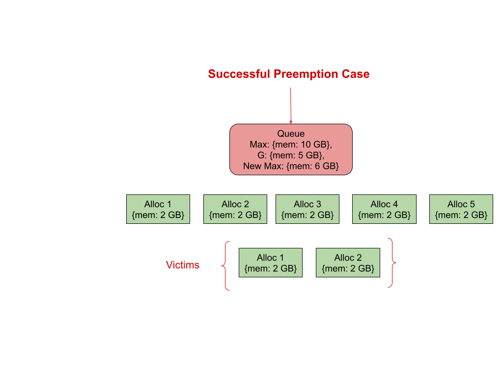

<!--
Licensed to the Apache Software Foundation (ASF) under one
or more contributor license agreements.  See the NOTICE file
distributed with this work for additional information
regarding copyright ownership.  The ASF licenses this file
to you under the Apache License, Version 2.0 (the
"License"); you may not use this file except in compliance
with the License.  You may obtain a copy of the License at

  http://www.apache.org/licenses/LICENSE-2.0

Unless required by applicable law or agreed to in writing,
software distributed under the License is distributed on an
"AS IS" BASIS, WITHOUT WARRANTIES OR CONDITIONS OF ANY
KIND, either express or implied.  See the License for the
specific language governing permissions and limitations
under the License.
-->

## Motivation

Queue quota can be increased or decreased based on the need. In case of an increase, the scheduler works as normal and no change in behavior. As usual, it keeps permitting both the new and existing apps to run based on the newly configured quota. In case of an decrease, the scheduler stops accepting new workloads and waits for the running applications' natural exit so that newly configured quota comes into effect eventually. This behavior of natural exit is acceptable as long all the running applications are short lived. Whereas, for longer running applications, taking more time and that too in an unpredictable way to bring quota change into effect is not acceptable and it requires a surgical approach to preempt running containers based on well defined criteria so that newly configured quota would come into immediate effect.

## Goals

* Implement Preemption only for quota decrease.  
* Honour Queue Guaranteed Resources   
* Inter-Queue Preemption configuration should not be used in conjunction  
* Queue Priority related configurations should not be used in conjunction

## Non-Goals

* Intra-Queue Preemption  
* Cross Node Preemption

## Quota Preemption Configuration

Quota Enforcement through Preemption feature can be turned off globally by setting the   
appropriate property at partition level. It is configurable as follows:

```yaml
partitions:  
  - name: <name of the partition>  
    preemption:  
   	 quotapreemptionenabled: <boolean value>  
    queues:  
      - name: <name of the queue>  
        resources:  
          max: <maximum resources allowed for this queue>
```

Default is false (disabled). It means, the whole feature is turned OFF globally and preemption won’t be triggered when lowering the quota which is nothing but the situation exists today. So, having default as false is to retain the existing behavior as is.

Setting it to true would turn ON the feature globally and preemption would be triggered whenever any queue quota decreases.

## Quota Preemption Delay

Quota Preemption Delay is the time duration after which the preemption should get triggered for quota changes. Otherwise, triggering preemption immediately has a profound impact especially on the queues where long live applications run. It is applicable only for quota decrease, nothing to do with increase. It is configurable.Unit is seconds.

It is configurable as follows:

```yaml
partitions:  
  - name: <name of the partition>  
    queues:  
      - name: <name of the queue>  
        resources:  
          max: <maximum resources allowed for this queue>  
          quota.preemption.delay: <quota preemption delay in seconds>
```
It could be any value between 0 and maxint. 

The default is 0. It means, preemption won’t be triggered when lowering the quota which is nothing but the situation exists today. As of now, In case of quota decrease, new quota would be applied and brought into effect only for the new requests during the next scheduling cycle but existing applications continue to run as is. So, having default as 0 is to retain the existing behavior as is.

Setting any value between 60 seconds and 5 hours is preferable for most of the cases.

Examples are

1\) To trigger preemption after 2 hours

```yaml
partitions:  
  - name: default  
    queues:  
      - name: queueA  
        resources:  
          max:  
            {memory: 10G}  
          quota.preemption.delay: 7200
```

2\) To trigger preemption immediately after 5 minutes

```yaml
partitions:  
  - name: default  
    queues:  
      - name: queueA  
        resources:  
          max:  
            {memory: 10G}  
          quota.preemption.delay: 5
```

The delay timer clocks in once the config map has been saved. Config map could be modified for multiple scenarios, but the timer clocks in only when either Queue max resources or quota preemption delay property changes. Once the timer started, changes could happen to either one of these two properties. In case of any such changes, timers reset and start again from the beginning, not on top of the current timer value to avoid unnecessary confusions. Manipulation based on the current timer value which has already started a while back could cause a lot of confusion and make it difficult to reason about the net effect of the change. So, timers reset and starting again from 0 is easy to interpret in all scenarios. In short, any quota preemption delay or max resources configured either through initial setup or change applied later is applicable from the moment the config map has been saved. Only values being used currently and newer values coming from config map are combined together to decide the next steps at any given moment even though the delay timer has not yet passed the current time or actual preemption process has not yet started. So, in case of decrease from Q to Q/3 at T1 with delay of ‘x’ seconds and again increase from Q/3 to Q/2 at T2 before T1 \+ x seconds has passed doesn’t trigger preemption as recent change is purely an increase. But, If T1 \+ x seconds had just passed and preemption had just triggered around the same time as T2 then the triggered process cannot be reverted and/or interrupted in the middle of it. At any given time, only one preemption process should be running for the specific queue even though quota has been decreased with delay of ‘0’ seconds (immediately) around the same time preemption started for the same queue based on earlier changes. No action should be taken when preemption is already running for the same queue and skipped as allowing it to continue would create havoc.  
In addition, changes could be made to more than one queue at the same time but with different delay values. In case of the same delay for leaf queue and other parent queue in the whole queue hierarchy, leaf queue could be prioritized over the parent as it might help the [Queue selection process](#queue-selection-and-ordering) for the parent as described later. Need not to go through further on this in detail here as these cases would be sorted out appropriately during the implementation.

### Impact of Restart

How does Quota Preemption Delay work after the quota changes followed up by restart? As explained earlier, the clock kicks in once the config map has been saved, say T1. Yunikorn restarted at T2. When service starts again after T2, Quota Preemption Delay would start again from the beginning and lead to postponing this activity due to lost time (T2-T1) as opposed to earlier schedule.

## Meaningful Quota Decrease

When Queue has both max resources and guaranteed resources set, decreasing quota to lower value should always be greater than guaranteed resources. Otherwise, it would violate the [goal](#goals) of considering guaranteed resources also into account and making sure usage doesn't fall below guaranteed resources as part of the preemption process. Preemption should not make usage fall below guaranteed resources at any cost. Config validation is required to ensure max resource is always greater than guaranteed resource only when [delay](#quota-preemption-delay) has been configured with value greater than ‘0’.

## Preemptable Resource calculation

Whenever any queue quota changes, the first thing would be to understand the usage. If the usage is below or equal to the new quota, no need to trigger preemption. Otherwise, preemption would be triggered. We need to calculate the resources that need to be preemptable in order to bring newer quotas into effect. So, a preemptable resource is the amount of resources that needs to be preempted in order to bring the new quota into effect immediately.

Preemptable resource “preemptable resource” would be derived by subtracting the current usage from newly defined “max resources” quota using subtract method 

resources.subOnlyExisting(existing, newer)

as resource types might differ. Different possible scenarios are lowering all resource types, lowering specific resource types, complete elimination of specific resource types from its earlier configurations, brand new resource types not present in its earlier configurations etc. Using the above said resource subtraction method would guarantee the reliable delta calculation.

Results could contain all positive values or negative values or combinations of both. Results derived containing negative value for any resource type are the only ones that need to be preempted. Nothing needs to be done for all other resource types as usage should be either equal or below the corresponding resource types in ““max resources” value. So, “preemptable resource” contains only resource types which need to be preempted.

Below table covers the various possible scenarios for the queue `root.a.b` with examples:

|Queue| Current Max           | New Max               | Usage                 | Preemptable Resources |
|--|-----------------------|-----------------------|-----------------------|-----------------------|
| `root.a.b` | \{M: 100G\}           | \{M: 50G\}            | \{M: 80G\}            | \{M: 30G\}            |
|  | Nil                   | \{M: 50G\}            | \{M: 80G\}            | \{M: 30G\}            |
|  | \{M: 100G, CPU: 100\} | \{M: 50G, CPU: 50\}   | \{M: 80G, CPU: 80\}   | \{M: 30G, CPU: 30\}   |
|  | \{M: 100G, CPU: 100\} | \{M:200G, CPU: 50\}   | \{M: 100G, CPU: 80\}  | \{CPU: 30\}           |
|  | \{M: 100G\}           | \{M: 100G, CPU: 100\} | \{M: 50G, CPU: 500\}  | \{CPU: 400\}          |
|  | \{M: 100G, CPU: 100\} | \{M: 50G\}            | \{M: 80G, CPU: 100\}  | \{M: 30G\}            |
|  | \{M: 100G\}           | \{CPU: 100\}          | \{M: 100G, CPU: 500\} | \{CPU: 400\}          |

## Lowering Leaf Queue Quota

Whenever any leaf queue quota changes, the above described preemptable resource should be used as the target. Once we know the target, the next step is to go over the tasks running in the queue being worked upon to choose the potential victims.

### How are victims selected and processed?

Collect all running tasks based on below described criteria:

1. Ignore Daemon set pods  
2. Choose pods which have “at least one” match with preemptable resources.

Once the set of tasks been collected, same has to be sorted based on the below described preference rules:

1. Prefer Non originator pods over originator  
2. In case of tie in rule \#1, prefer pods based on priority. Lower priority picked up first followed by high priority pods.  
3. In case of tie in rule \#2, Prefer pods for which the “allowPreemption” flag has been set to true over other pods.  
4. In case of tie in rule \#3, prefer “young” pods based on the age  
   

Once the tasks are sorted, tasks can be traversed one by one and preempted to free up resources until we reach the target.

## Lowering Parent Queue Quota

Whenever any leaf queue quota changes, we know the specific queue to work on. Whereas, in case of lowering parent queue quota, we need to traverse all the way down to collect the end leaf queues because it is the place where actual tasks need to be preempted. But how do we select the queue(s) among different queue paths located under the parent queue for which quota has been decreased?

### Queue selection and ordering

Child Queues with nil usage and queues for which [preemption is already in progress](#quota-preemption-delay)  would be eliminated in the beginning itself to avoid participation in below described steps. Once elimination is over, an above calculated preemptable resource could be distributed fairly among the remaining child queues as described below.

Usage above the guaranteed resources only is allowed to be preempted to ensure that this preemption doesn’t end up in taking usage below the guaranteed resources. So, Usage above Guaranteed resources is calculated and curved out from each child queue and termed as “releasable resources”. It is nothing but subtracting the usage from the configured guaranteed resources. Guaranteed resources might have been configured only for a few types but not for all. So, all different combinations are possible. For child queues that don't have guaranteed resources set completely, all used resources can be considered as “releasable”. Since resource types could differ between guaranteed and used resources, results could contain positive and negative values. Only negative values are the resources that can be released as part of the preemption process. 

Once “releasable resources” is derived, calculate “total releasable resources” by adding all child queues “releasable resources”. After that “releasable resources %” for each child queue could be derived by dividing its “releasable resources” by “total releasable resources”. “releasable resources %” might have different values for each resource type as it all depends on the guaranteed resources configuration and usages. Now, applying “releasable resources %” on above calculated preemptable resources would yield preemptable resources  for each child queue. We might need to introduce “round off” adjustments based on the results which can be sorted out during the implementation.

Honoring Guaranteed resources on one specific queue would increase or decrease the preemption rate on other siblings is a side effect caused by the above shift which is something admin should take into account while doing quota readjustments. We can introduce a configuration to decide the percentage of distribution among queues or queue based individual preemption property to permit the maximum preemptable resource later.

Since we know the preemptable resource target for each leaf queue located under the current parent queue being worked upon, the next step is to repeat the same process for all levels until we reach the leaf queues branched from different queues at different levels. As always, a recursive approach would be followed here too. After reaching the end leaf queues, next step is to follow the steps described in [victims selection process](#how-are-victims-selected-and-processed?)

Queue selection process prior to doing [victims selection process](#how-are-victims-selected-and-processed?) has a disadvantage of not doing sorting based on pod significance across all queues. However, given the advantage as described above, Queue selection ensures fairness in the preemption process triggered through lowering of parent queue quota.

## “Preemption does not help” situations

Resources used by each victim may or may not differ. Selecting victims from potential victims involves necessary checks, one among them is to ensure usage doesn’t go below the guaranteed resources. So, there could be chances that there are no viable options to proceed further. For example, Preemptable resources is \{memory: 40 GB\}, Guaranteed resources: \{memory: 50 GB\} and Usage is \{memory: 100 GB\}. 5 victims. Each victim is using \{memory: 20  GB\}. Preempting 2 victims is not a problem and attempting 3rd one would make use fall below the guaranteed resources. One could come up with ‘N’ number of different scenarios by applying different possible combinations using the above example as reference.  
Unlike Intra queue preemption, where in asks (preemptor) goes through preemption process every scheduling cycle with an interval of  \`X\` seconds and probability of preemption yielding positive outcome after multiple attempts is higher, this preemption process doesn’t have a such inherent retry capabilities to increase the probability of successful preemption. Even if it is available, it is not going to help much as running victims are long lived workloads and not going to change immediately. We don’t have any option other than trying “best effort” solutions as there is no retryable possibility. In order to achieve a successful preemption outcome, a new configuration option called “miss” could be introduced as a  “best effort”  approach to define a smaller % of resources that could be ignored by preempting the victims as much as we can depending on the situations to alleviate the above problem smoothly. Not only does it address the above problem, it helps in making a serious attempt to bring down the usage to the nearest expected level and thereby making an effort to march towards the objective of this whole quota enforcement through preemption.

However, there could be situations where the above explained “best effort” might not be applied to get best out of the process as it depends on the no. of potential victims available at any moment. If there are not enough victims available, maybe only 1 victim, preemption does not help at any cost as attempting further would make usage go below the guaranteed resources.

Administrators should be informed about all these kinds of situations to avoid surprises through well defined mechanisms.




## Relevance of existing Intra Queue Preemption Configurations and Queue Setups

In short, all existing Intra Queue Preemption Configurations have no relevance from this design point of view and should not be used in conjunction with newly added configurations.

### Preemption Fence & Preemption Delay

Existing Preemption related properties like preemption.policy, preemption.delay should not be considered or used in conjunction with this [preemption](#motivation) as the objective is completely different from the other one. In addition, the reason for not considering preemption.policy (fence) into account especially for the child queues underneath the current parent queue being worked upon is to avoid unbiased and incorrect decisions. A fence is a unidirectional way of traversing down the hierarchy and preventing going upwards to look for victims. Quota change also traverses down the hierarchy to apply the change. So, there is no reason to bring the fence into account. In addition, Choosing Victims only from Non fenced child queues doesn’t seem to be a fair way of running the selection process. In case of having Fenced child queues fenced underneath the current parent queue doesn’t allow us to complete the quota enforcement through preemption at all. Hence, preemption.policy should not be considered.

Queue=\>properties=\>preemption.delay should not be confused with above discussed Quota Change Preemption delay [Queue=\>resources=\>preemption.delay](#quota-preemption-configuration) and treated differently as earlier has been introduced to compensate for the scheduling cycle interval and used only in the scheduling cycle core path.

### Priority Fence & Offset

priority.policy (fence) & priority.offset makes an impact while working across different queues. These two properties have been used in Inter queue preemption before choosing the victims from queues located under different queue paths. Whereas, this preemption looks inside the queue or queues located underneath the parent queue being worked upon to apply quota change. So, above said priority related properties need not to be considered.

### Dynamic Queues

When a Dynamic queue is created, it uses the child template defined on its immediate queue or any ancestor queue in the whole queue hierarchy. When any lowering quota happens on existing child templates, the currently used dynamic queue can be left as is as the queue itself has a shorter life span, and would be deleted anyway once the application completes. For the newly created dynamic queue, resource configuration is going to be based on the newly defined quota and works as expected.

Quota could be lowered through annotations as well. In such cases, default behavior would be applied as there is no way to set preemption.delay through annotations as of now. It means, a new lowered quota would be applied immediately only for new requests and existing applications should continue to run as is and go through natural exit.

## Future Plans

1. Victims could be further segregated based on the nodes. Once node wise victims are available, node fulfillment processes like bin packing etc could be brought into picture.  
2. Introduce a “closest match” algorithm to choose the victims which is less intrusive from a general perspective. Prefer “closest match” victim by starting with choosing victims whose resource types exactly match with “preemptable resources”, then ordered (ascending) by count of non matching resource types.

