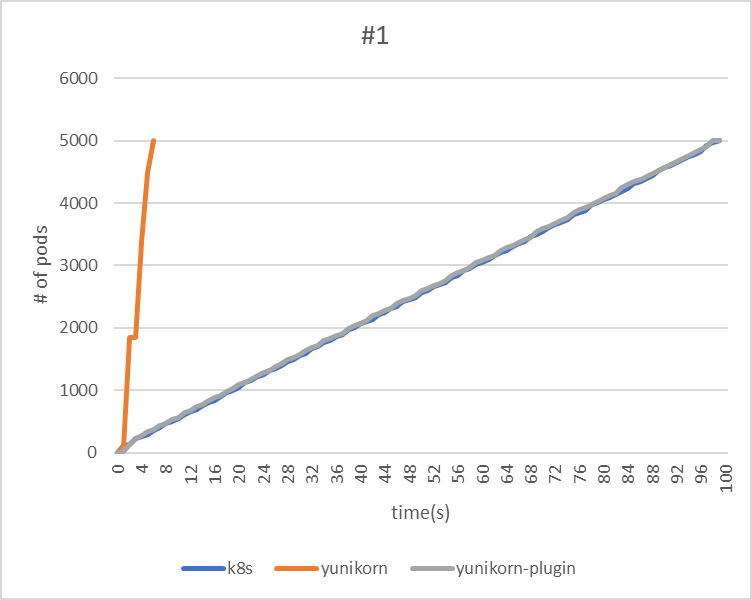
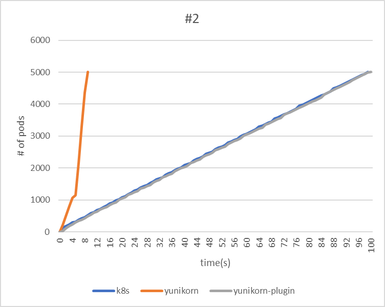
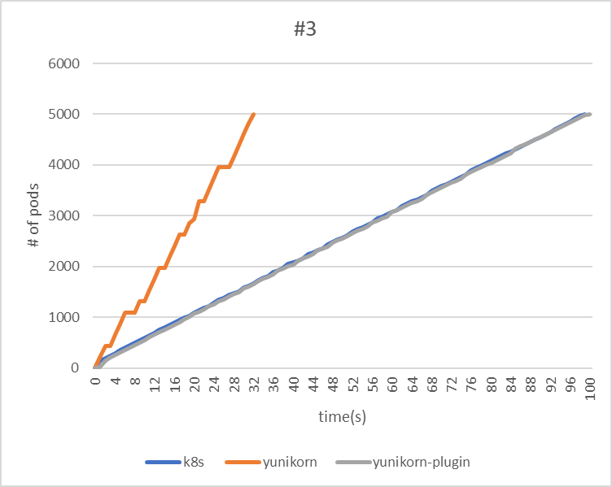
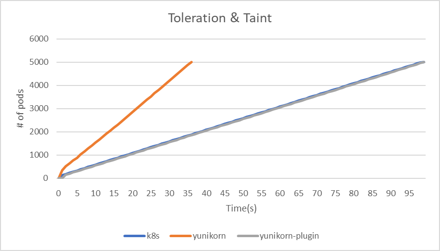
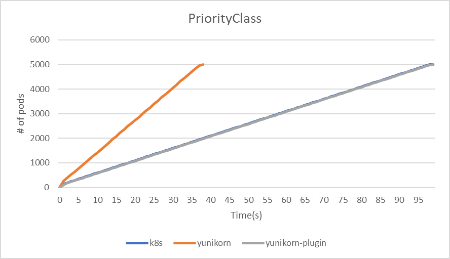

<!--
Licensed to the Apache Software Foundation (ASF) under one
or more contributor license agreements.  See the NOTICE file
distributed with this work for additional information
regarding copyright ownership.  The ASF licenses this file
to you under the Apache License, Version 2.0 (the
"License"); you may not use this file except in compliance
with the License.  You may obtain a copy of the License at

  http://www.apache.org/licenses/LICENSE-2.0

Unless required by applicable law or agreed to in writing,
software distributed under the License is distributed on an
"AS IS" BASIS, WITHOUT WARRANTIES OR CONDITIONS OF ANY
KIND, either express or implied.  See the License for the
specific language governing permissions and limitations
under the License.
-->

[KWOK](https://kwok.sigs.k8s.io/) is a powerful toolkit designed to swiftly establish a cluster of thousands of Nodes within seconds. This page is dedicated to leveraging KWOK for performance testing. The objective is to conduct a comparative analysis between YuniKorn (Standard mode/Plugin mode) and Kube-scheduler, evaluating their capabilities in workload handling.

KWOK conserves memory by emulating only node and pod behavior, unlike Kubemark, which emulates a kubelet and consumes a significant amount of memory.

Using Kwok, we replicated previous performance tests, deploying 10 deployments on 5000 nodes with 5000 replicas each, resulting in a remarkably low total memory usage of 30-40GB. As a result, Kwok enables us to scale up experiments and assess the performance of YuniKorn without the need to consider bandwidth and Kubelet processing speed.

## Environment

The test is conducted using KWOK in a Cluster. The cluster environment is optimized according to the performance tuning settings in the YuniKorn documentation. For more details, refer to the [Benchmarking Tutorial](performance/performance_tutorial.md#performance-tuning). You can conveniently set up Kwok in your Kubernetes Cluster by downloading the scripts we provide [here](https://github.com/apache/yunikorn-k8shim/blob/master/deployments/kwok-perf-test/kwok-setup.sh). 

For data monitoring, Prometheus will be employed to gather metrics. We'll use count(kube_pod_status_scheduled_time\{namespace="default"\}) as an indicator of throughput.

## Test Cases

We will start a comparative analysis with kube-scheduler to evaluate the throughput of these two different schedulers. In addition, we will compare the performance differences when managing large numbers of Taints and Tolerations, configuring Affinity and Anti-Affinity settings, and handling PriorityClass jobs.

:::important
YuniKorn schedules pods according to the application. Bearing this in mind, our testing focuses on assessing the impact of various features like Taint & Tolerations, Affinity, and PriorityClass on performance. This requires assigning unique configurations to each pod to understand their effects accurately. We use shell scripts to configure a large number of pods efficiently, storing their configurations in a YAML file. These pods are then deployed as needed to evaluate the impact on system performance.

During this process, we've identified that the primary constraint is the processing capability of the api-server. Our data indicates that it is capable of deploying 5,000 pods in just 38 seconds, achieving a throughput of 131.6 pods per second.
:::

### Throughtput
In this experiment, we will use the following three test cases to measure the throughput and scheduling duration of different schedulers. Each application will be deployed at one-second intervals.

#### Test Case:

| Test Case | Applications | Tasks | Total Pods |
| --------- | ------------ | ----- | ---------- |
| #1        | 1            | 5000  | 5000       |
| #2        | 5            | 1000  | 5000       |
| #3        | 25           | 200   | 5000       |

#### Result:

| #1                   | kube-scheduler | yunikorn | yunikorn plugin mode |
| -------------------- | -------------- | -------- | -------------------- |
| makespan             | 99             | 6        | 99                   |
| throughput(pods/sec) | 50.5           | 833.3    | 50.5                 |


| #2                   | kube-scheduler | yunikorn | yunikorn plugin mode |
| -------------------- | -------------- | -------- | -------------------- |
| makespan             | 99             | 9        | 100                  |
| throughput(pods/sec) | 50.5           | 555.6    | 50                   |


| #3                   | kube-scheduler | yunikorn | yunikorn plugin mode |
| -------------------- | -------------- | -------- | -------------------- |
| makespan             | 99             | 32       | 100                  |
| throughput(pods/sec) | 50.5           | 156.3    | 50                   |
:::note
Regarding the throughput of the YuniKorn Scheduler, the third test took the longest time. This can be attributed to the fact that the application is deployed only every second, thereby lengthening the makespan.
:::


### Taint & Tolerations 

In the Taint & Tolerations test case, each node is initially assigned a taint that corresponds to its numerical identifier. Following this, pods are randomly assigned tolerations based on the indexes of different nodes. To assess the impact on system performance, we will deploy a YAML file containing 5000 pods and monitor the outcome.

```yaml
kubectl taint nodes kwok-node-1 key-1=value-1:NoSchedule
```

```yaml
tolerations:
- key: key-$rand
  operator: "Exists"
```

#### Result:

| Taint & Tolerations  | kube-scheduler | yunikorn | yunikorn plugin mode |
| -------------------- | -------------- | -------- | -------------------- |
| makespan             | 99             | 36       | 99                   |
| throughput(pods/sec) | 50.5           | 138.9    | 50.5                 |


### Affinity & Non-Affinity

In the test cases for Affinity & Non-Affinity, 5,000 pods will be divided into four different combinations as follows:

| Types of Node affinity and anti-affinity | Operator | Numbers of Pods |
| ---------------------------------------- | -------- | --------------- |
| Preferred                                | In       | 625             |
| Preferred                                | NotIn    | 625             |
| Required                                 | In       | 625             |
| Required                                 | NotIn    | 625             |


| Types of Pod affinity and anti-affinity | Operator | Numbers of Pods |
| --------------------------------------- | -------- | --------------- |
| Preferred                               | In       | 1250            |
| Preferred                               | NotIn    | 1250            |


In the Node affinity section, the matchExpressions value is set to the hostname of a randomly selected node.
```yaml
affinity:
    nodeAffinity:
      requiredDuringSchedulingIgnoredDuringExecution:
        nodeSelectorTerms:
        - matchExpressions:
          - key: kubernetes.io/hostname
            operator: $operator
            values:
            - kwok-node-$randHost
```

In the Pod affinity section, the value of matchExpressions is a randomly assigned applicationId.
```yaml
affinity:
  podAffinity:
    preferredDuringSchedulingIgnoredDuringExecution:
    - weight: 100
      podAffinityTerm:
        labelSelector:
          matchExpressions:
          - key: applicationId
            operator: $operator
            values:
            - nginx-$randAppID1
        topologyKey: kubernetes.io/role
```

#### Result

| Affinity & Non-Affinity | kube-scheduler | yunikorn | yunikorn plugin mode |
| ----------------------- | -------------- | -------- | -------------------- |
| makespan                | 99             | 42       | 100                  |
| throughput(pods/sec)    | 50.5           | 119      | 50                   |


### PriorityClass
Firstly, deploy 100 distinct PriorityClasses. Subsequently, deploy Jobs with 5,000 Pods at the same time. As YuniKorn sorts priorities solely based on the application and queue, we will assign unique applicationIDs to each Pod and randomly assign different PriorityClasses to the Pods. This approach allows us to observe and analyze the throughput differences between different schedulers.

#### Result

| PriorityClass        | kube-scheduler | yunikorn | yunikorn plugin mode |
| -------------------- | -------------- | -------- | -------------------- |
| makespan             | 99             | 38       | 99                   |
| throughput(pods/sec) | 50.5           | 131.6    | 50.5                 |


## Summary

The test results reveal that YuniKorn demonstrates the highest throughput across all three tests. Both Kube-scheduler and YuniKorn plugin mode perform comparably.

In tests involving Taint & Tolerations, Affinity & Anti-affinity, and PriorityClass, it's observed that despite numerous parameters and constraints in the deployment process, there's minimal impact on the final throughput and makespan. With the YuniKorn scheduler, a relatively lower throughput was noted, primarily due to the api-server becoming a bottleneck when deploying 5,000 pods simultaneously.
