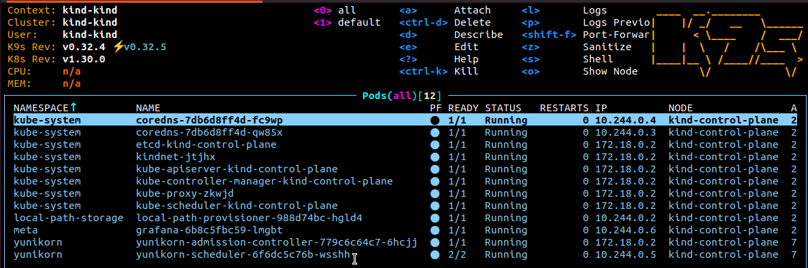
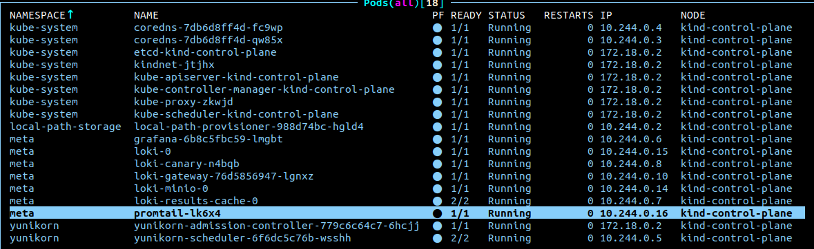
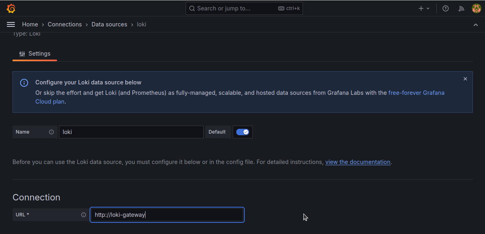
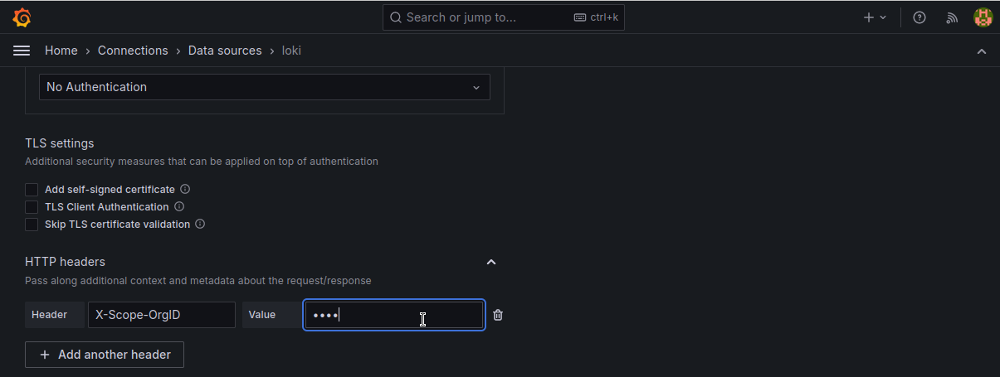
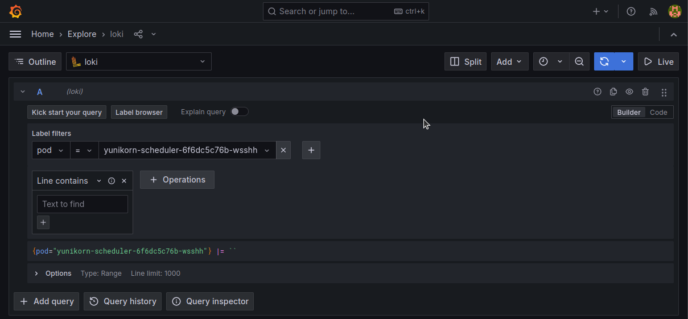
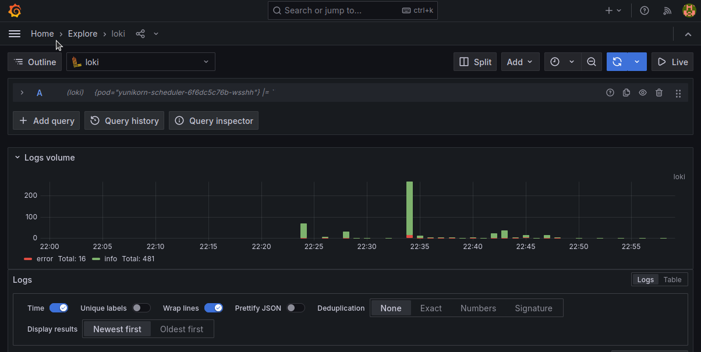

<!--
Licensed to the Apache Software Foundation (ASF) under one
or more contributor license agreements.  See the NOTICE file
distributed with this work for additional information
regarding copyright ownership.  The ASF licenses this file
to you under the Apache License, Version 2.0 (the
"License"); you may not use this file except in compliance
with the License.  You may obtain a copy of the License at

  http://www.apache.org/licenses/LICENSE-2.0

Unless required by applicable law or agreed to in writing,
software distributed under the License is distributed on an
"AS IS" BASIS, WITHOUT WARRANTIES OR CONDITIONS OF ANY
KIND, either express or implied.  See the License for the
specific language governing permissions and limitations
under the License.
-->

In this example, Loki, along with Promtail, is used to collect YuniKorn logs from the cluster. These logs are then visualized through a Grafana dashboard.

## Modify YuniKorn settings
Follow [YuniKorn install guide](https://yunikorn.apache.org/docs/) and modify YuniKorn configmap "yunikorn-defaults" to allow ray operator based on k8s service account.
```
kubectl patch configmap yunikorn-defaults -n yunikorn --patch '{"data":{"admissionController.accessControl.systemUsers": "^system:serviceaccount:kube-system:,^system:serviceaccount:meta:"}}' 
```

## Install Grafana 
Install the Grafana Helm chart:
```
helm repo add grafana https://grafana.github.io/helm-charts
helm repo update
helm upgrade --install grafana grafana/grafana -n meta --create-namespace
```


## Install Loki
1. Create the `binary.yaml` file
```
#binary.yaml
loki:
  commonConfig:
    replication_factor: 1
  schemaConfig:
    configs:
      - from: 2024-04-01
        store: tsdb
        object_store: s3
        schema: v13
        index:
          prefix: loki_index_
          period: 24h
  ingester:
    chunk_encoding: snappy
  tracing:
    enabled: true
  querier:
    max_concurrent: 2

deploymentMode: SingleBinary
singleBinary:
  replicas: 1
  resources:
    limits:
      cpu: 1
      memory: 2Gi
    requests:
      cpu: 1
      memory: 2Gi
  extraEnv:
    # Keep a little bit lower than memory limits
    - name: GOMEMLIMIT
      value: 3750MiB

chunksCache:
  enabled: false
  # default is 500MB, with limited memory keep this smaller
  writebackSizeLimit: 10MB

resultsCache:
  enabled: false

# Enable minio for storage
minio:
  enabled: true

# Zero out replica counts of other deployment modes
backend:
  replicas: 0
read:
  replicas: 0
write:
  replicas: 0

ingester:
  replicas: 0
querier:
  replicas: 0
queryFrontend:
  replicas: 0
queryScheduler:
  replicas: 0
distributor:
  replicas: 0
compactor:
  replicas: 0
indexGateway:
  replicas: 0
bloomCompactor:
  replicas: 0
bloomGateway:
  replicas: 0
```
2. Install the Loki Helm chart:
```
helm upgrade --install loki grafana/loki -n meta -f binary.yaml
```


:::info[Troubleshoot]
If your Loki and Loki-minio pods remain pending, you need to delete them and wait for them to restart.
:::

## Install promtail
1. Create the `promtail.yaml` file
```
#promtail.yaml
config:
  clients:
    - url: http://loki-gateway/loki/api/v1/push
      tenant_id: user
      external_labels:
        cluster: kind-cluster
```
2. Install the promtail Helm chart:
```
helm upgrade --install promtail grafana/promtail -f promtail.yaml
```


## Grafana settings to connect to Loki
### 1. Access the Grafana Web UI
```
kubectl port-forward -n meta service/grafana 3000:3000
```
After running port forwarding, you can access Grafana's web interface by [localhost:3000](http://localhost:3000) in your browser.

### 2. Set URL and HTTP headers
In grafana, adding a loki data source with url and http headers allows grafana to fetch logs.

#### set URL field `http://loki-gateway`


#### In order to fetch logs from promtail which tenantID is user, set HTTP headers field X-Scope-OrgId with user.


## Loki log result
1. Set tracking target

2. bar chart

3. INFO log

