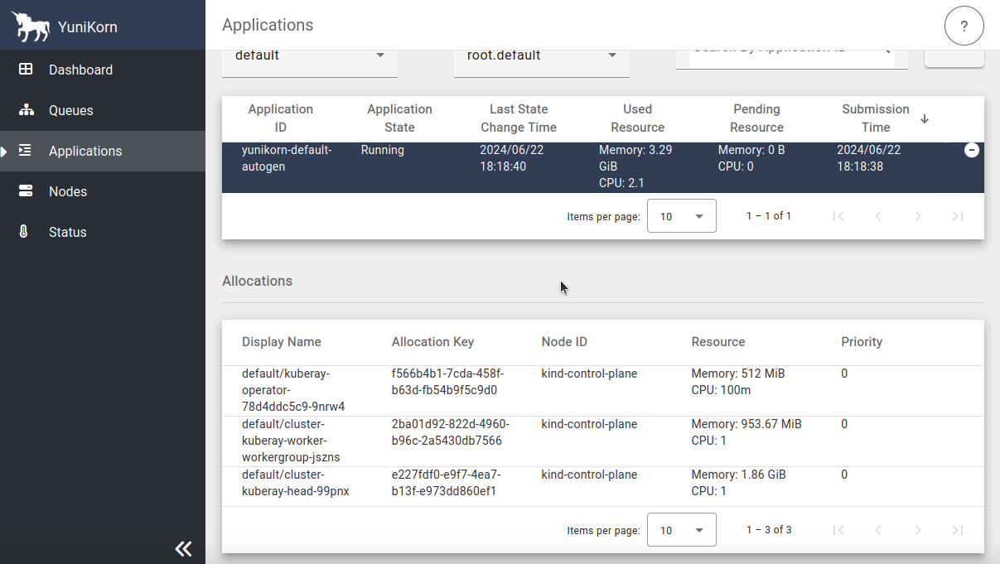
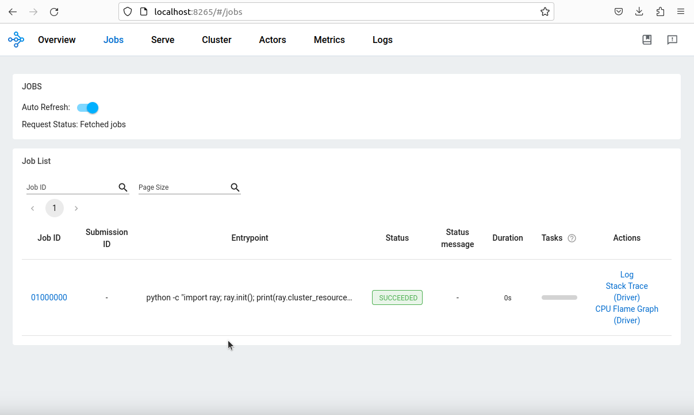

import RayOperator from './kuberay/_ray_operator.mdx';
import RayCRDYunikornConfig from './kuberay/_ray_crd_yunikorn_config.mdx';
import YunikornConfigMapPatch from './utils/_yunikorn_configmap_patch.mdx';

<!--
Licensed to the Apache Software Foundation (ASF) under one
or more contributor license agreements.  See the NOTICE file
distributed with this work for additional information
regarding copyright ownership.  The ASF licenses this file
to you under the Apache License, Version 2.0 (the
"License"); you may not use this file except in compliance
with the License.  You may obtain a copy of the License at

  http://www.apache.org/licenses/LICENSE-2.0

Unless required by applicable law or agreed to in writing,
software distributed under the License is distributed on an
"AS IS" BASIS, WITHOUT WARRANTIES OR CONDITIONS OF ANY
KIND, either express or implied.  See the License for the
specific language governing permissions and limitations
under the License.
-->

:::note
This example demonstrates how to set up [KubeRay](https://docs.ray.io/en/master/cluster/kubernetes/getting-started.html) and run a [RayCluster](https://docs.ray.io/en/master/cluster/kubernetes/getting-started/raycluster-quick-start.html) with the YuniKorn scheduler. Here're the pre-requisites:
- This tutorial assumes YuniKorn is [installed](../../get_started/get_started.md) under the namespace `yunikorn`
- Use kube-ray version >= 1.2.2 to enable support for YuniKorn gang scheduling
:::

## Install YuniKorn

A simple script to install YuniKorn under the namespace `yunikorn`, refer to [Get Started](../../get_started/get_started.md) for more details.

```shell script
helm repo add yunikorn https://apache.github.io/yunikorn-release
helm repo update
helm install yunikorn yunikorn/yunikorn --create-namespace --namespace yunikorn
```

<RayOperator/>

## Create RayCluster with YuniKorn

In the example, we set the `ray.io/gang-scheduling-enabled` label to `true` to enable gang scheduling.

import Tabs from '@theme/Tabs';
import TabItem from '@theme/TabItem';

<Tabs>
<TabItem value="amd64" label="x86-64 (Intel/Linux)">

```yaml
cat <<EOF | kubectl apply -f -
apiVersion: ray.io/v1
kind: RayCluster
metadata:
  name: test-yunikorn-0
  labels:
    ray.io/gang-scheduling-enabled: "true"
    yunikorn.apache.org/app-id: test-yunikorn-0
    yunikorn.apache.org/queue: root.default
spec:
  rayVersion: "2.9.0"
  headGroupSpec:
    rayStartParams: {}
    template:
      spec:
        containers:
          - name: ray-head
            image: rayproject/ray:2.9.0
            resources:
              limits:
                cpu: "1"
                memory: "2Gi"
              requests:
                cpu: "1"
                memory: "2Gi"
  workerGroupSpecs:
    - groupName: worker
      rayStartParams: {}
      replicas: 2
      minReplicas: 2
      maxReplicas: 2
      template:
        spec:
          containers:
            - name: ray-head
              image: rayproject/ray:2.9.0
              resources:
                limits:
                  cpu: "1"
                  memory: "1Gi"
                requests:
                  cpu: "1"
                  memory: "1Gi"
EOF
```

</TabItem>
<TabItem value="aarch64" label="Apple Silicon(arm64)">

```yaml
cat <<EOF | kubectl apply -f -
apiVersion: ray.io/v1
kind: RayCluster
metadata:
  name: test-yunikorn-0
  labels:
    ray.io/gang-scheduling-enabled: "true"
    yunikorn.apache.org/app-id: test-yunikorn-0
    yunikorn.apache.org/queue: root.default
spec:
  rayVersion: "2.9.0"
  headGroupSpec:
    rayStartParams: {}
    template:
      spec:
        containers:
          - name: ray-head
            image: rayproject/ray:2.9.0-aarch64
            resources:
              limits:
                cpu: "1"
                memory: "2Gi"
              requests:
                cpu: "1"
                memory: "2Gi"
  workerGroupSpecs:
    - groupName: worker
      rayStartParams: {}
      replicas: 2
      minReplicas: 2
      maxReplicas: 2
      template:
        spec:
          containers:
            - name: ray-head
              image: rayproject/ray:2.9.0-aarch64
              resources:
                limits:
                  cpu: "1"
                  memory: "1Gi"
                requests:
                  cpu: "1"
                  memory: "1Gi"
EOF
```

</TabItem>
</Tabs>

- RayCluster result
  
- YuniKorn UI
  

## Submit a RayJob to RayCluster
```
export HEAD_POD=$(kubectl get pods --selector=ray.io/node-type=head -o custom-columns=POD:metadata.name --no-headers)
echo $HEAD_POD

kubectl exec -it $HEAD_POD -- python -c "import ray; ray.init(); print(ray.cluster_resources())"
```

Services in Kubernetes aren't directly accessible by default. However, you can use port-forwarding to connect to them locally.
```
kubectl port-forward service/test-yunikorn-0-head-svc 8265:8265
```
After port-forward set up, you can access the Ray dashboard by going to `http://localhost:8265` in your web browser.

- Ray Dashboard
  

Have doubts? Check out the [KubeRay integration with Apache YuniKorn](https://docs.ray.io/en/master/cluster/kubernetes/k8s-ecosystem/yunikorn.html) official documents.

